# **C Language Tutorial**


## Preparations for C Language

C is a procedural programming language. It was initially developed by Dennis Ritchie in the year 1972. It was mainly developed as a system programming language to write an operating system. The main features of C language include low-level access to memory, a simple set of keywords, and clean style, these features make C language suitable for system programming like an operating system or compiler development.

Next to control 40 pins of Raspberry Pi via C language.

Install WiringPi GPIO Library

We will control IO ports of Raspberry Pi by WiringPi GPIO library, let’s install WiringPi GPIO library.

Click the terminal icon of Raspberry Pi and open the terminal, as shown below:

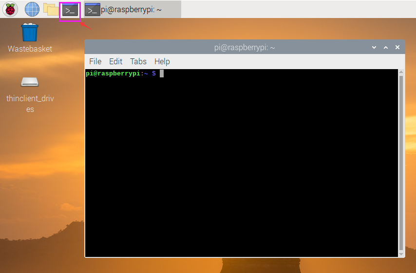

Enter the following commands in the terminal and tap“Enter”

cd /tmp

wget https://project-downloads.drogon.net/wiringpi-latest.deb

sudo dpkg -i wiringpi-latest.deb

As shown below：

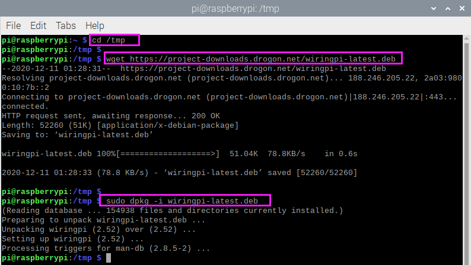

Check the version of WiringPi GPIO library and corresponding definition of 40-pin headers

Input the following commands and press“Enter”

gpio -v

gpio readall

The version of WiringPi GPIO library is 2.52


Pins definition of WiringPi GPIO Library

(note: the silk mark of our extension board is defined by pins of BCM GPIO as well)

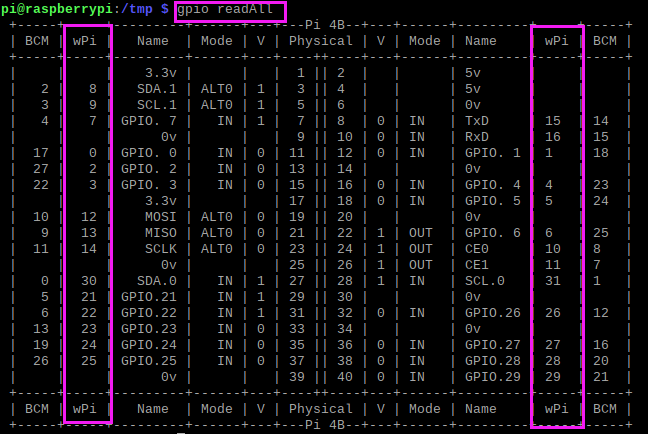

Run Example Code1：

Copy the C_code.zip we provide to pi folder, and extract the example code from zip file, as shown below:


Double-click C_code folder to look through example code, as shown below:

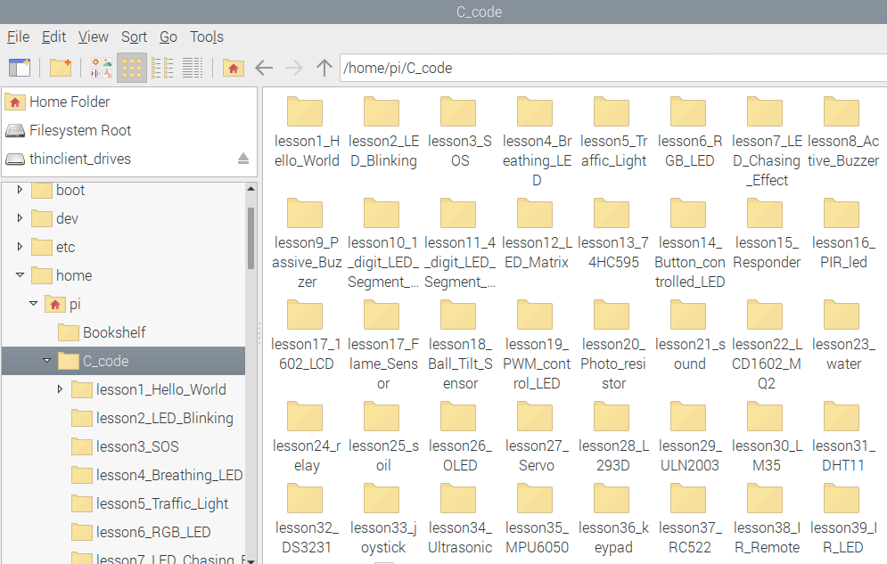

Set the default editor of file with .c

Enter lesson1_Hello_World and right-click Open with...


Click Programming to select Geany Programmer’s Editor ;


Then, we can directly open file by doubl-click Geany Programmer’s Editor.

**The Use of Geany Programmer’s Editor**

Open“HelloWorld.c”via it, click to compile code to check grammar errors.

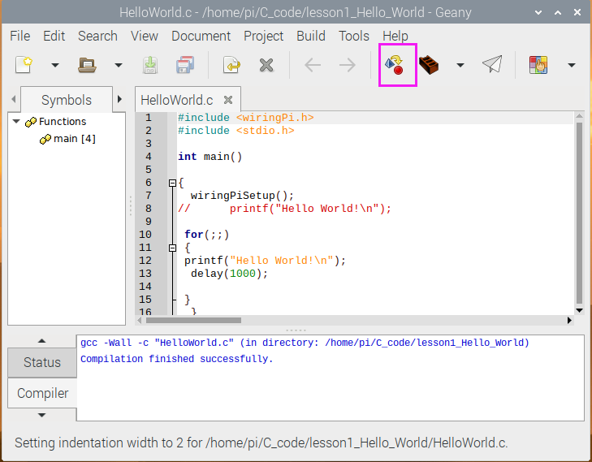

**Run Example Code**

Terminal enters the corresponding courses，for example, enter lesson1_Hello_World.

Enter the route with terminal command cd:

cd /home/pi/C_code/lesson1_Hello_World

Input the compilation command:

gcc HelloWorld.c -o HelloWorld -lwiringPi

Input ls to check file of the current folder:

The compilation file:HelloWorld

Run a compilation file: HelloWorld

Input command：sudo ./HelloWorld(as shown below)

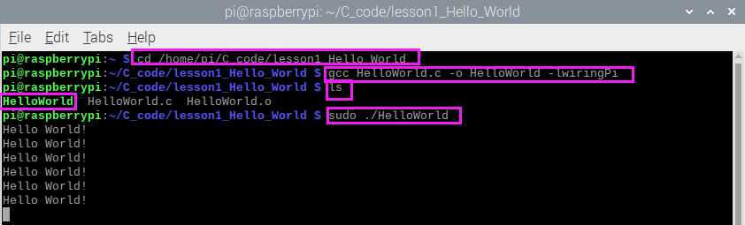

Command Explanation


You could select the folder and right-click to choose Openin the terminal as shown below, if you feel it complicated to enter the route.

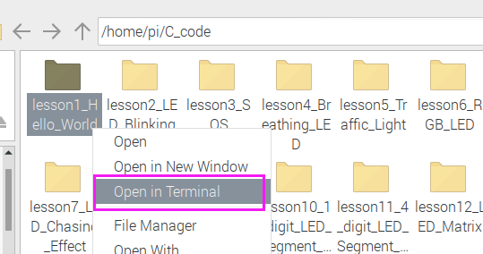

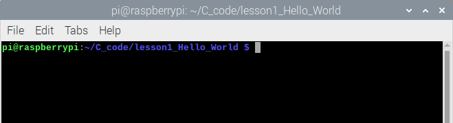

## Projects：

**Note: G, - and GND marked on sensors and modules are so-called positive, which are connected to GND of GPIO extension board or “-” of breadboard; V、+、VCC are known as positive, which are interfaced 3V3 or 5V on extension board and“+”on breadboard**

### Project 1：Hello World

 Compile and Run the Example Code：

Input the following commands in the terminal, and press“Enter”:

cd /home/pi/C_code/lesson1_Hello_World

gcc HelloWorld.c -o HelloWorld -lwiringPi

sudo ./HelloWorld

 Test Results：

Terminal prints Hello World ! , as shown below:

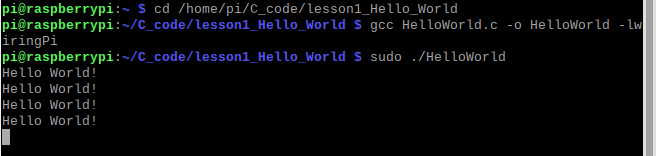

 Example Code：

```c
##include <wiringPi.h>   //wiringPi GPIO library
##include <stdio.h>  //standard input & output library

int main()  //Main function, the entry of the program
{
  
  wiringPiSetup();  //Initializes the wiringPi GPIO library
  while(1)  //An infinite loop
  {
    printf("Hello World!\n");  //\n is a newline print
    delay(1000);  //delay 1000ms
  }
}
```


### Project 2：LED Blinks

 Description：

Let’s start from a rather basic and simple experiment----LED Blinks.

 Components：

| 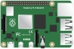 | 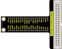 |             |  |  |  |  |
| ------------------------ | ------------------------ | ----------------------------------- | ------------------------ | ------------------------ | ------------------------ | ------------------------ |
| Raspberry Pi*1           | GPIO Extension Board*1   | 40pin Colorful <br />Jumper Wires*1 | Breadboard*1             | LED Red *1               | 220Ω Resistor*1          | Jumper Wires             |

**LED**: 

A light-emitting diode, the current is connected when anode(long pin) is connected to VCC, and cathode(short pin)is connected to GND. Its brightness is 2V and current is 6mA. LED must be connected to a resistor in the circuit, otherwise, the components will be burned.

**Resistor**: 

we use a carbon film resistor, 220Ωand its accuracy is 5%, why choose 220Ω resistor?

Since the high-level output voltage of GPIO pin of the Raspberry Pi is 3.3V, and the voltage of the LED is about 2V, and the current is about 6mA, we need to use a resistor to bear the voltage (3.3V-2V) = 1.3V, according to ohm The law: U/I = R knows: (3.3-2)/6 * 1000 ≈ 217Ω.

**Breadboard**: 

Below is a short instruction of breadboard. The holes on the board are connected. The inner board is structure diagram.

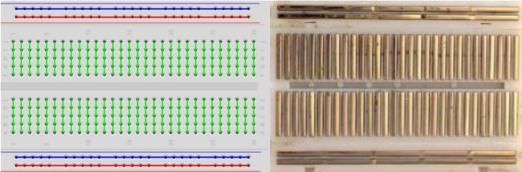

 Schematic Diagram

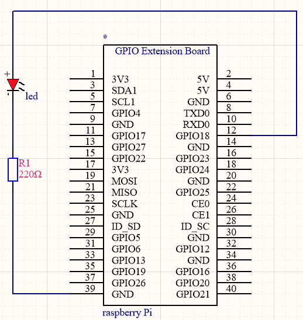

 **Connection Diagram：**

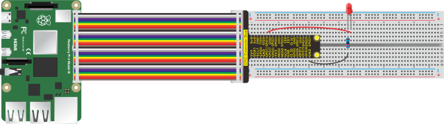

Since the PIN numbers of GPIO Extension Board and RPi GPIO are same, the part of breadboard and GPIO Extension Board is only shown on further connection diagram.

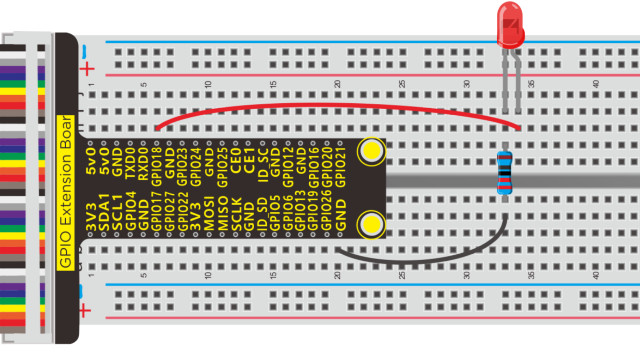

 Working Principle：

The positive pole of LED is connected to GPIO18, when the pin of GPIO18 outputs 3.3V, LED will be on; when its pin outputs 0V, LED will be off.

 Run Example Code

Input the following commands in the terminal and press“Enter”:

cd /home/pi/C_code/lesson2_LED_Blinking

gcc LED_Blinking.c -o LED_Blinking -lwiringPi

sudo ./LED_Blinking

 Test Results：

Terminal prints and LED flashes.

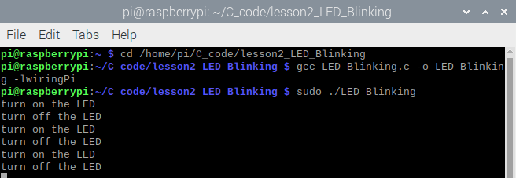

Note: Press Ctrl + C on keyboard and exit code running.

 Example Code：

```c
##include <wiringPi.h>
##include <stdio.h>

##define ledPin 1  //define led pin, BCM GPIO 18

int main()
{
  wiringPiSetup();  //Initialize wiringPi
  
  pinMode(ledPin,OUTPUT);  //set the ledPin OUTPUT mode
  
  while(1)
  { 
        digitalWrite(ledPin,HIGH);  //turn on led
        printf("turn on the LED\n");
        delay(500);       //delay 500ms
        digitalWrite(ledPin,LOW);   //turn off led
        printf("turn off the LED\n");
        delay(500);	  
  }
}
```


### Project 3：SOS Light

 Description：

S.O.S is a Morse code distress signal , used internationally, that was originally established for maritime use. We will present it with flashing LED.

 Experiment Components:

| 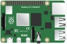 | 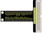 |        |  |  |  |  |
| ------------------------ | ------------------------ | ------------------------------ | ------------------------ | ------------------------ | ------------------------ | ------------------------ |
| Raspberry Pi*1           | GPIO Extension Board*1   | 40 pin Colorful Jumper Wires*1 | Breadboard*1             | LED - Red *1             | 220Ω Resistor*1          | Jumper Wires             |

 Schematic Diagram


 **Connection Diagram：**


 Run Example Code

Input the following commands and press "Enter":

cd /home/pi/C_code/lesson3_SOS

gcc SOS.c -o SOS -lwiringPi

sudo ./SOS

 Test Results：

LED flashes quickly for three times, three times slowly and quickly three times, the terminal prints ... \_ \_ \_ ...

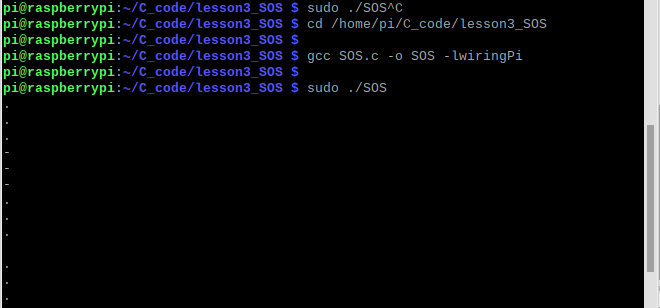

Note: Press Ctrl + C on keyboard and exit code running.

 Example Code:

```c
##include <wiringPi.h>
##include <stdio.h> //The stdio.h header file defines three variable types, 
                   //some macros, and various functions to perform input and output.

##define ledPin 1  //define led pin
int i1,i2,i3;

int main()
{
	wiringPiSetup();  //Initialize wiringPi

	pinMode(ledPin,OUTPUT);  //set the ledPin OUTPUT mode

	while(1)
	{
		while(i1<3)
		{
			digitalWrite(ledPin,HIGH);  //turn on led
			delay(100);       //delay 100ms
			digitalWrite(ledPin,LOW);   //turn off led
			delay(100);
			i1 = i1 + 1;
			printf(".\n");
		}
		while(i2<3)
		{
			digitalWrite(ledPin,HIGH);  //turn on led
			delay(1000);       //delay 1000ms      
			digitalWrite(ledPin,LOW);   //turn off led
			delay(1000);
			i2 = i2 + 1;
			printf("-\n");
		}
		while(i3<3)
		{
			digitalWrite(ledPin,HIGH);  //turn on led
			delay(100);       //delay 100ms      
			digitalWrite(ledPin,LOW);   //turn off led
			delay(100);
			i3 = i3 + 1;
			printf(".\n");
		}
		//clean
		i1 = 0;
		i2 = 0;
		i3 = 0;
		printf(" \n");
		delay(500);
	}
	
}
```


### Project 4：Breathing LED

 Description：

A“breathing LED” is a phenomenon where an LED's brightness smoothly changes from dark to bright and back to dark, continuing to do so and giving the illusion of an LED“breathing.” This phenomenon is similar to a lung breathing in and out. So how to control LED’s brightness? We need to take advantage of PWM.

 Experiment Components：

|  | 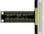 |        |  |  |  |  |
| ------------------------ | ------------------------ | ------------------------------ | ------------------------ | ------------------------ | ------------------------ | ------------------------ |
| Raspberry Pi*1           | GPIO Extension Board*1   | 40 pin Colorful Jumper Wires*1 | Breadboard*1             | LED - Red *1             | 220ΩResistor *1          | Jumper Wires             |

 Working Principle：

We use the PWM output of GPIO, PWM outputs analog signals and output value is 0~100 which is equivalent to output voltage 0~3.3V from GPIO port.

According to Ohm's law: U/R = I, the resistance is 220Ω, and the value of voltage U changes, so does the value of current I, which can control the brightness of the LED lamp.

PWM (Pulse Width Modulation) is the control of the analog circuit through the digital output of microcomputer and a method that making digital coding on analog signal levels.

It sends square waves with certain frequency through digital pins, that is, high level and low level are output alternately for a period of time. Total time of each group high and low level is fixed, which is called cycle. 

The time of high level output is pulse width whose percentage is called Duty Cycle. The longer that high level lasts, the larger the duty cycle of analog signals is, the corresponding voltage as well.

Below chart is pulse width 50%, then the output voltage is 3.3 * 50% = 1.65V，the brightness of LED is medium.

In the experiment, we produce PWM via Wiringpi.

There are two ways outputting PWM on Wiringpi, one is PWM of Raspberry Pi(we recommend you to choose it if you want to control PWM correctly), the other is analog PWM of Wiring pi.


 Schematic Diagram


 **Connection Diagram：**


 Run Example Code1：

PWM Output:

Input the following commands and press "Enter":

cd /home/pi/C_code/lesson4_Breathing_LED

gcc Breathing_LED1.c -o Breathing_LED1 -lwiringPi

sudo ./Breathing_LED1

 Test Result 1：

LED gradually brightens then darkens, in loop way.

Note: Press Ctrl + C on keyboard and exit code running.

 Example Code 1：

```c
##include <stdio.h>
##include <wiringPi.h>
 
##define LED 1  //define led pin

int main(void)
{
    int bright;
    printf("Raspberry Pi wiringPi PWM test program\n");
    wiringPiSetup();  //Initialize wiringPi
    pinMode(LED,PWM_OUTPUT);  //set the ledPin OUTPUT mode
    
    while(1)
    {
        for (bright = 0; bright < 1024; ++bright)   // pwm 0~1024
        {
            pwmWrite(LED,bright);
            printf("bright:%d\n",bright);  //%d is the integer output, bright is the variable to output
            delay(10);
        }
        for (bright = 1023; bright >= 0; --bright)
        {
            pwmWrite(LED,bright);
            printf("bright:%d\n",bright);
            delay(10);
        }
    }
    return 0;
 }
```


 Run Example Code 2：

Software simulates PWM output:

Input the following commands and press "Enter":

cd /home/pi/C_code/lesson4_Breathing_LED

gcc Breathing_LED2.c -o Breathing_LED2 -lwiringPi

sudo ./Breathing_LED2

 Test Result2：

LED gradually brightens then darkens, in loop way.

Note: Press Ctrl + C on keyboard and exit code running.

 **Example Code 2：**

```c
##include <stdio.h>
##include <wiringPi.h>
##include <softPwm.h>  //Software PWM library

##define LED 1 

int main(void)
{
       int i = 0;
       wiringPiSetup();  //Initialize wiringPi
       softPwmCreate(LED, 0, 100);  //Create pin LED as the PWM output(0~100)
       while (1)
       {
              for(i=0; i<100; i++)
              {
                     softPwmWrite(LED, i);  //pwm write
                     delay(20);
                     printf("PWM = %d\n",i);
              }
              for(i=99; i>0; i--)
              {
                     softPwmWrite(LED, i);
                     delay(20);
                     printf("PWM = %d\n",i);
              }
       }
       return 0;
}
```


### Project 5：Traffic Lights

 Description：

In this lesson, we will learn how to control multiple LED lights and simulate the operation of traffic lights.

Traffic lights are signaling devices positioned at road intersections, pedestrian crossings, and other locations to control flows of traffic.

Green light on: Allows traffic to proceed in the direction denoted, if it is safe to do so and there is room on the other side of the intersection.

Red light: Prohibits any traffic from proceeding. A flashing red indication requires traffic to stop and then proceed when safe (equivalent to a stop sign).

Amber light (also known as 'orange light' or 'yellow light'):

Warns that the signal is about to change to red, with some jurisdictions requiring drivers to stop if it is safe to do so, and others allowing drivers to go through the intersection if safe to do so.

 Experiment Components：

| 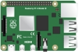 |  |        |  |  |
| ------------------------ | ------------------------ | ------------------------------ | ------------------------ | ------------------------ |
| Raspberry Pi*1           | GPIO Extension Board*1   | 40 pin Colorful Jumper Wires*1 | Breadboard*1             | LED - Red *1             |
|  |  |        |  |                          |
| LED - Green*1            | LED - Yellow*1           | 220Ω Resistor*3                | Jumper Wires             |                          |

 Schematic Diagram

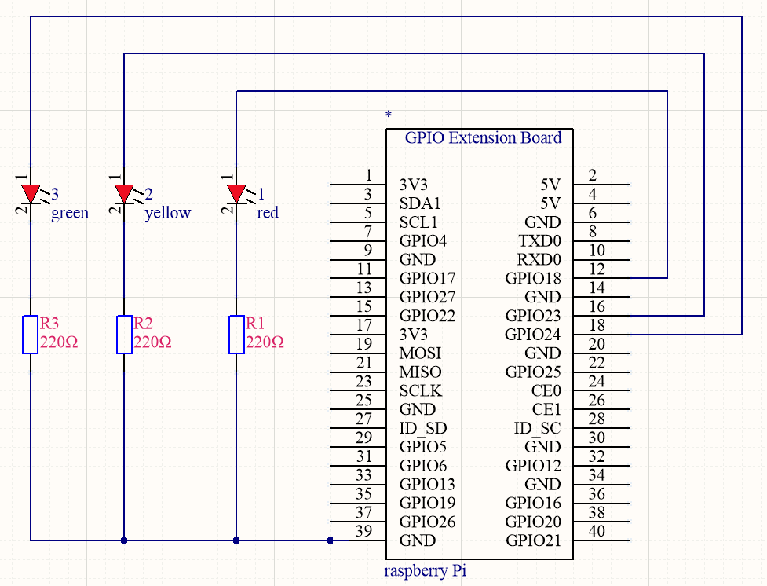

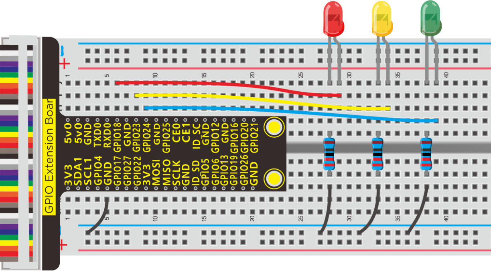

 Run Example Code

Input the following commands and press "Enter":

cd /home/pi/C_code/lesson5_Traffic_Light

gcc Traffic_Light.c -o Traffic_Light -lwiringPi

sudo ./Traffic_Light

 Test Results：

Note: Press Ctrl + C on keyboard and exit code running.

Red light is on 5s and off, yellow light flashes 3s and turn off, green light is lit for 5s and off, in loop way.

 **Example Code**

```c
##include <wiringPi.h>

##define R_pin 1  //BCM GPIO 18
##define G_pin 4  //BCM GPIO 24
##define Y_pin 5  //BCM GPIO 23

int main()
{
  wiringPiSetup();
  char j;
  pinMode(R_pin,OUTPUT);
  pinMode(G_pin,OUTPUT);
  pinMode(Y_pin,OUTPUT);
  
  digitalWrite(R_pin, LOW);
  digitalWrite(G_pin, LOW);
  digitalWrite(Y_pin, LOW);
  
  while(1)
  { 
   digitalWrite(R_pin, HIGH);//// turn on red LED
   delay(5000);// wait 5 seconds
   digitalWrite(R_pin, LOW); // turn off red LED
   for(j=0;j<3;j++) // blinks for 3 times
   {
   digitalWrite(G_pin, HIGH);// turn on yellow LED
   delay(500);// wait 0.5 second
   digitalWrite(G_pin, LOW);// turn off yellow LED
   delay(500);// wait 0.5 second
   } 

   digitalWrite(Y_pin, HIGH);// turn on green LED
   delay(5000);// wait 5 second
   digitalWrite(Y_pin, LOW);// turn off green LED
   } 
}
```


### Project 6：RGB Light

 Description：

In this chapter, we will demonstrate how RGB lights show different colors via programming.

 Experiment Components：

| 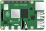 | 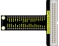 |        |  |  |  |  |
| ------------------------ | ------------------------ | ------------------------------ | ------------------------ | ------------------------ | ------------------------ | ------------------------ |
| Raspberry Pi*1           | GPIO Extension Board*1   | 40 pin Colorful Jumper Wires*1 | Breadboard*1             | RGB - LED *1             | 100Ω Resistor*3          | Jumper Wires             |

 Component Knowledge：

We use common cathode RGB lights.

**Working Principle：**

RGB LED integrated three LEDs emitting red,green and blue light. It has 4 pins，long pin (-) is a shared pin, that is, the negative port of 3LED, as shown below, we control three LEDs to emit light with different brightness to make RGB show different colors.


Red, green and blue are three primary colors. They could produce all kinds of visible lights when mixing them up. Computer screen, single pixel mobile phone screen, neon light work under this principle.

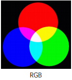

Next, we will make a RGB LED displaying all kinds of colors

 Schematic Diagram

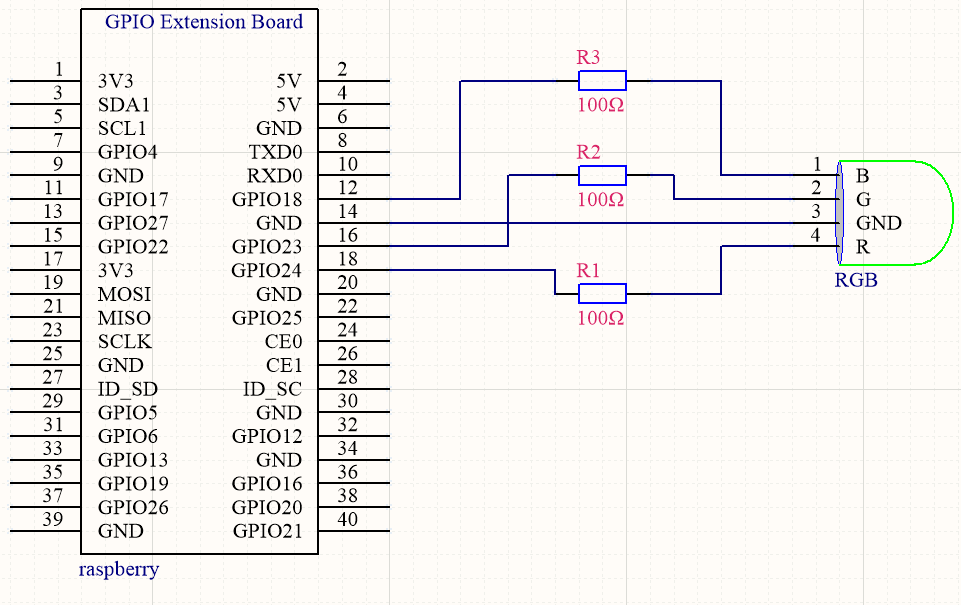

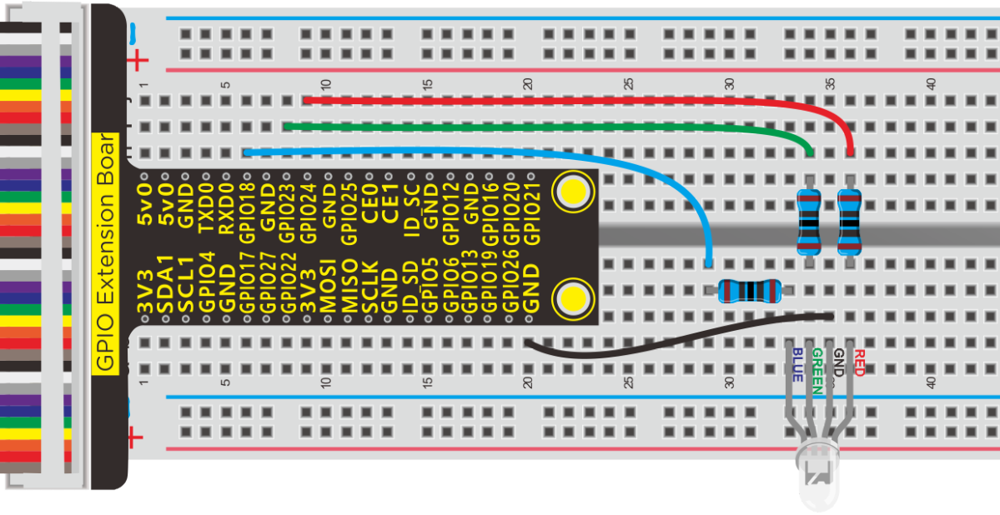

 Example Code

Input the following commands and press "Enter"

cd /home/pi/C_code/lesson6_RGB_LED

gcc RGB_LED.c -o RGB_LED -lwiringPi

sudo ./RGB_LED

 Test Results：

RGB lights show colors randomly

Note: Press Ctrl + C on keyboard and exit code running

RGB light shows the all kinds of colors randomly.

 **Example Code:**

```c
##include <stdio.h>
 ##include <stdlib.h>
 ##include <stdint.h>
 ##include <wiringPi.h>
 ##include <softPwm.h>
 ##include <time.h>

 ##define pin_R 5 //BCM GPIO 24
 ##define pin_G 4 //BCM GPIO 23
 ##define pin_B 1 //BCM GPIO 18
 

int main(void){
     int red,green,blue;
     if (wiringPiSetup() == -1){
          printf("Setup GPIO error!\n");
          return -1;
     }
     softPwmCreate(pin_R, 0, 100); 
     softPwmCreate(pin_G, 0, 100); 
     softPwmCreate(pin_B, 0, 100); 
     
     while (1){
          srand((unsigned)time(NULL));
          red = rand()%101 + 0;
          green = rand()%101 + 0;
          blue = rand()%101 + 0;
          softPwmWrite(pin_R, red);
          softPwmWrite(pin_G, green);
          softPwmWrite(pin_B, blue);
          delay(100);
     }
     return 0;
}
```


### Project 7：Flow Light

 Description：

What is flow light? Maybe you see it on the wall of buildings and billboards. It is a scene that LED gradually brightens then darkens one by one.

 Experiment Components：

| 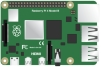 | 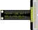 |        |  |  |  |  |
| ------------------------ | ------------------------ | ------------------------------ | ------------------------ | ------------------------ | ------------------------ | ------------------------ |
| Raspberry Pi*1           | GPIO Extension Board*1   | 40 pin Colorful Jumper Wires*1 | Breadboard*1             | LED - Red *8             | 220Ω Resistor*8          | Jumper Wires             |

 Schematic Diagram


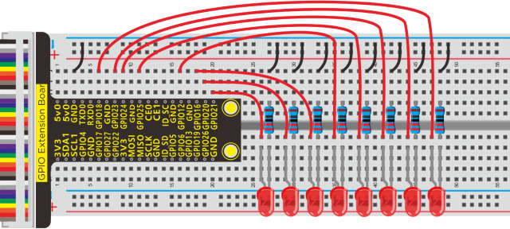

 Example Code

Input the following commands and press "Enter":

cd /home/pi/C_code/lesson7_LED_Chasing_Effect

gcc LED_Chasing_Effect.c -o LED_Chasing_Effect -lwiringPi

sudo ./LED_Chasing_Effect

 Test Results：

Eight LED lights change from light to dark then back to dark, one by one.

Note: Press Ctrl + C on keyboard and exit code runningNote: press Ctrl + C to exit the code.

 **Example Code**

```c
##include <wiringPi.h>

##define led1 1 //BCM GPIO 18
##define led2 4 //BCM GPIO 23
##define led3 5 //BCM GPIO 24
##define led4 6 //BCM GPIO 25
##define led5 26 //BCM GPIO 12
##define led6 27 //BCM GPIO 16
##define led7 28 //BCM GPIO 20
##define led8 29 //BCM GPIO 21

int main()
{
    wiringPiSetup();
    pinMode(led1,OUTPUT);  //set pin OUTPUT mode
    pinMode(led2,OUTPUT);
    pinMode(led3,OUTPUT);
    pinMode(led4,OUTPUT);
    pinMode(led5,OUTPUT);
    pinMode(led6,OUTPUT);
    pinMode(led7,OUTPUT);
    pinMode(led8,OUTPUT);

    digitalWrite(led1, LOW);  //set pin LOW
    digitalWrite(led2, LOW);
    digitalWrite(led3, LOW);
    digitalWrite(led4, LOW);
    digitalWrite(led5, LOW);
    digitalWrite(led6, LOW);
    digitalWrite(led7, LOW);
    digitalWrite(led8, LOW);
    
    while(1)
    {  
        //Light up one by one
        digitalWrite(led1, HIGH); 
        delay(200); 
        digitalWrite(led2, HIGH);
        delay(200); 
        digitalWrite(led3, HIGH);
        delay(200); 
        digitalWrite(led4, HIGH);
        delay(200);
        digitalWrite(led5, HIGH);
        delay(200); 
        digitalWrite(led6, HIGH);
        delay(200); 
        digitalWrite(led7, HIGH);
        delay(200); 
        digitalWrite(led8, HIGH);
        delay(200);
        
        //Turn off one by one
        digitalWrite(led1, LOW);
        delay(200); 
        digitalWrite(led2, LOW);
        delay(200); 
        digitalWrite(led3, LOW);
        delay(200); 
        digitalWrite(led4, LOW);
        delay(200);
        digitalWrite(led5, LOW);
        delay(200); 
        digitalWrite(led6, LOW);
        delay(200); 
        digitalWrite(led7, LOW);
        delay(200); 
        digitalWrite(led8, LOW);
        delay(200);
    }    
}
```


### Project 8：Doorbell

 Description：

In this project, we will demonstrate how doorbell works

 Experiment Components：

|  | 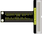                                     |        |  |
| ------------------------ | ------------------------------------------------------------ | ------------------------------ | ------------------------ |
| Raspberry Pi*1           | GPIO Extension Board*1                                       | 40 pin Colorful Jumper Wires*1 | Breadboard*1             |
|  |  | 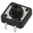       | 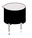 |
| Jumper Wires             | 10KΩ Resistor*1                                              | Button Switch *1               | Active Buzzer *1         |

 **Components Knowledge:**

**Active buzzer：**

An active buzzer generates a tone using an internal oscillator, so all that is needed is a DC voltage. A passive buzzer requires an AC signal to make a sound. It is like an electromagnetic speaker, where a changing input signal produces the sound, rather than producing a tone automatically.

As a type of electronic buzzer with integrated structure, buzzers, which are supplied by DC power, are widely used in computers, printers, photocopiers, alarms, electronic toys, automotive electronic devices, telephones, timers and other electronic products for voice devices. Buzzers can be categorized as active and passive (see the following picture). Turn the pins of two buzzers facing up, and the one with a green circuit board is a passive buzzer, while the other enclosed with a black tape is an active one.

**Button switch:**

it can control circuit. Before pressed, the current can’t pass from one end to the other end. Both ends are like two mountains. There is a river in between. We can't cross this mountain to another mountain. When pressed, my internal metal piece is  connecting the two sides to let the current pass, just like building a bridge to connect the two mountains.

Inner structure: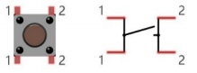

1 and 1 , 2 and 2 are connected. However, 1 and 2 are disconnected when the button is not pressed; 1 and 2 are connected when pressing the button.

**10KΩ resistor**：

It is pull-up resistor. The high and low levels of Raspberry Pi will be unstable if connecting only GPIO pins instead of resistors. 

Resistor could stabilize the electronic signal and protect circuit.

The circuit will be shorten and components will be burnt if without wiring 10kΩ resistor, as shown below; 

 Schematic Diagram：

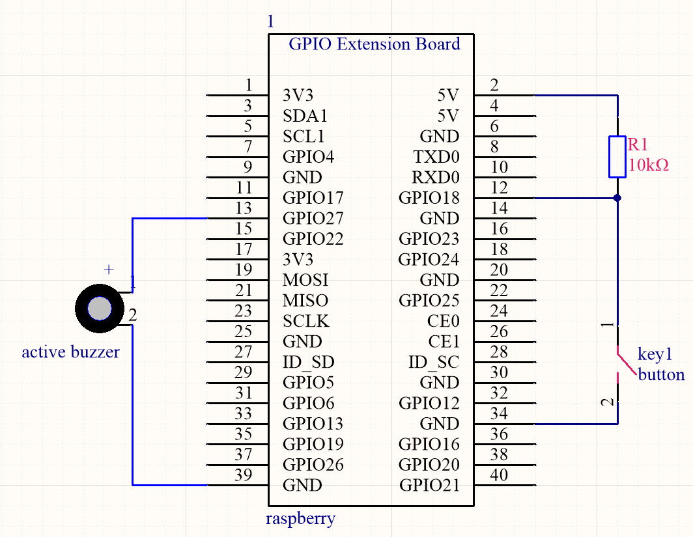

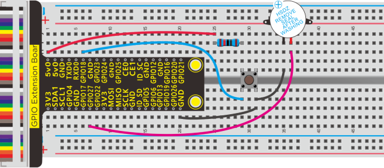

 Run Example Code：

Input the following commands and press "Enter":

cd /home/pi/C_code/lesson8_Active_Buzzer

gcc Active_Buzzer.c -o Active_Buzzer -lwiringPi

sudo ./Active_Buzzer

 Test Results：

Press button, the buzzer emits sound, otherwise, it doesn’t.

Note: Press Ctrl + C on keyboard and exit code running.

 Example Code：

```c
##include <wiringPi.h>
##include <stdio.h>
##define button 1   //button pin BCM GPIO 18
##define buzzer 2   //buzzer pin BCM GPIO 27
int main()
{
  wiringPiSetup();
  char val;
  {
    pinMode(button,INPUT);  //set the button pin INPUT mode
    pinMode(buzzer,OUTPUT);
  }
  
  while(1)
  {
    val=digitalRead(button);  // digital read
    printf("val = %d\n", val);
    if(val==0)//check if the button is pressed, if yes, turn on the Buzzer
      digitalWrite(buzzer,HIGH);  //The buzzer made a sound
    else
      digitalWrite(buzzer,LOW);
  }	
}
```


### Project 9：Passive Buzzer

 Description：

We will conduct an interesting experiment-----control passive buzzer to compose a song.

 Experiment Components：

| 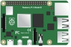 | 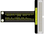 |        |  | 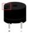 |  |
| ------------------------ | ------------------------ | ------------------------------ | ------------------------ | ------------------------ | ------------------------ |
| Raspberry Pi*1           | GPIO Extension Board*1   | 40 pin Colorful Jumper Wires*1 | Breadboard*1             | Passive Buzzer *1        | Jumper Wires             |

 Component Knowledge：

**Passive buzzer**：

Passive buzzer is a type of electronic buzzer with integrated structure.

Buzzers can be categorized as active and passive ones (see the following picture).

An active buzzer has a built-in oscillating source, so it will make sounds when electrified. But a passive buzzer does not have such source, so it will not tweet if DC signals are used; instead, you need to use square waves whose frequency is between 2K and 5K to drive it. The active buzzer is often more expensive than the passive one because of multiple built-in oscillating circuits.

 

Turn the pins of two buzzers face up, and the one with a green circuit board is a passive buzzer, while the other enclosed with a black tape is an active one, as shown：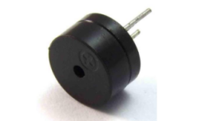

Passive buzzer provides alternating current to sound coils to make electronic magnet and permanent magnet attraction or repulsion so as to push vibration film to emit sound, according to electromagnetic induction. 

Only certain frequency with high and low levels can make passive buzzer emit sound, since DC current only makes vibration film vibrated continuously rather than producing sound.

 Schematic and Connection Diagram

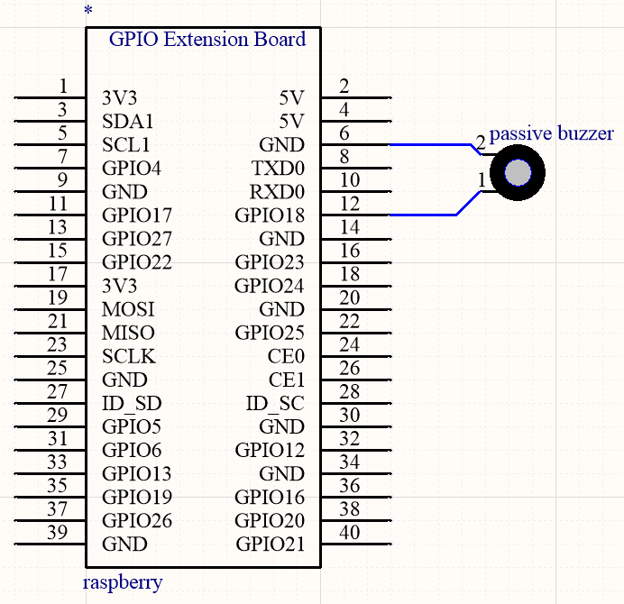

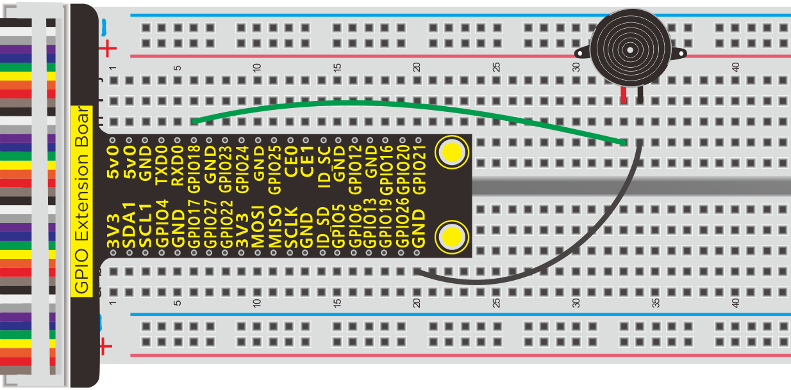

 Run Example Code1：

Input the following commands and press "Enter":

cd /home/pi/C_code/lesson9_Passive_Buzzer

gcc Passive_Buzzer1.c -o Passive_Buzzer1 -lwiringPi

sudo ./Passive_Buzzer1

 Test Result1：

Passive buzzer emits“do、re、mi、fa、sol、la、si”.

Note: Press Ctrl + C on keyboard and exit code running.

 Example Code1：

```c
##include <stdio.h>
##include <stdlib.h>
##include <stdint.h>
##include <wiringPi.h>

##define buzPin 1  //BCM GPIO 18

void init()
{
   if (wiringPiSetup () == -1)
       exit (1) ;
   pinMode(buzPin, PWM_OUTPUT); //Set the pin to PWM output mode
   pwmSetMode(PWM_MODE_MS);  // Set PWM signal mode to MS mode
   pwmSetClock(32);  // Set the clock base frequency to 19.2m /32=600KHZ
}

void beep(int freq,int t_ms)
{
   int range;
   if(freq<100||freq>1000)
   {
      printf("invalid freq");
      return;
   }
   // Set the range to 600KHZ/ Freq. That is, 
   //the freQ frequency period is composed of the range of 1/600khz.
   range=600000/freq;
   pwmSetRange(range);
   pwmWrite(buzPin,range/2);  // Set the duty cycle to 50%.
   if(t_ms>0)
   {
      delay(t_ms);
   }
}

int main()
{
   wiringPiSetup();
   init();

   while(1)
   { 
      beep(262,300);  //Frequency and time
      printf("do\n");
      beep(294,300);
      printf("re\n");
      beep(330,300);
      printf("mi\n");
      beep(349,300);
      printf("fa\n");
      beep(392,300);
      printf("so\n");
      beep(440,300);
      printf("la\n");
      beep(494,300);
      printf("si\n");
      beep(523,300);
      printf("Do\n");
      pwmWrite(buzPin,0);   //turn off the buzzer 
      delay(2000);  
   } 	  
}
```

 Run Example Code2：

Input the following commands and press "Enter".

cd /home/pi/C_code/lesson9_Passive_Buzzer

gcc Passive_Buzzer2.c -o Passive_Buzzer2 -lwiringPi

sudo ./Passive_Buzzer2

 Test Result2：

Passive buzzer plays a “Happy Birthday”song.

Note: Press Ctrl + C on keyboard and exit code running.

 **Example Code2：**

```c
##include <stdio.h>
##include <stdlib.h>
##include <stdint.h>
##include <wiringPi.h>
##define Do 262
##define Re 294
##define Mi 330
##define Fa 349
##define Sol 392
##define La 440
##define Si 494
##define Do_h 532
##define Re_h 587
##define Mi_h 659
##define Fa_h 698
##define Sol_h 784
##define La_h 880
##define Si_h 988

##define buzPin 1   //buzzer pin BCM GPIO 18

//The tones
int song_1[]=
{
    Sol,Sol,La,Sol,Do_h,Si,
    Sol,Sol,La,Sol,Re_h,Do_h,
    Sol,Sol,Sol_h,Mi_h,Do_h,Si,La,
    Fa_h,Fa_h,Mi_h,Do_h,Re_h,Do_h
};

//To the beat
float beat_1[]=
{
    0.5,0.5,1,1,1,1+1,
    0.5,0.5,1,1,1,1+1,
    0.5,0.5,1,1,1,1,1,
    0.5,0.5,1,1,1,1+1
};

int length;
int x;

void init()
{
   if (wiringPiSetup () == -1)
       exit (1) ;
   pinMode(buzPin, PWM_OUTPUT); //Set the pin to PWM output mode
   pwmSetMode(PWM_MODE_MS);  // Set PWM signal mode to MS mode
   pwmSetClock(32);  // Set the clock base frequency to 19.2m /32=600KHZ
}

void beep(int freq,int t_ms)
{
   int range;
   if(freq<100||freq>1000)
   {
      printf("invalid freq");
      return;
   }
   // Set the range to 600KHZ/ Freq. That is, 
   //the freQ frequency period is composed of the range of 1/600khz.
   range=600000/freq;
   pwmSetRange(range);
   pwmWrite(buzPin,range/2);  // Set the duty cycle to 50%.
   if(t_ms>0)
   {
      delay(t_ms);
   }
}

int main()
{
  wiringPiSetup();
  init();
  length=sizeof(song_1)/sizeof(song_1[0]); //Number of tones
  
  while(1)
  {
    for(x=0;x<length;x++)  //play
    {
      beep(song_1[x],500*beat_1[x]);
    }
    pwmWrite(buzPin,0);   //turn off buzzer
    delay(2000);  
  } 	  
}
```


### Project 10：1-Digit 7 Segment LED Display

 Description：

In this lesson, let’s learn how to control LED display.

 Experiment Components：

| 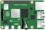 | 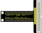 |        |  |  |  |  |
| ------------------------ | ------------------------ | ------------------------------ | ------------------------ | ------------------------ | ------------------------ | ------------------------ |
| Raspberry Pi*1           | GPIO Extension Board*1   | 40 pin Colorful Jumper Wires*1 | Breadboard*1             | 1-digit 7-seg LED*1      | 220ΩResistor*8           | Jumper Wires             |

 Component Knowledge：

**LED display：**

LED segment display is a semiconductor light-emitting device. Its basic unit is a light-emitting diode (LED).

For the common anode display, connect the common anode (COM) to +5V. When the cathode level of a certain segment is low, the segment is on; when the cathode level of a certain segment is high, the segment is off. 

For the common cathode display, connect the common cathode (COM) to GND. When the anode level of a certain segment is high, the segment is on; when the anode level of a certain segment is low, the segment is off.

Each segment of the display consists of an LED. So when you use it, you also need to use a current-limiting resistor. Otherwise, LED will be burnt out. 

When using 1-digit 7-segment display please notice that if it is common anode, the common anode pin connects to the power source; if it is common cathode, the common cathode pin connects to the GND.

Each of the LEDs in the display is given a positional segment with one of its connection pins led out from the rectangular plastic package. These LED pins are labeled from “a” through to “g” representing each individual LED. 

**Below is the seven-segment pin diagram.**

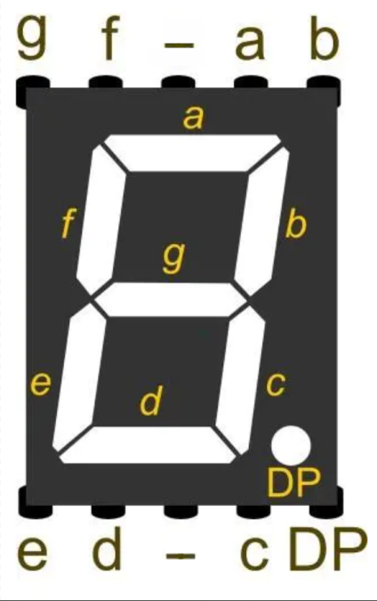

 Schematic Diagram：

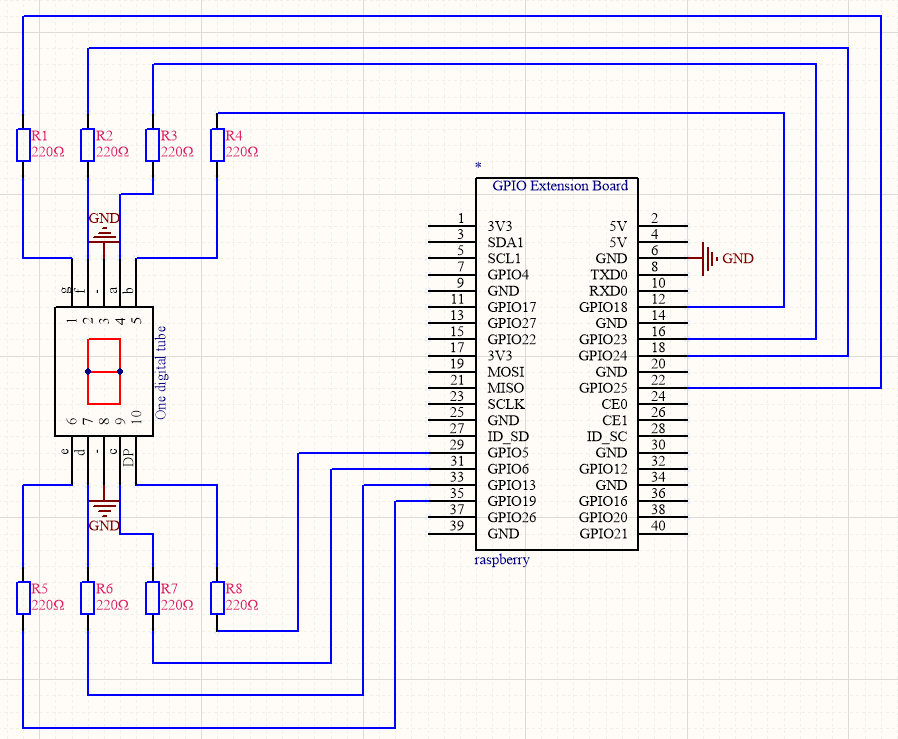

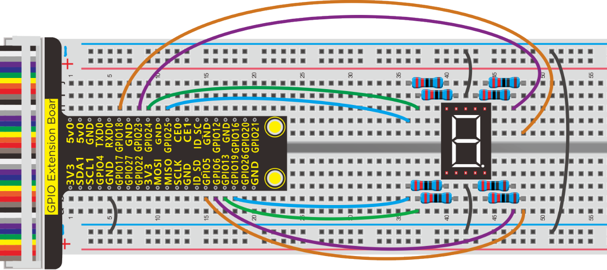

 Run Example Code：

Input the following commands and press "Enter":

cd /home/pi/C_code/lesson10_1_digit_LED_Segment_Display

gcc 1_digit_LED_Segment_Display.c -o 1_digit_LED_Segment_Display -lwiringPi

sudo ./1_digit_LED_Segment_Display

 Test Results：

LED display shows0\~9，in loop way.

Note: Press Ctrl + C on keyboard and exit code running.

 **Example Code：**

```c
##include <wiringPi.h>
//led pin
int a=4;  //GPIO23
int b=1;  //GPIO18
int c=22;  //GPIO6
int d=23;  //GPIO13
int e=24;  //GPIO19
int f=5;  // GPIO24
int g=6;  //GPIO25
int dp=21;  //GPIO5

int i;

void digital_0()//0
{
  digitalWrite(a,HIGH);
  digitalWrite(b,HIGH);
  digitalWrite(c,HIGH);
  digitalWrite(d,HIGH);
  digitalWrite(e,HIGH);
  digitalWrite(f,HIGH);
  digitalWrite(g,LOW);
  digitalWrite(dp,LOW);
}
void digital_1()//1
{
  digitalWrite(a,LOW);
  digitalWrite(b,HIGH); 
  digitalWrite(c,HIGH); 
  digitalWrite(d,LOW);
  digitalWrite(e,LOW); 
  digitalWrite(f,LOW);
  digitalWrite(g,LOW);
  digitalWrite(dp,LOW); 
}
void digital_2()//2
{
  digitalWrite(a,HIGH);
  digitalWrite(b,HIGH);
  digitalWrite(c,LOW);
  digitalWrite(d,HIGH);
  digitalWrite(e,HIGH);
  digitalWrite(f,LOW);
  digitalWrite(g,HIGH);
  digitalWrite(dp,LOW);
}
void digital_3()//3
{
  digitalWrite(a,HIGH);
  digitalWrite(b,HIGH);
  digitalWrite(c,HIGH);
  digitalWrite(d,HIGH);
  digitalWrite(e,LOW);
  digitalWrite(f,LOW);
  digitalWrite(g,HIGH);
  digitalWrite(dp,LOW);
}
void digital_4()//4
{
  digitalWrite(a,LOW);
  digitalWrite(b,HIGH);
  digitalWrite(c,HIGH);
  digitalWrite(d,LOW);
  digitalWrite(e,LOW);
  digitalWrite(f,HIGH);
  digitalWrite(g,HIGH);
  digitalWrite(dp,LOW);
}
void digital_5()//5
{
  digitalWrite(a,HIGH);
  digitalWrite(b,LOW);
  digitalWrite(c,HIGH);
  digitalWrite(d,HIGH);
  digitalWrite(e,LOW);
  digitalWrite(f,HIGH);
  digitalWrite(g,HIGH);
  digitalWrite(dp,LOW);
  digitalWrite(e,LOW);
}
void digital_6()//6
{
  digitalWrite(a,HIGH);
  digitalWrite(b,LOW);
  digitalWrite(c,HIGH);
  digitalWrite(d,HIGH);
  digitalWrite(e,HIGH);
  digitalWrite(f,HIGH);
  digitalWrite(g,HIGH);
  digitalWrite(dp,LOW);

}
void digital_7()//7
{
  digitalWrite(a,HIGH);
  digitalWrite(b,HIGH);
  digitalWrite(c,HIGH);
  digitalWrite(d,LOW);
  digitalWrite(e,LOW);
  digitalWrite(f,LOW);
  digitalWrite(g,LOW);
  digitalWrite(dp,LOW);
}
void digital_8()//8
{
  digitalWrite(a,HIGH);
  digitalWrite(b,HIGH);
  digitalWrite(c,HIGH);
  digitalWrite(d,HIGH);
  digitalWrite(e,HIGH);
  digitalWrite(f,HIGH);
  digitalWrite(g,HIGH);
  digitalWrite(dp,LOW);
}
void digital_9()//9
{
  digitalWrite(a,HIGH);
  digitalWrite(b,HIGH);
  digitalWrite(c,HIGH);
  digitalWrite(d,HIGH);
  digitalWrite(e,LOW);
  digitalWrite(f,HIGH);
  digitalWrite(g,HIGH);
  digitalWrite(dp,LOW);
}
int main()
{
  wiringPiSetup();

  for(i=22;i<=29;i++)
  {
    pinMode(i,OUTPUT); 
  }
  
  while(1)
  { 
    digital_0();//0
    delay(1000);
    digital_1();//1
    delay(1000);
    digital_2();//2
    delay(1000); 
    digital_3();//3
    delay(1000); 
    digital_4();//4
    delay(1000); 
    digital_5();//5
    delay(1000); 
    digital_6();//6
    delay(1000); 
    digital_7();//7
    delay(1000); 
    digital_8();//8
    delay(1000);
    digital_9();//9
    delay(1000);
  } 
}
```


### Project 11：4-Digit LED Display

 Description：

In previous lesson, the LED display only shows 1 digit number, whereas, we could try to operate 4 digit LED display.

 Experiment Components：

|  | 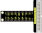 |        |  |  |  |  |
| ------------------------ | ------------------------ | ------------------------------ | ------------------------ | ------------------------ | ------------------------ | ------------------------ |
| Raspberry Pi*1           | GPIO Extension Board*1   | 40 pin Colorful Jumper Wires*1 | Breadboard*1             | 4-digit 7-seg LED*1      | 220Ω Resistor*8          | Jumper Wires             |

 Component Knowledge：

**digit LED display:**

The 4-digit LED display is divided into common anode and common cathode. Similar to 1-digit segment LED display, it is controlled display segment by 8 GPIO ports(8 LED lights). However, this is 4 digit display, 4 GPIO ports are required to control the bit selection terminal.

Ours is common cathode.

4-digit LED Display Pinout

Pin 1, 2, 3 and 4 are control pin of control bit

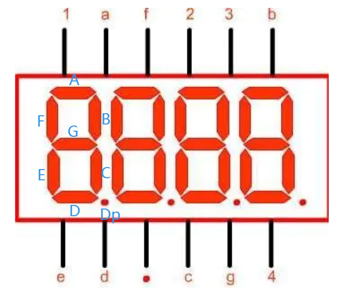

 Schematic Diagram


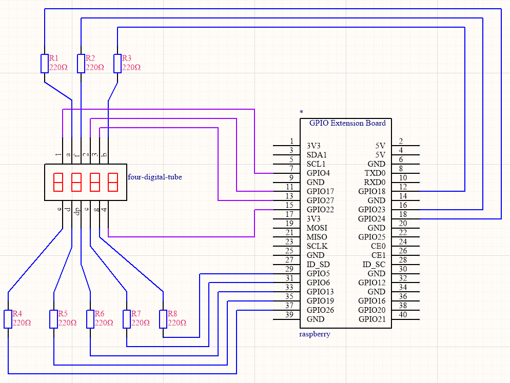

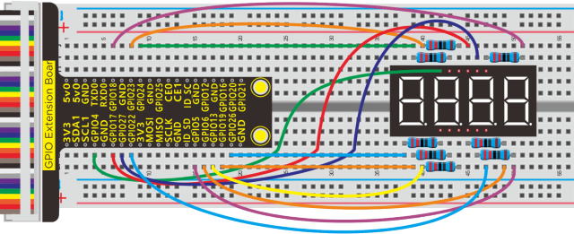

 Run Example Code：

Input the following commands and press "Enter":

cd /home/pi/C_code/lesson11_4_digit_LED_Segment_Display

gcc 4_digit_LED_Segment_Display.c -o 4_digit_LED_Segment_Display -lwiringPi

sudo ./4_digit_LED_Segment_Display

 Test Results：

4-digit LED display firstly shows“0000”, then plus 1 every time until it reaches“9999”, however, when “9999” adds 1, the value changes into“0000”.

Note: Press Ctrl + C on keyboard and exit code running.

 Example Code：

```c
##include <wiringPi.h>
int a = 5;// GPIO24
int b = 1; // GPIO18
int c = 22;// GPIO6
int d = 24;// GPIO19
int e = 25;// GPIO26
int f = 4;// GPIO23
int g = 21;// GPIO5
int dp = 23;// GPIO13

int d4 = 3;// GPIO22
int d3 = 2;// GPIO27
int d2 = 0;// GPIO17
int d1 = 7;// GPIO4
// set variable
long n = 1230;
int x = 100;
int del = 55;    // fine adjustment for clock
void WeiXuan(unsigned char n)//
{
  switch (n)
  {
    case 1:
      digitalWrite(d1, LOW);
      digitalWrite(d2, HIGH);
      digitalWrite(d3, HIGH);
      digitalWrite(d4, HIGH);
      break;
    case 2:
      digitalWrite(d1, HIGH);
      digitalWrite(d2, LOW);
      digitalWrite(d3, HIGH);
      digitalWrite(d4, HIGH);
      break;
    case 3:
      digitalWrite(d1, HIGH);
      digitalWrite(d2, HIGH);
      digitalWrite(d3, LOW);
      digitalWrite(d4, HIGH);
      break;
    case 4:
      digitalWrite(d1, HIGH);
      digitalWrite(d2, HIGH);
      digitalWrite(d3, HIGH);
      digitalWrite(d4, LOW);
      break;
    default :
      digitalWrite(d1, HIGH);
      digitalWrite(d2, HIGH);
      digitalWrite(d3, HIGH);
      digitalWrite(d4, HIGH);
      break;
  }
}
void Num_0()
{
  digitalWrite(a, HIGH);
  digitalWrite(b, HIGH);
  digitalWrite(c, HIGH);
  digitalWrite(d, HIGH);
  digitalWrite(e, HIGH);
  digitalWrite(f, HIGH);
  digitalWrite(g, LOW);
  digitalWrite(dp, LOW);
}
void Num_1()
{
  digitalWrite(a, LOW);
  digitalWrite(b, HIGH);
  digitalWrite(c, HIGH);
  digitalWrite(d, LOW);
  digitalWrite(e, LOW);
  digitalWrite(f, LOW);
  digitalWrite(g, LOW);
  digitalWrite(dp, LOW);
}
void Num_2()
{
  digitalWrite(a, HIGH);
  digitalWrite(b, HIGH);
  digitalWrite(c, LOW);
  digitalWrite(d, HIGH);
  digitalWrite(e, HIGH);
  digitalWrite(f, LOW);
  digitalWrite(g, HIGH);
  digitalWrite(dp, LOW);
}
void Num_3()
{
  digitalWrite(a, HIGH);
  digitalWrite(b, HIGH);
  digitalWrite(c, HIGH);
  digitalWrite(d, HIGH);
  digitalWrite(e, LOW);
  digitalWrite(f, LOW);
  digitalWrite(g, HIGH);
  digitalWrite(dp, LOW);
}
void Num_4()
{
  digitalWrite(a, LOW);
  digitalWrite(b, HIGH);
  digitalWrite(c, HIGH);
  digitalWrite(d, LOW);
  digitalWrite(e, LOW);
  digitalWrite(f, HIGH);
  digitalWrite(g, HIGH);
  digitalWrite(dp, LOW);
}
void Num_5()
{
  digitalWrite(a, HIGH);
  digitalWrite(b, LOW);
  digitalWrite(c, HIGH);
  digitalWrite(d, HIGH);
  digitalWrite(e, LOW);
  digitalWrite(f, HIGH);
  digitalWrite(g, HIGH);
  digitalWrite(dp, LOW);
}
void Num_6()
{
  digitalWrite(a, HIGH);
  digitalWrite(b, LOW);
  digitalWrite(c, HIGH);
  digitalWrite(d, HIGH);
  digitalWrite(e, HIGH);
  digitalWrite(f, HIGH);
  digitalWrite(g, HIGH);
  digitalWrite(dp, LOW);
}
void Num_7()
{
  digitalWrite(a, HIGH);
  digitalWrite(b, HIGH);
  digitalWrite(c, HIGH);
  digitalWrite(d, LOW);
  digitalWrite(e, LOW);
  digitalWrite(f, LOW);
  digitalWrite(g, LOW);
  digitalWrite(dp, LOW);
}
void Num_8()
{
  digitalWrite(a, HIGH);
  digitalWrite(b, HIGH);
  digitalWrite(c, HIGH);
  digitalWrite(d, HIGH);
  digitalWrite(e, HIGH);
  digitalWrite(f, HIGH);
  digitalWrite(g, HIGH);
  digitalWrite(dp, LOW);
}
void Num_9()
{
  digitalWrite(a, HIGH);
  digitalWrite(b, HIGH);
  digitalWrite(c, HIGH);
  digitalWrite(d, HIGH);
  digitalWrite(e, LOW);
  digitalWrite(f, HIGH);
  digitalWrite(g, HIGH);
  digitalWrite(dp, LOW);
}
void Clear()    // clear the screen
{
  digitalWrite(a, LOW);
  digitalWrite(b, LOW);
  digitalWrite(c, LOW);
  digitalWrite(d, LOW);
  digitalWrite(e, LOW);
  digitalWrite(f, LOW);
  digitalWrite(g, LOW);
  digitalWrite(dp, LOW);
}

void pickNumber(unsigned char n)// select number
{
  switch (n)
  {
    case 0: Num_0();
      break;
    case 1: Num_1();
      break;
    case 2: Num_2();
      break;
    case 3: Num_3();
      break;
    case 4: Num_4();
      break;
    case 5: Num_5();
      break;
    case 6: Num_6();
      break;
    case 7: Num_7();
      break;
    case 8: Num_8();
      break;
    case 9: Num_9();
      break;
    default: Clear();
      break;
  }
}
void Display(unsigned char x, unsigned char Number)//    take x as coordinate and display number
{
  WeiXuan(x);
  pickNumber(Number);
  delay(1);
  Clear() ; // clear the screen
} 


int i;
int main()
{
  
  wiringPiSetup();

  for(i=0;i<=7;i++)  //set pin OUTPUT mode
  {
    pinMode(i,OUTPUT);  
  } 
  for(i=21;i<=29;i++)
  {
    pinMode(i,OUTPUT);  
  } 

  while(1)
  { 
    int w=0;
    int s=0;
    int y=0;
    int z=0;
    unsigned long currentMillis = millis();  //The time it takes the program to run here

    while(z>=0)
    {
      while(millis()-currentMillis<1000)  //Refresh once a second
      {
        Display(1,w);
        Display(2,s);
        Display(3,y);
        Display(4,z);
      }
      currentMillis = millis(); 
      z++;  //  The units digit automatically adds 1
      if (z>9)  //If the units digit is greater than 9
      {
       y++;  //Ten digit plus 1
       z=0;  //Let's clear the units digit 0
      }
      if (y>9)
      {
       s++;
       y=0;
      }
      if (s>9) 
      {
       w++;
       s=0;
      }
      if (w>9) 
      {
       w=0;
       s=0;
       y=0;
       z=0;
      }
    }  
  }      
}
```

 Knowledge：

| FUNCTION                    | EXPLANATION                                                  |
| --------------------------- | ------------------------------------------------------------ |
| millis()-currentMillis\<100 | Import millis() function，which means the time of the display of 4 bit number is 100ms，that is, number changes each 100ms |
| Display(1,w);               | Call subfunction, set each bit to show number, 4 bit in total and set four numbers |

### Project 12：8*8 Dot Matrix

 Description：

In this chapter, let’s get down with a 8x8 LED dot matrix.

 Experiment Components：

| 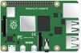 | 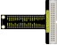 |        |  | 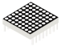 |  |  |
| ------------------------ | ------------------------ | ------------------------------ | ------------------------ | ------------------------ | ------------------------ | ------------------------ |
| Raspberry Pi*1           | GPIO Extension Board*1   | 40 pin Colorful Jumper Wires*1 | Breadboard*1             | 8\*8 LED Matrix\*1       | 220ΩResistor*8           | Jumper Wires             |

 Component Knowledge：

**8\*8 LED Matrix：**

8×8 matrix consists of 64 dots or pixels. There is a LED for each pixel and these LEDs are connected to total of 16 pins.

Generally, there are two types of dot matrix – common cathode and common anode.


Pic 1


Pic 2

 Schematic Diagram：

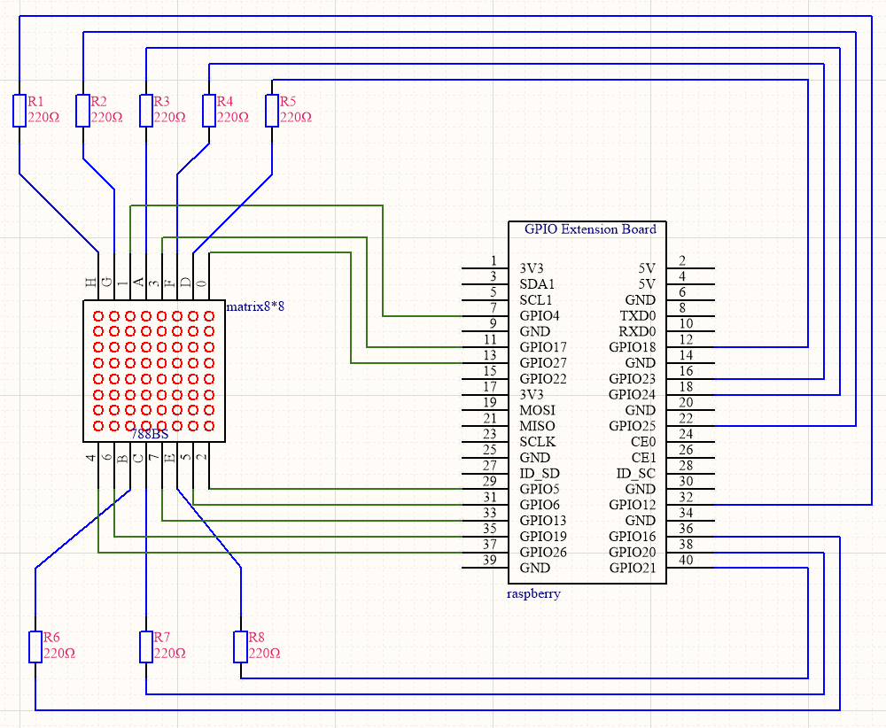

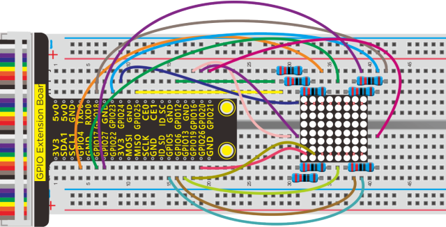

 Working Principle：

8\*8 is composed of LEDs. It will turn on if the positive is high level and negative is low level.

For the above figure, the first LED will be on if setting Y0(0) to HIGH and the rest of pins to LOW, X0(A) to LOW and the rest one to HIGH.

 Run Example Code：

Input the following commands and press "Enter":

cd /home/pi/C_code/lesson12_LED_Matrix

gcc LED_Matrix.c -o LED_Matrix -lwiringPi

sudo ./LED_Matrix

 Test Results：

The dot on 8\*8 dot matrix module gradually turns on until to full screen and then off.

Note: Press Ctrl + C on keyboard and exit code running.

 Example Code：

```c
##include <wiringPi.h>

int y[8]={2,7,21,0,25,22,24,23};  //Y direction pin
int x[8]={5,27,28,1,29,4,6,26};   //X direction pin

int main()
{
  wiringPiSetup();
  char i;
  char j;
  for(i=0;i<8;i++)  //Set both XY pins to output mode
  {
    pinMode(y[i],OUTPUT);
    pinMode(x[i],OUTPUT);
  }

  while(1)
  {
     for(j=0;j<8;j++)
    {
       digitalWrite(x[j], LOW);// set I/O pins as low
    }  
    for(i=0;i<8;i++)
    {
       digitalWrite(y[i], HIGH);// set I/O pins as high
        delay(200);       // delay
    }
     for(i=0;i<8;i++)
    {
       digitalWrite(y[i], LOW);// set I/O pins as low
        delay(200);       // delay
    }
  }    
}
```


### Project 13：74HC595

 Description：

In previous lesson, we control a 1-digit LED display with eight, which is wasteful. We need to figure out a method to save the use of GPIO ports. In fact, we need a 74HC595 CHIP.

 Experiment Components：

|  |  |        |  |      |
| ------------------------ | ------------------------ | ------------------------------ | ------------------------ | ---- |
| Raspberry Pi*1           | GPIO Extension Board*1   | 40 pin Colorful Jumper Wires*1 | Breadboard*1             |      |
|  | 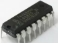 |        |  |      |
| 220Ω Resistor*8          | 74HC595N*1               | Jumper Wires                   | 1-digit 7- seg LED*1     |      |

 Component Knowledge：

**74HC595**：

The 74HC595 consists of an 8−bit shift register and an 8−bit D−type latch with three−state parallel outputs. The shift register accepts serial data  and  provides  a  serial  output.  The  shift  register  also  provides parallel  data  to  the  8−bit  latch.  The  shift  register  and  latch  have independent clock inputs. This device also has an asynchronous reset for the shift register.

**74HC595 Pinout：**

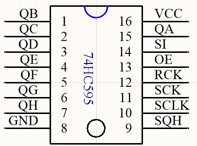

**74HC595 Control Protocol**

| PIN         | FUNCTION                                                     |
| ----------- | ------------------------------------------------------------ |
| 13 PIN OE   | Enable pin, not controlled by program when high level; <br />make it connect to GND when low level |
| 14 PIN SI   | This is pin receiving data, enter a bit each time and compose a byte if inputting eight times |
| 10 PIN SCLK | Shift register clear pin, used to clear out all data in shift register, <br />when low level, data will be cleared out. |
| 11 PIN SCK  | Clock pin of shift register, <br />the data inside will move backward and receive the data input when it is on rising edge. |
| 12 PIN RCK  | Clock input pin of latch register, <br />data from shift register will saved in latch register when it is on rising edge. <br />The data will be output from QA\~QH |
| 9 Pin SQH   | Cascade pin，connected to multiple 74HC595 chips             |

More details about 74HC595 chip, you could look through chip specification folder.

 Schematic Diagram：


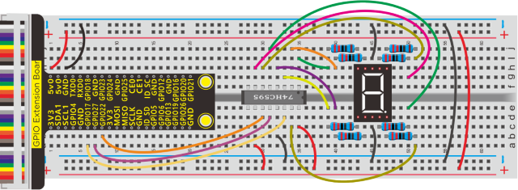

The output end QA~QH of 74HC595 respond to the pin DP, and g~a.

Why? Since the binary is counted from the right, programming will be convenient. For example, 1-digit display shows 0011 1111 , the first bit is 1 which equals to QA saved in 74HC595, then when the rest numbers are sent to 74HC595, 1 will be pushed to QH, and last bit 0 is placed on QA. However, the wiring is so inverse that the first bit of binary corresponds to a and last one to DIP controlling 1-digit display.

| 74HC595 |    |    |    |    |    |    |    |    |         |
|---------|----|----|----|----|----|----|----|----|---------|
|         | QH | QG | QF | QE | QD | QC | QB | QA |         |
|         | a  | b  | c  | d  | e  | f  | g  | dp |         |
| **0**   | 1  | 1  | 1  | 1  | 1  | 1  | 0  | 0  | **252** |
| **1**   | 0  | 1  | 1  | 0  | 0  | 0  | 0  | 0  | **96**  |
| **2**   | 1  | 1  | 0  | 1  | 1  | 0  | 1  | 0  | **218** |
| **3**   | 1  | 1  | 1  | 1  | 0  | 0  | 1  | 0  | **242** |
| **4**   | 0  | 1  | 1  | 0  | 0  | 1  | 1  | 0  | **102** |
| **5**   | 1  | 0  | 1  | 1  | 0  | 1  | 1  | 0  | **182** |
| **6**   | 1  | 0  | 1  | 1  | 1  | 1  | 1  | 0  | **190** |
| **7**   | 1  | 1  | 1  | 0  | 0  | 0  | 0  | 0  | **224** |
| **8**   | 1  | 1  | 1  | 1  | 1  | 1  | 1  | 0  | **254** |
| **9**   | 1  | 1  | 1  | 1  | 0  | 1  | 1  | 0  | **246** |

 Run Example Code：

Input the following commands and press "Enter":

cd /home/pi/C_code/lesson13_74HC595

gcc 74HC595.c -o 74HC595 -lwiringPi

sudo ./74HC595

 Test Results：

LED display shows 0\~9.

Note: Press Ctrl + C on keyboard and exit code running.

 Example Code：

```c
##include <wiringPi.h>
##include <wiringShift.h>
int dataPin = 0; //define three pins  BCM GPIO 17
int latchPin = 2; //BCM GPIO 22
int clockPin = 3; //BCM GPIO 27
int a[10]={252,96,218,242,102,182,190,224,254,246}; 
int x;
int main()
{
  wiringPiSetup();
 
  {
  pinMode(latchPin,OUTPUT);
  pinMode(clockPin,OUTPUT);
  pinMode(dataPin,OUTPUT); //three pins as output
  }
  
  while(1)
  { 
  for(x=0; x<10 ;x++ )                        //calculate counting function
  {
    digitalWrite(latchPin,LOW);
    shiftOut(dataPin,clockPin,MSBFIRST,a[x]);     //display array a[x]
    digitalWrite(latchPin,HIGH);
    delay(1000);
  }
  }	
}
```


### Project 14：Button-controlled LED

 Description：

Usually, a complete open loop control is made of external information input. Controller and actuator.

The external information is input into controller which can analyze the input data and send to control signals to make actuator to react.


A button-controlled LED is decided by an open loop control. Next, we will make a desk lamp with a button, an LED and RPi. LED is on when button is pressed, on the contrary, it will be off.

 Experiment Components：

|  | 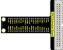 |        | 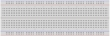 |  |
| ------------------------ | ------------------------ | ------------------------------ | ------------------------ | ------------------------ |
| Raspberry Pi*1           | GPIO Extension Board*1   | 40 pin Colorful Jumper Wires*1 | Breadboard*1             | LED - Red *1             |
|  |  |        | 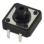 |                          |
| 220Ω Resistor*1          | Jumper Wires             | 10KΩ Resistor*1                | Button Switch *1         |                          |

 Schematic Diagram：

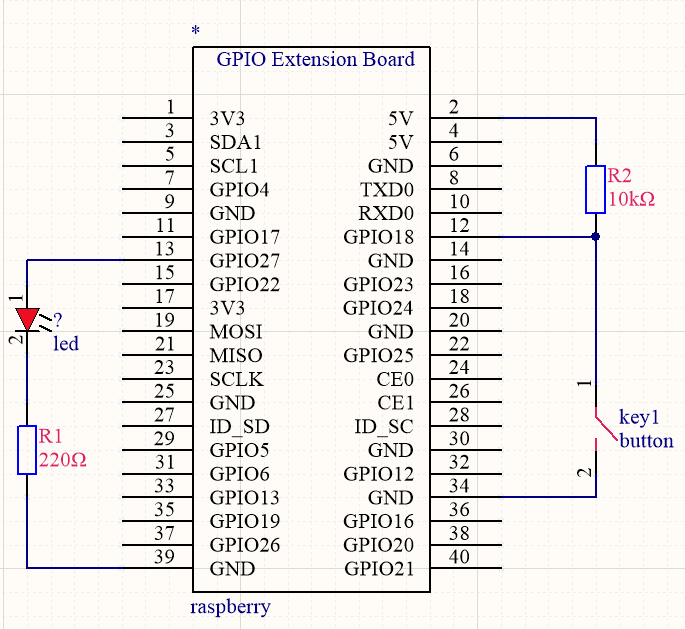

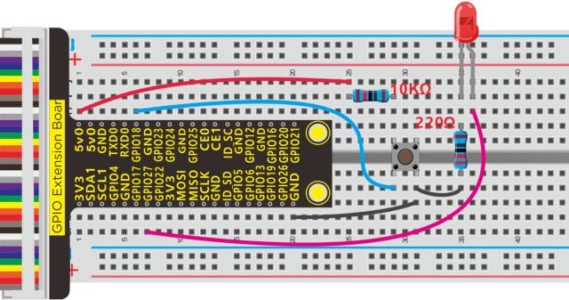

 Eliminate Button Shaking

The LED status won’t jump into new state immediately when button is pressed. There will be a short continuous shaking before into new status, which is similar with release status.


Therefore, there will be many a presses and release actions. The shaking will misleads the high speed movement of MCU, causing wrong judgement. That requires that we need to judge the button’ status frequently.

The button means being pressed when its status is stable.

 Run Example Code：

Input the following commands and press "Enter":

cd /home/pi/C_code/lesson14_Button_controlled_LED

gcc Button_controlled_LED.c -o Button_controlled_LED -lwiringPi

sudo ./Button_controlled_LED

 Test Results：

Press button, LED turns on, press again, LED is off.

Note: Press Ctrl + C on keyboard and exit code running.

 Example Code：

```c
##include <wiringPi.h>
##include <stdio.h>
##define btnPin 1  // button Pin BCM GPIO 18
##define ledPin 2  // LED pin BCM GPIO 27
  
int main()
{
  wiringPiSetup();
  int val; //Button variables
  int count = 0; //Record the number of button presses
  int flag = 0;  //Odd even variable
  pinMode(btnPin,INPUT);
  pinMode(ledPin,OUTPUT);
  digitalWrite(ledPin,LOW);  //turn off led
  
  while(1)
  { 
    val=digitalRead(btnPin);  //Receive button value
    if(val == 0)
    {
      delay(10);
      val=digitalRead(btnPin);  //Receive button value
      if(val == 1)
      {
        count = count + 1;
        printf("count = %d",count);
      }
    }
    flag = count % 2; //Remainder 2 ,Even is 0, odd is 1
    if(flag == 1)
      digitalWrite(ledPin,HIGH);  //turn on led
    else
      digitalWrite(ledPin,LOW);  //turn off led
  }	 
}
```


### Project 15：Responder

 Description：

A responder is someone who answers a question or who acts quickly in response to some event. In this lesson, we will show you how to make a responder and introduce its working principle.

 Experiment Components：

|  | 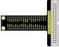 |        |  |  |  |
| ------------------------ | ------------------------ | ------------------------------ | ------------------------ | ------------------------ | ------------------------ |
| Raspberry Pi*1           | GPIO Extension Board*1   | 40 pin Colorful Jumper Wires*1 | Breadboard*1             | LED - Red *1             | LED - Green*1            |
|  |  |        |  |  |                          |
| LED - Yellow*1           | 220Ω Resistor*3          | Jumper Wires                   | 10KΩ Resistor*4          | Button Switch*4          |                          |

 Schematic Diagram：

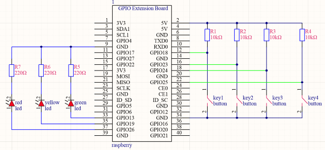

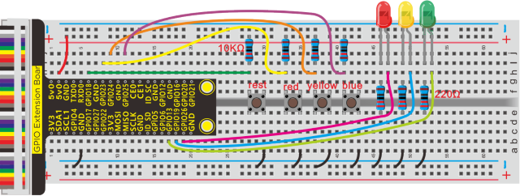

 Design Description：

You could assume a scene that three competitors in knowledge quiz.

Everyone has a responder and an LED. Corresponding LED will turn on if one presses his own responder, however, others’ won’t be on. What’s more, a questioner has a button to control their LEDs. After a round of game, LEDs are off, the quiz restarts.

 Run Example Code：

Input the following commands and press "Enter":

cd /home/pi/C_code/lesson15_Responder

gcc Responder.c -o Responder -lwiringPi

sudo ./Responder

 Test Results：

The corresponding LED will turn on if a competitor press his own responder, but others’ are off. The questioner press a button to turn off their LEDs and restart a new round quiz.

Note: Press Ctrl + C on keyboard and exit code running.

 Example Code：

```c
##include <wiringPi.h>

//define the pin
##define redled  25    //BCM GPIO 26
##define yellowled 24  //BCM GPIO 19
##define blueled 23    //BCM GPIO 13
##define redpin 4      //BCM GPIO 23
##define yellowpin 5   //BCM GPIO 24
##define bluepin 6     //BCM GPIO 25
##define restpin 1     //BCM GPIO 18

int red;
int yellow;
int blue;

void clear_led()// all LED off
{
   digitalWrite(redled,LOW);
   digitalWrite(blueled,LOW);
   digitalWrite(yellowled,LOW);
}
void RED_YES()// execute the code until red light is on; end cycle when reset button is pressed
{
   while(digitalRead(restpin)==1)
   {
      digitalWrite(redled,HIGH);
      digitalWrite(blueled,LOW);
      digitalWrite(yellowled,LOW);
   }
   clear_led();
}
void YELLOW_YES()// execute the code until yellow light is on; end cycle when reset button is pressed
{
   while(digitalRead(restpin)==1)
   {
      digitalWrite(redled,LOW);
      digitalWrite(blueled,LOW);
      digitalWrite(yellowled,HIGH);
   }
   clear_led();
}
void BLUE_YES()// execute the code until green light is on; end cycle when reset button is pressed
{
   while(digitalRead(restpin)==1)
   {
      digitalWrite(redled,LOW);
      digitalWrite(blueled,HIGH);
      digitalWrite(yellowled,LOW);
   }
   clear_led();
}

int main()
{
   wiringPiSetup();
   pinMode(redled,OUTPUT);
   pinMode(yellowled,OUTPUT);
   pinMode(blueled,OUTPUT);
   pinMode(redpin,INPUT);
   pinMode(yellowpin,INPUT);
   pinMode(bluepin,INPUT);
  
   while(1)
   { 
      //digital read button
      red=digitalRead(redpin);
      yellow=digitalRead(yellowpin);
      blue=digitalRead(bluepin);
      if(red==LOW)  //red is pressed
      {
         RED_YES(); 
      }
         
      if(yellow==LOW) //yellow is pressed
      {
         YELLOW_YES();
      }
      
      if(blue==LOW)  //blue is pressed
      {
         BLUE_YES();
      }
   }	
}
```


### Project 16：PIR Motion Sensor

 Description：

In this lesson, we will learn about PIR motion sensor.

 Experiment Components：

|  | 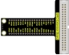 |        |  |  |
| ------------------------ | ------------------------ | ------------------------------ | ------------------------ | ------------------------ |
| Raspberry Pi*1           | GPIO Extension Board*1   | 40 pin Colorful Jumper Wires*1 | Breadboard*1             | LED - Red *1             |
|  | 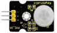 |        |                          |                          |
| 220Ω Resistor*1          | PIR Motion Sensor*1      | Jumper Wires                   |                          |                          |

 Component Knowledge：

**PIR Motion Sensor：**

The principle of human infrared sensor is that when certain crystals, such as lithium tantalite and triglyceride sulfate, are heated, the two ends of the crystal will generate an equal number of charges, with opposite signs, which can be converted into voltage output by an amplifier.

Human body will emit IR ray, although weak but can be detected. Sensor will output high level(1) when human being is detected by sensor, otherwise, it will output low level o.

Note: Nothing but moving person can be detected, with the detection distance is up to 3m.

 Schematic Diagram：

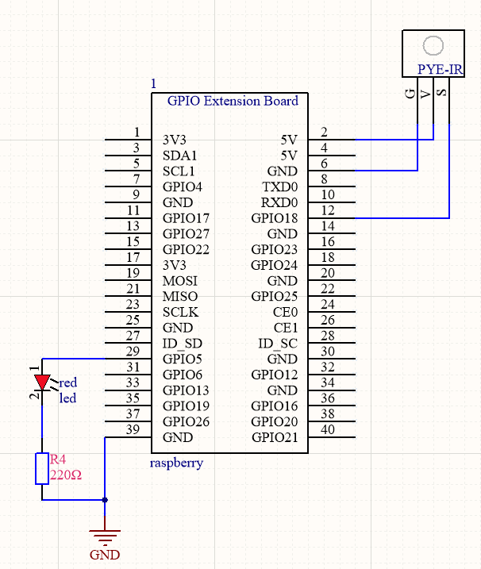

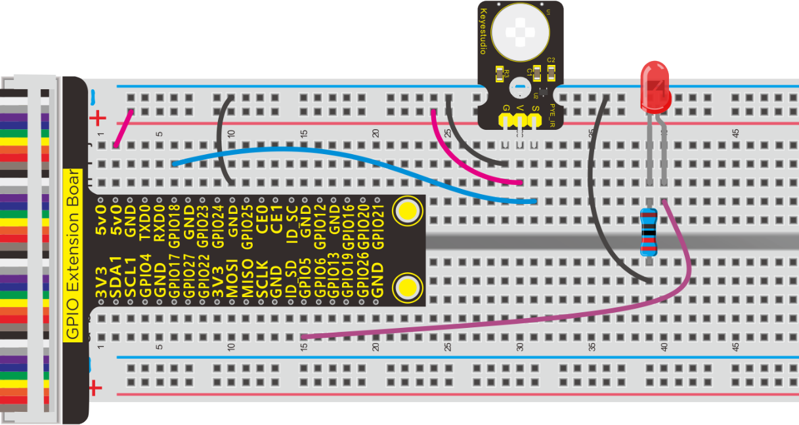

 Run Example Code：

Input the following commands and press "Enter":

cd /home/pi/C_code/lesson16_PIR_led

gcc PIR_led.c -o PIR_led -lwiringPi

sudo ./PIR_led

 Test Results：

LED will turn on and terminal prints somebody if PIR motion sensor detects people; if not, LED will be off and terminal will print nobody.

Note: Press Ctrl + C on keyboard and exit code running.

 Example Code：

```c
##include <wiringPi.h>
##include <pcf8591.h>
##include <stdio.h>

##define PIR_pin 1  //PIR pin  BCM GPIO 18
##define led_pin 21  //LED pin BCM GPIO 5

int main(void)
{
   int val = 0;
   wiringPiSetup();
   pinMode(PIR_pin,INPUT);
   pinMode(led_pin,OUTPUT);
     
   while(1)
   {
      val=digitalRead(PIR_pin);
      if(val==1)
      {
         printf("somebody\n");
         digitalWrite(led_pin,HIGH);
      }
      else
      {
         printf("nobody\n");
         digitalWrite(led_pin,LOW);
      }
}
}
```


### Project 17：Fire Alarm

 Description：

A flame detector is a sensor designed to detect and respond to the presence of a flame or fire, allowing flame detection.

 Experiment Components：

| 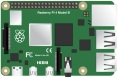 | 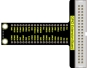 |        |  | 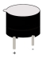 |
| ------------------------ | ------------------------ | ------------------------------ | ------------------------ | ------------------------ |
| Raspberry Pi*1           | GPIO Extension Board*1   | 40 pin Colorful Jumper Wires*1 | Breadboard*1             | Active Buzzer *1         |
|  |  |        |                          |                          |
| Flame Sensor *1          | 10KΩ Resistor*1          | Jumper Wires                   |                          |                          |

 Component Knowledge：

**Flame Sensor：**

Flame sensor is made based on the principle that infrared ray is highly sensitive to flame. It has an infrared receiving tube specially designed to detect fire, and then convert the flame brightness to fluctuating level signal. The signals are then input into the central processor and be dealt with accordingly.

Flame sensor is used to detect fire source with wavelength in 760nm～1100nm, detection angle is 60°. When its IR waves length is close to 940nm, and its sensitivity is highest.

Notice that keep flame sensor away from fire source to defend its damage for its working temperature is between -25°-85°.

 Schematic Diagram：

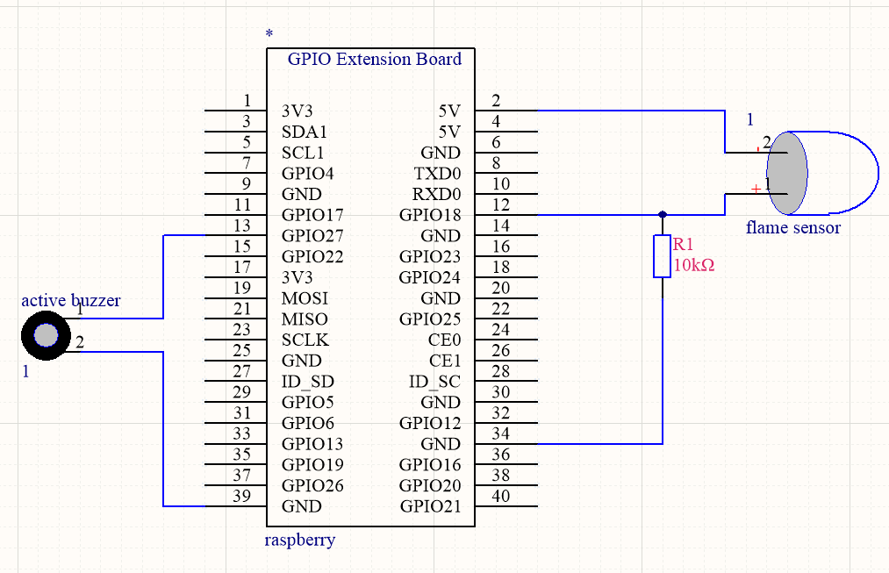

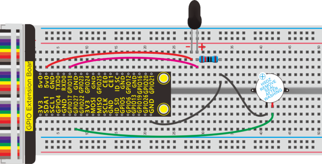

 Run Example Code：

Input the following commands and press "Enter":

cd /home/pi/C_code/lesson17_Flame_Sensor

gcc Flame_Sensor.c -o Flame_Sensor -lwiringPi

sudo ./Flame_Sensor

 Test Results：

Buzzer will alarm when detecting fire; otherwise, it will stop emitting sound.

Note: Press Ctrl + C on keyboard and exit code running.

 Example Code：

```c
##include <wiringPi.h>
##include <stdio.h>
##define flamePin 1  //BCM GPIO 18
##define buzPin 2  //define buzzer pin  BCM GPIO 27

int main()
{
  wiringPiSetup();
  char val;
  {
    pinMode(flamePin,INPUT);
    pinMode(buzPin,OUTPUT);
  }
  
  while(1)
  { 
   val=digitalRead(flamePin);
   printf("val = %d\n",val);
   if(val==1) //When flame is detected
    digitalWrite(buzPin,HIGH);  //Buzzer turn on
   else
    digitalWrite(buzPin,LOW);  //Buzzer turn off
  }	
}
```


### Project 18：Electronic Hourglass

 Description：

An hourglass (or sandglass, sand timer, sand clock or egg timer) is a device used to measure the passage of time. It comprises two glass bulbs connected vertically by a narrow neck that allows a regulated flow of a substance (historically sand) from the upper bulb to the lower one. 

Typically the upper and lower bulbs are symmetric so that the hourglass will measure the same duration regardless of orientation. The specific duration of time a given hourglass measures is determined by factors including the quantity and coarseness of the particulate matter, the bulb size, and the neck width.

 Experiment Components：

|  | 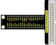 |        |  |  |
| ------------------------ | ------------------------ | ------------------------------ | ------------------------ | ------------------------ |
| Raspberry Pi*1           | GPIO Extension Board*1   | 40 pin Colorful Jumper Wires*1 | Breadboard*1             | LED - Red *2             |
|  |  |        |  |                          |
| 220Ω Resistor*2          | Ball Tilt Sensor*1       | 10KΩ Resistor*1                | Jumper Wires             |                          |

 Component Knowledge：

**Ball Tilt Sensor**：

Tilt sensors (tilt ball switch) allow you to detect orientation or inclination. They are small, inexpensive, low-power and easy-to-use. If used properly, they will not wear out. 

The tilt-switch twig is the equivalent of a button, and is used as a digital input. Inside the tilt switch is a ball that make contact with the pins when the case is upright. Tilt the case over and the balls don't touch, thus not making a connection. When the switch is level it is open, and when tilted, the switch closes.

It can be used for orientation detection, alarm device or others. 

Here is the principle of tilt sensor to illustrate how it works:


 Schematic Diagram：

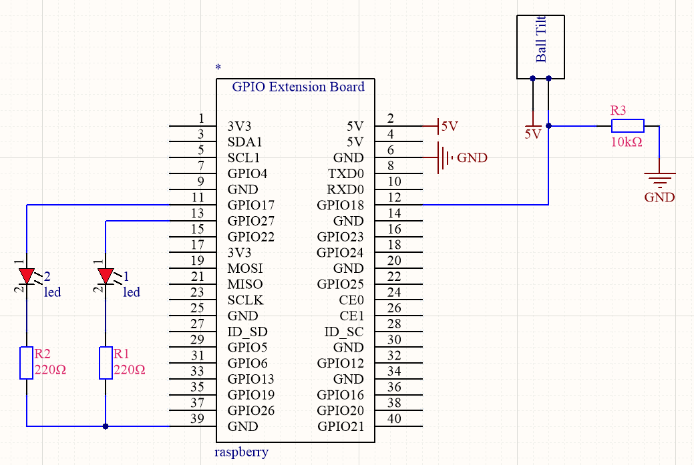

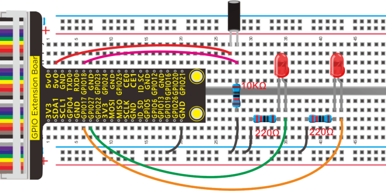

 Run Example Code：

Input the following commands and press "Enter":

cd /home/pi/C_code/lesson18_Ball_Tilt_Sensor

gcc Ball_Tilt_Sensor.c -o Ball_Tilt_Sensor -lwiringPi

sudo ./Ball_Tilt_Sensor

 Test Results：

Led1 gradually brightens and led2 gradually darkens when place electronic hourglass; however, as you make it upside down, led1 gradually darkens, led2 gets bright.

Note: Press Ctrl + C on keyboard and exit code running.

 Example Code：

```c
##include <stdio.h>
 ##include <stdlib.h>
 ##include <stdint.h>
 ##include <wiringPi.h>
 ##include <softPwm.h>

//define led pin
 ##define LED1 0  //BCM GPIO 17
 ##define LED2 2  //BCM GPIO 27
 //define Ball Tilt Sensor Pin
 ##define tiltPin 1  //BCM GPIO 18

 int main(void){
     int val;
     int val1 = 50;  //Initial value of LED brightness
     int val2 = 50;
     if (wiringPiSetup() == -1)
     {
        printf("Setup GPIO error!\n");
        return -1;
     }
     softPwmCreate(LED1, 0, 100);  //Define the pin as PWM output
     softPwmCreate(LED2, 0, 100); 
     while (1)
     {
        val=digitalRead(tiltPin); //Read the value of the tilt sensor
        if(val==0)  //upright
        {
          val1++;  //The value of LED1 increases
          val2--;  //Led2 value reduced
          if(val1>=100)  //The size of the limit
          {
            val1 = 100;
          }
          if(val2<=0) //The size of the limit
          {
            val2 = 0;
          }
          softPwmWrite(LED1, val1);  //The value after PWM output changes
          softPwmWrite(LED2, val2);
          delay(50);  //Delay, adjust the speed
        }
        else
        {
          val1--;
          val2++;
          if(val1<=0)
          {
            val1 = 0;
          }
          if(val2>=100)
          {
            val2 = 100;
          }
          softPwmWrite(LED1, val1);
          softPwmWrite(LED2, val2);
          delay(50);
        }
     }
  return 0;
}
```


### Project 19：Stepless Dimming

 Description：

A step-less dimming control method of a lighting system is applicable to the situations where a light source for a lighting terminal is a fluorescent lamp and/or an LED lamp.

 **Experiment Components：**

| 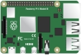       | 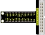 |        |  | 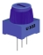 |
| ------------------------------ | ------------------------ | ------------------------------ | ------------------------ | ------------------------ |
| Raspberry Pi*1                 | GPIO Extension Board*1   | 40 pin Colorful Jumper Wires*1 | Breadboard*1             | Potentiometer*1          |
| 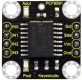       |  |                                |                          |                          |
| PCF8591 A/D Converter Module*1 | Jumper Wires             |                                |                          |                          |

 Component Knowledge：

**Keyestudio PCF8591 A/D Converter Module：**

Raspberry Pi doesn’t come with AD/DA function. It has to be connected AD/DA shield if it is connected to analog sensor. We use pcf8591 AD/DA converter which adopts iic communication. Therefore, the operation steps are shown below:

a. Enter sudo raspi-config and press “Enter” to navigate the configuration page.


b. Enable the I2C function according to the following pictures(press（↑）,（↓）,（←）,（→）on the keyboard and “Enter”）.


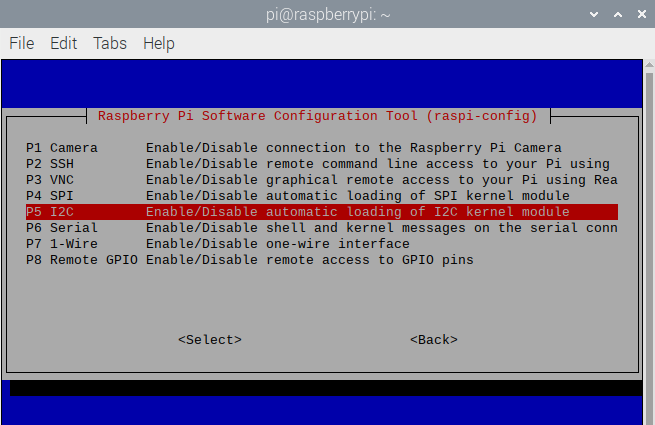


You could check more detail about I2C communication agreement in the following link:

<https://www.nxp.com/docs/en/user-guide/UM10204.pdf>

**PCF8591 Pins:**

More details about PCF8591 chip, you could look through chip specification folder

From the below figure, PCF8591 has an analog output pin Aout and four analog input pin A0-A3.

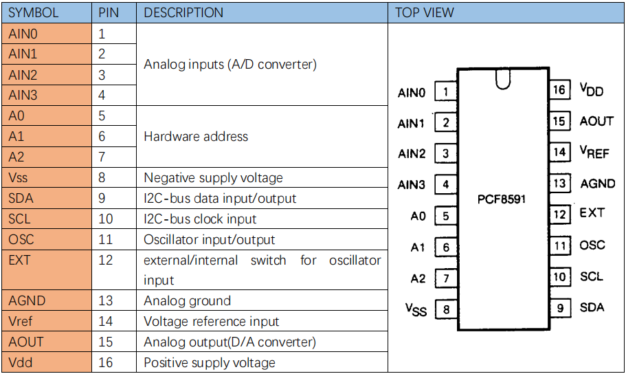

Check the address of iic module（PCF8591）of Raspberry Pi, enter command i2cdetect -y 1 and press Enter.

The iic address of PCF8591 is 0x48.

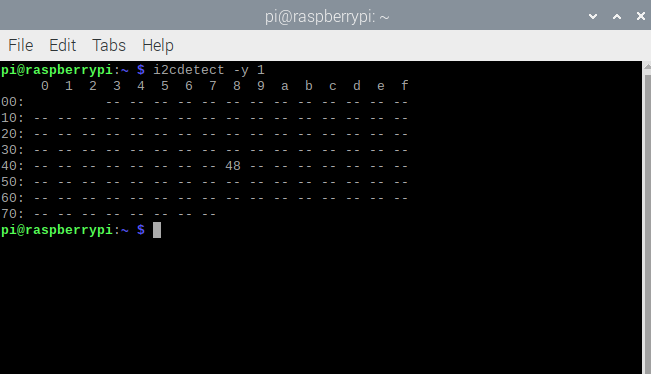

Used to read the address of pin A0\~A3.

The address of analog output pin AOUT: 0x40, that is, 64 converting from hexadecimal to decimal

A0 = 0x40 \##\##A0 ----\> port address

A1 = 0x41

A2 = 0x42

A3 = 0x43

**Adjustable Potentiometer**

The rotary potentiometer means the change of resistance.

We could convert the resistance’s change into the voltage’s when setting circuit. Then, voltage changes will be output to GPIO port through module signals.

Wiring according to the below figure and rotate clockwise, resistance value reduces.

 Schematic Diagram：

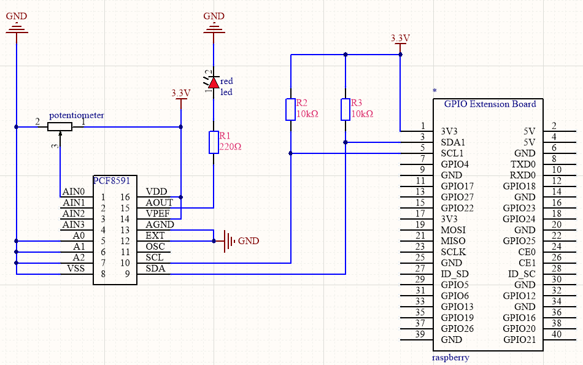


Note: PCF8591 module comes with an LED connected to Aout pint

 Run Example Code：

Input the following commands and press "Enter":

cd /home/pi/C_code/lesson19_PWM_control_LED

gcc PWM_control_LED.c -o PWM_control_LED -lwiringPi

sudo ./PWM_control_LED

 Test Results：

Terminal prints the analog value read by adjustable potentiometer. The LED brightness will vary with the the rotary of potentiometer.

Note: Press Ctrl + C on keyboard and exit code running

 Example Code：

```c
##include <wiringPi.h>
##include <pcf8591.h>  //pcf8591 library
##include <stdio.h>

##define Address 0x48  //iic address
##define BASE 64  //DAC write address
##define A0 BASE+0  //A0 analogRead  address
##define A1 BASE+1  //A1 analogRead  address
##define A2 BASE+2 
##define A3 BASE+3

int main(void)
{
      unsigned char value;
      wiringPiSetup();
      pcf8591Setup(BASE,Address);   //Initialize the pcf8591
        
     while(1)
     {
        value=analogRead(A0);    //read the ADC value of channel 0           
        printf("A0:%d\n",value);
        analogWrite(BASE,value);      //write the DAC value
        printf("AOUT:%d\n",value);
        delay(100);
     }
}
```

 Knowledge：

| \##define Address 0x48 pcf8591Setup(BASE,Address);                                            | Icc address of PCF8591 is set to 0x48                                                                                                       |
|----------------------------------------------------------------------------------------------|---------------------------------------------------------------------------------------------------------------------------------------------|
| \##define BASE 64 \##define A0 BASE+0 \##define A1 BASE+1 \##define A2 BASE+2 \##define A3 BASE+3 | pcf8591 analog port Set the address of A0 to 0x40 Set the address of A1 to 0x41 Set the address of A2 to 0x42 Set the address of A3 to 0x43 |

### Project 20：Photoresistor

 Description：

Photo resistor (Photovaristor) is a resistor whose resistance varies according to different incident light strength. It's made based on the photoelectric effect of semiconductor. In this lesson, let’s explain how it works.

 Experiment Components：

|  | 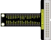 |        | 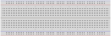 |  |
| ------------------------ | ------------------------ | ------------------------------ | ------------------------------------------------------------ | ------------------------ |
| Raspberry Pi*1           | GPIO Extension Board*1   | 40 pin Colorful Jumper Wires*1 | Breadboard*1                                                 | LED - Red *1             |
|  |  |        | 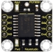                                     |  |
| 220Ω Resistor*1          | Photo Resistor*1         | 10KΩ Resistor*1                | PCF8591 A/D Converter Module*1                               | Jumper Wires             |

 Component Knowledge：

**Photoresistor：**

Photo resistor (Photovaristor) is a resistor whose resistance varies according to different incident light strength. It's made based on the photoelectric effect of semiconductor. If the incident light is intense, its resistance reduces; if the incident light is weak, the resistance increases. 

If incident light on a photoresistor exceeds a certain frequency, photons absorbed by the semiconductor give bound electrons enough energy to jump into the conduction band. The resulting free electrons (and their hole partners) conduct electricity, thereby lowering resistance. 

 Schematic Diagram：

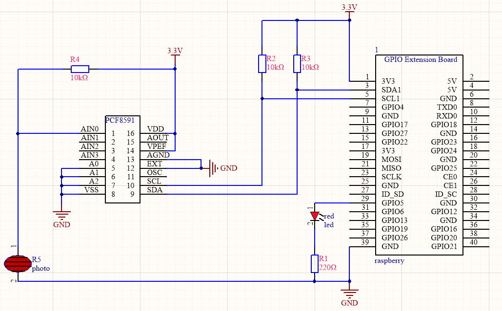


 Run Example Code：

Note: in the experiment, I2C communication is used. We need to check the iic address first( enter command：i2cdetect -y 1 and press “Enter”. If failed, check the wiring is correct or not. If correct, you need to enable I2C communication function of Raspberry Pi, project 19 is for your reference.

After enabling I2C communication, input the following commands and press "Enter":

cd /home/pi/C_code/lesson20_Photo_resistor

gcc Photo_resistor.c -o Photo_resistor -lwiringPi

sudo ./Photo_resistor

 Test Results：

Terminal prints the value tested by photoresistor. LED will turn on if the ambient environment is dim, otherwise, LED will be off.

Note: Press Ctrl + C on keyboard and exit code running.

 Example Code：

```c
##include <wiringPi.h>
##include <pcf8591.h>
##include <stdio.h>

##define Address 0x48
##define BASE 64
##define A0 BASE+0
##define A1 BASE+1
##define A2 BASE+2
##define A3 BASE+3

##define ledPin 21  //led pin BCM GPIO 5

int main(void)
{
     unsigned char value;
     wiringPiSetup();
     pcf8591Setup(BASE,Address);
     pinMode(ledPin,OUTPUT);
        
     while(1)
     {
        value=analogRead(A0);              
        printf("A0:%d\n",value);
        delay(100);
        if(value>100)
          digitalWrite(ledPin,HIGH);
        else
          digitalWrite(ledPin,LOW);
     }
}
```


### Project 21：Sound-activated Light

 Description：

You might find the lights automatically on when you pass them, nevertheless, they will be off if the surrounding is quiet. Do you know why?

Actually, it is sound sensor that controls them on and off.

 Experiment Components:

|  | 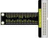 |        |        |  |
| ------------------------ | ------------------------ | ------------------------------ | ------------------------------ | ------------------------ |
| Raspberry Pi*1           | GPIO Extension Board*1   | 40 pin Colorful Jumper Wires*1 | Breadboard*1                   | LED - Red *1             |
|  | 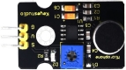 |        |        |                          |
| 220Ω Resistor*1          | Sound Sensor*1           | Jumper Wires                   | PCF8591 A/D Converter Module*1 |                          |

 Component Knowledge：

**Sound Sensor：**

A sound sensor is defined as a module that detects sound waves through its intensity and converting it to electrical signals.

The sound sensor has a built-in capacitive electret microphone which is highly sensitive to sound. Sound waves cause the thin film of the electret to vibrate and then the capacitance changes, thus producing the corresponding changed voltage. Since the voltage change is extremely weak, it needs to be amplified. So it is converted into a voltage ranging from 0 to 5V, which is received by data acquisition unit after A/D adapter conversion and then sent to an MCU.

The module can be applied to noise monitoring in traffic artery, and detection of noises within the boundary of industrial enterprises, factories, and construction sites, detection of noises in urban regions, and noise detection and assessment of living surroundings. 

 Schematic and Connection Diagram：

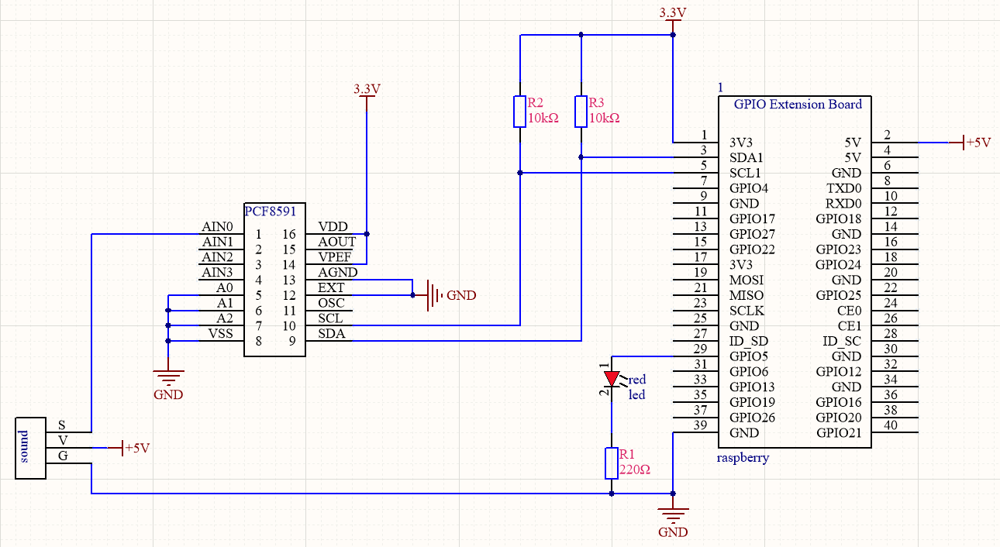

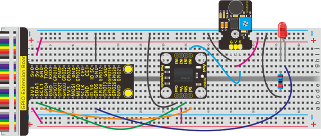

 Run Example Code：

Note: in the experiment, I2C communication is used. We need to check the iic address first( enter command：i2cdetect -y 1 and press“Enter”. If failed, check the wiring is correct or not. If correct, you need to enable I2C communication function of Raspberry Pi, project 19 is for your reference.

After enabling the I2C communication，input the following commands and press "Enter":

cd /home/pi/C_code/lesson21_sound

gcc Sound_led.c -o Sound_led -lwiringPi

sudo ./Sound_led

 Test Results：

When you clap your hands suddenly, LED lights up and clap again, LED is off.

Note: Press Ctrl + C on keyboard and exit code running.

 Example Code：

```c
##include <wiringPi.h>
##include <pcf8591.h>
##include <stdio.h>

##define Address 0x48
##define BASE 64
##define A0 BASE+0
##define A1 BASE+1
##define A2 BASE+2
##define A3 BASE+3

##define ledPin 21  //led pin  //BCM GPIO 5

int count = 0;
int flag = 0;

int main(void)
{
     unsigned char value;
     wiringPiSetup();
     pcf8591Setup(BASE,Address);
     pinMode(ledPin,OUTPUT);
        
     while(1)
     {
        value=analogRead(A0);  //Read the value of the sound sensor
        printf("A0:%d\n",value);
        delay(100);
        if(value>80)
        {
			count = count + 1;
			flag = count % 2;
		}
		if(flag == 1)
		{
			digitalWrite(ledPin,HIGH);
		}
        else
        {
			digitalWrite(ledPin,LOW);
		}
     }
}
```


### Project 22：LCD1602 & MQ-2 Gas Leakage Alarm

 Description：

Some households have access to gas, which is composed of CO, CO2, N2, H2 and CH4. CO is one of toxic gases. People will be in danger if absorbing too much CO. However, we could tackle with this problem over a gas leakage alarm.

Gas MQ-2 leakage alarm detects the presence of a combustible or toxic gas and react by displaying a reading, setting off an audible or visual alarm.

 Experiment Components：

|  | 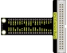   |        |  | 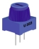 | 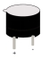 |
| ------------------------ | -------------------------- | ------------------------------ | ------------------------ | ------------------------ | ------------------------ |
| Raspberry Pi*1           | GPIO Extension Board*1     | 40 pin Colorful Jumper Wires*1 | Breadboard*1             | Potentiometer*1          | Active Buzzer *1         |
|  | 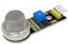   | 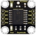       |  |  |                          |
| LCD1602 display*1        | Analog Gas MQ-2 Sensor * 1 | PCF8591 A/D Converter Module*1 | Jumper Wires             | M-F Dupont Line          |                          |

 Component Knowledge：

MQ-2 gas sensor adopts the material sensitive to gas------SnO2 with low electricity conductivity. When beset with combustible gas, its electricity conductivity varies with the of the concentration of flammable gas, however, the simple circuit could convert the change of  electricity conductivity into the output signals of the concentration of gas sensor.

MQ-2 gas sensor is a multi-purpose and cost-effective. It can detect the concentration of flammable gas and smoke in the range of 300~10000ppm.Meanwhile, it has high sensitivity to natural gas, liquefied petroleum gas and other smoke, especially to alkanes smoke. 

**LCD1602 LED Display：**

It could show the characters or numbers in 16 rows and 2 columns.

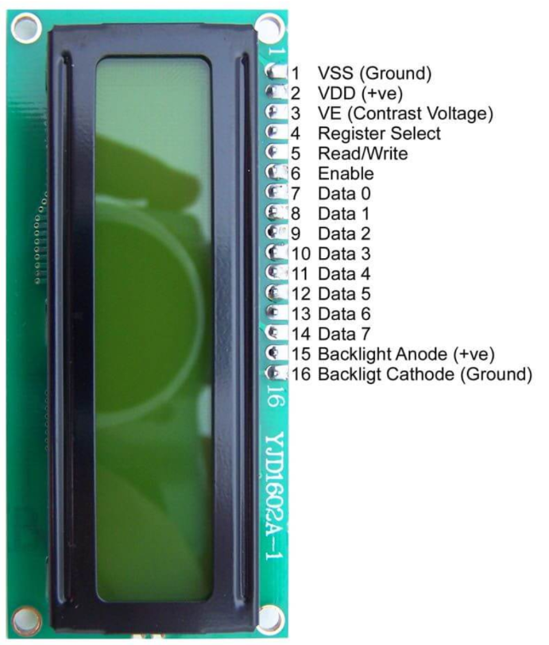

**1602 LCD Pins:**

|    PIN    | FUNCTION                                                     |
| :-------: | ------------------------------------------------------------ |
|   Pin 1   | GND                                                          |
|   Pin 2   | VCC is connected to positive of 5V                           |
|   Pin 3   | V0 is the contrast adjustment terminal of LCD. <br />The contrast is the weakest when the positive power is connected, and the contrast is the highest when the power is grounded (for high contrast causing double image a 10K potentiometer can help adjust contrast during use) |
|   Pin 4   | RS is register selection, <br />select data register when high level 1 and choose command register when low level 0 |
|   Pin 5   | RW is reading and writing signal line. <br />Reading operation actives if high level(1)，writing operation actives ig low level(0) |
|   Pin 6   | E(EN) is enable end, read information when high level(1), execute the command when low level(0) |
| Pin 7\~14 | D0～D7 are 8-bit two-way data ends                           |
|  Pin 15   | Positive of backlight                                        |
|  Pin 16   | Negative of backlight                                        |

LCD1602 usually uses eight data cable to provide the data of Data0\~Data7, however, it supports“4Bits”mode which is so called four data cables so as to save GPIO ports.

 Schematic Diagram：

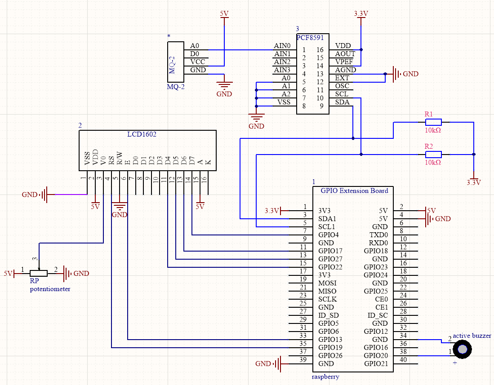

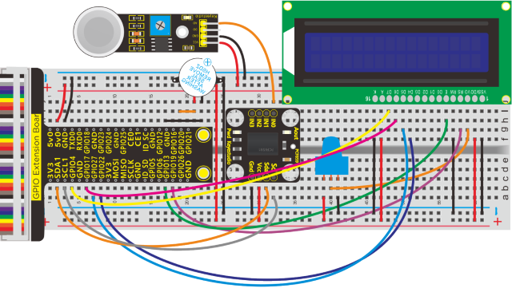

 Run Example Code：

Note: in the experiment, I2C communication is used. We need to check the iic address first( enter command：i2cdetect -y 1 and press“Enter”. If failed, check the wiring is correct or not. If correct, you need to enable I2C communication function of Raspberry Pi, project 19 is for your reference.

After enabling the I2C communication, input the following commands and press "Enter":

cd /home/pi/C_code/lesson22_LCD1602_MQ2

gcc 1602_MQ2.c -o 1602_MQ2 -lwiringPiDev -lwiringPi

sudo ./1602_MQ2

 Test Results：

Buzzer alarms when detecting the poisonous gas.

Note: Press Ctrl + C on keyboard and exit code running.

 Example Code：

```c
##include <stdio.h>
##include <stdlib.h>
##include <string.h>
##include <wiringPi.h>
##include <pcf8591.h>
##include <lcd.h>
##define Address 0x48
##define BASE 64
##define A0 BASE+0
##define A1 BASE+1
##define A2 BASE+2
##define A3 BASE+3

##define buzPin 28   //buzzer pin  BCM GPIO 20

void change(int num,char *src) //This function changes 1234 to 4321 of the string
{
	char temp = '\0';
	int m = 0;
	int i = 0;

	while(num != 0)
	{
		m = num%10;
		temp = m+'0';
		src[i] = temp;
		i++;
		num = num/10;
	}
	src[i] = '\0';
}

int main(void)
{
        unsigned char dat;
	wiringPiSetup();
        pcf8591Setup(BASE,Address);            
	int fd;
	int i;
	if (wiringPiSetup() == -1){
	exit(1);
	}
	fd = lcdInit(2,16,4, 24,23, 3,2,0,7,0,0,0,0); //set LCD pin
	printf("%d", fd);
	if (fd == -1){
	    printf("lcdInit 1 failed\n") ;
            return 1;
	}
	lcdClear(fd);
	{
            pinMode(buzPin,OUTPUT);
	}
	while(1){
	    
	    dat=analogRead(A0); 
	    if(dat>60)
	        digitalWrite(buzPin,HIGH);
	    else
	        digitalWrite(buzPin,LOW);
	    int i = 0;
	    int len = 0;
	    char temp; //Define an intermediate variable
	    char  *src = (char*)malloc(sizeof(char)*100);
	    change(dat,src);
	    len = strlen(src);
	    for(i = 0;i < len/2;i++) //Output the string in reverse order
	    {
		temp = src[i];
		src[i] = src[len-i-1];
		src[len-i-1] = temp;
	    }
            printf("MQ2:%d\n",dat);
	    lcdPosition(fd, 0, 0); 
            lcdPuts(fd, "MQ2");
	    lcdPosition(fd, 0, 1); 
	    lcdPuts(fd, src);
	    delay(100);
	    lcdClear(fd);
	}
   return 0;
}
```


### Project 23：Water Level Monitor

 Description：

If you have ever had a water heater explode or ever tried to make submersible electronics, then you know how important it is to detect when water is around.

Let’s know more about water level sensor.

 Experiment Components:

| 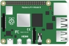 | 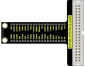       |        |  | 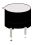 |
| ------------------------ | ------------------------------ | ------------------------------ | ------------------------ | ------------------------ |
| Raspberry Pi*1           | GPIO Extension Board*1         | 40 pin Colorful Jumper Wires*1 | Breadboard*1             | Active Buzzer *1         |
|  |        |        |  |                          |
| Water Level Sensor * 1   | PCF8591 A/D Converter Module*1 | Jumper Wires                   | M-F Dupont Line          |                          |

 Component Knowledge：

**Water Level Sensor：**

Our water sensor is easy- to-use, portable and cost-effective, designed to identify and detect water level and water drop.

This sensor measures the volume of water drop and water quantity through an array of traces of exposed parallel wires.

It could convert water content to analog signals, and output analog value could be used by function of application. It has the features of low consumption as well.

 Schematic and Connection Diagram：

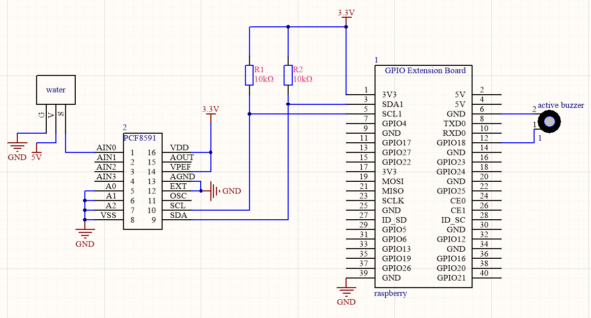
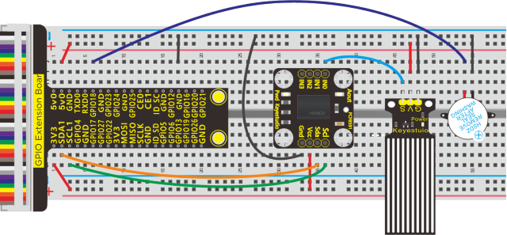

 Run Example Code：

Note: in the experiment, I2C communication is used. We need to check the iic address first( enter command：i2cdetect -y 1 and press“Enter”. If failed, check the wiring is correct or not. If correct, you need to enable I2C communication function of Raspberry Pi, project 19 is for your reference.

After enabling the I2C communication，input the following commands and press "Enter":

cd /home/pi/C_code/lesson23_water

gcc water.c -o water -lwiringPi

sudo ./water

 Test Results：

Buzzer makes a sound when water covering the exposed detection part.

Note: Press Ctrl + C on keyboard and exit code running.

 Example Code：

```c
##include <wiringPi.h>
##include <pcf8591.h>
##include <stdio.h>

##define Address 0x48
##define BASE 64
##define A0 BASE+0
##define A1 BASE+1
##define A2 BASE+2
##define A3 BASE+3

##define buzPin 1  //buzzer pin BCM GPIO 18

int main(void)
{
     unsigned char value;
     wiringPiSetup();
     pcf8591Setup(BASE,Address);
     pinMode(buzPin,OUTPUT);
        
     while(1)
     {
        value=analogRead(A0);  //Read the value of the water sensor
        printf("A0:%d\n",value);
        delay(100);
        if(value>30)
        {
	    digitalWrite(buzPin,HIGH);
        }
        else
        {
	    digitalWrite(buzPin,LOW);
	}
     }
}
```


### Project 24：5V Relay + Water Pump

 Description：

From a safety perspective, we specially designed this relay module with NO (normally open) and NC (normally closed) terminals. In this lesson, we will learn a special and easy-to-use switch, which is the relay module. Use the relay to start the motor. In daily life, the electronic device is driven by 220V AC and controlled by switch. People will be in danger once the electricity leakage happens, connecting switch to 220V AC directly.

Therefore, we design a relay module with NO and NC ends. Let’s get started.

 Experiment Components：

|   | 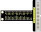  |                     |  | 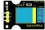  |
| ----------------------- | ----------------------- | ----------------------------------------- | ---------------------- | ----------------------- |
| Raspberry Pi*1          | GPIO Extension Board*1  | 40 pin Colorful Jumper Wires*1            | Breadboard*1           | Relay Module*1          |
|   |   | 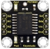                    |  |  |
| Water Pump*1            | Soil Humidity Sensor*1  | Keyestudio PCF8591 A/D Converter Module*1 | 220Ω Resistor*1        | Water Pipe*1            |
|  |  |                    |                        |                         |
| M-F Dupont Line         | Jumper Wires            | Screwdriver*1                             |                        |                         |

 Component Knowledge：

Relay: It is an "automatic switch" that uses a small current to control the operation of a large current.

Control input voltage: 5V

Rated load: 5A 250VAC (NO/NC) 5A 24VDC (NO/NC)

Rated load: You can use the 5V voltage of the Raspberry Pi to control a device with a DC voltage of 24V or an AC voltage of 250V.

**Water Pump**

-   Working voltage: DC3-5V,

-   Working current: 100-200mA,

-   Head: 0.3-0.8 meters,

-   Flow rate: 1.2-1.6L/min,

-   Weight: 28 grams

 Schematic Diagram：

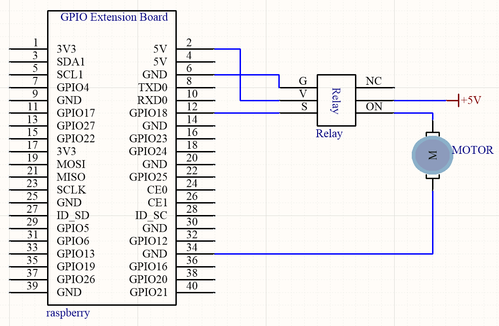

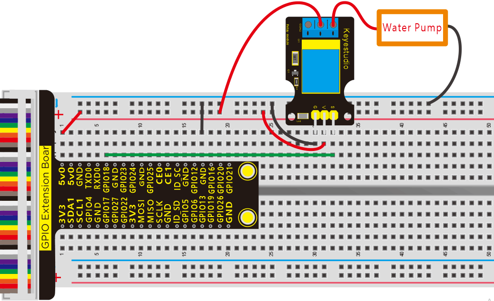

 Run Example Code：

Input the following commands and press "Enter":

cd /home/pi/C_code/lesson24_relay

gcc relay.c -o relay -lwiringPi

sudo ./relay

 Test Results：

Water pump activates when the indication on relay module turns on.

Note: Press Ctrl + C on keyboard and exit code running.

 Example Code：

```c
##include <wiringPi.h>
##include <stdio.h>

##define relayPin 1  //BCM GPIO 18

int main()
{
  wiringPiSetup();
  pinMode(relayPin,OUTPUT);
  
  while(1)
  { 
        digitalWrite(relayPin,HIGH);
        printf("turn on\n");
        delay(5000);
        digitalWrite(relayPin,LOW);
        printf("turn off\n");
        delay(1000);  
  }	
}
```


### Project 25： Flower-watering Device

 Description：

The household plants are popular in many a communities. They will die if you forget to water them, how about making an automatic watering device?

 Experiment Components：

|  |  |        |  | 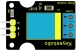 |
| ------------------------ | ------------------------ | ------------------------------ | ------------------------ | ------------------------ |
| Raspberry Pi*1           | GPIO Extension Board*1   | 40 pin Colorful Jumper Wires*1 | Breadboard*1             | Relay Module*1           |
| 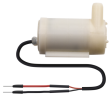 | 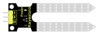 |        |  |  |
| Water Pump*1             | Soil Humidity Sensor*1   | PCF8591 A/D Converter Module*1 | 220Ω Resistor*1          | Water Pipe*1             |
|  |  |        |                          |                          |
| M-F Dupont Line          | Jumper Wires             | Screwdriver*1                  |                          |                          |

 Component Knowledge：

**Soil Humidity Sensor：**

This is a simple soil humidity sensor aims to detect the soil humidity. 

If the soil is in lack of water, the analog value output by the sensor will decrease; otherwise, it will increase. If you use this sensor to make an automatic watering device, it can detect whether your botany is thirsty to prevent it from withering when you go out. 

Using the sensor with controller makes your plant more comfortable and your garden smarter. The soil humidity sensor module is not as complicated as you might think, and if you need to detect the soil in your project, it will be your best choice.

 Schematic Diagram：

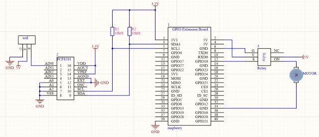

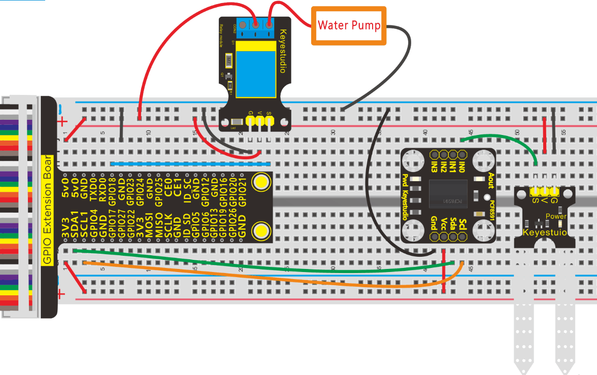

 Run Example Code：

Note: in the experiment, I2C communication is used. We need to check the iic address first( enter command：i2cdetect -y 1 and press“Enter”. If failed, check the wiring is correct or not. If correct, you need to enable I2C communication function of Raspberry Pi, project 19 is for your reference.

After enabling the I2C communication，input the following commands and press "Enter":

cd /home/pi/C_code/lesson25_soil

gcc soil.c -o soil -lwiringPi

sudo ./soil

 Test Results：

Water pump starts running when soil humidity sensor detects the drought of soil.

Note: Press Ctrl + C on keyboard and exit code running.

 Example Code：

```c
##include <wiringPi.h>
##include <pcf8591.h>
##include <stdio.h>

##define Address 0x48  //address  ---> device address
##define BASE 64    //DA converter command
##define A0 BASE+0  //A0  ----> port address
##define A1 BASE+1
##define A2 BASE+2
##define A3 BASE+3

##define relayPin 1  //BCM GPIO 18

int main(void)
{
     unsigned char value;
     wiringPiSetup();
     pcf8591Setup(BASE,Address);  //which port of the device you want to access
     pinMode(relayPin,OUTPUT);
        
     while(1)
     {
        value=analogRead(A0);              
        printf("A0:%d\n",value);
        delay(100);
        if(value<30)
            digitalWrite(relayPin,HIGH);
        else
            digitalWrite(relayPin,LOW);
       }
     }
```


### Project 26：OLED Display

 Description：

OLED display is the most commonly used for cellphone screen, thanks to its characteristics of high resolution, small-sized and high brightness.

 Experiment Components：


 Component Knowledge：

-   OLED display**：**

-   Use SSD1306 chip to drive

-   Communication: IIC communication

-   Size: 0.96inch

-   Resolution: 128\*96

-   Display Color: Blue

 Schematic Diagram：


 Run Example Code：

Note: in the experiment, I2C communication is used. We need to check the iic address first( enter command：i2cdetect -y 1 and press“Enter”. If failed, check the wiring is correct or not. If correct, you need to enable I2C communication function of Raspberry Pi, project 19 is for your reference.

After enabling the I2C communication, input the following commands and press "Enter":

cd /home/pi/C_code/lesson26_OLED/ssd1306_i2c-master

gcc demo.c ssd1306_i2c.c -o demo -lwiringPi

sudo ./demo

 Test Results：

OLED display shows character strings and roll to right, and show keyes and two rectangles on the left.

Note: Press Ctrl + C on keyboard and exit code running.

 Example Code：

```c
/******
Demo for ssd1306 i2c driver for  Raspberry Pi 
******/

##include "ssd1306_i2c.h"

int x = 30;

void main() {
	ssd1306_begin(SSD1306_SWITCHCAPVCC, SSD1306_I2C_ADDRESS);   //Initialize the OLED
	
	while(1)
	{
		ssd1306_clearDisplay();   //Clear the screen
		ssd1306_setTextSize(1);  //Define font size
		char* text = "This is demo for SSD1306 i2c driver for Raspberry Pi";
		ssd1306_drawString(text);  //load string
		ssd1306_display();  //display
		delay(1000);
		

		ssd1306_dim(1);  //Whether or not the display is fuzzy
		ssd1306_startscrollright(00,0xFF);  //Scroll to the right
		delay(1000);
		ssd1306_stopscroll();  //stop scroll

		ssd1306_clearDisplay();
		char c[] = "keyes";
		for(int i=0; i<5; i++)  //Five characters
		{
			ssd1306_drawChar(x, 20, c[i], WHITE, 1);  //Specifies the coordinate display character
			x = x + 6; //When the font size is 1, the font pixel is 6*8
		}
		//ssd1306_drawChar(30, 20, c[1], WHITE, 1);  //Specifies the coordinate display character
		ssd1306_display();  //display
		delay(3000);

		ssd1306_clearDisplay();
		ssd1306_fillRect(10,10, 50, 20, WHITE); //Draw a fill rectangle
		ssd1306_fillRect(80, 10, 130, 50, WHITE);
		ssd1306_display();
		delay(5000);
	}
	
}
```

You could look through ssd1306_i2c.h file if intend to use more functions.

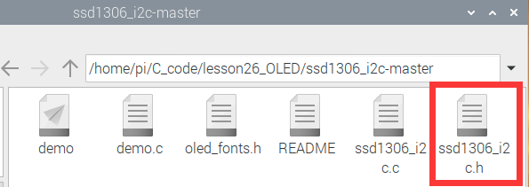

### Project 27：Servo

 Description：

Servo is applied widely, especially for robot like human robots and moving robots. In this lesson, we will learn how it works.

 Experiment Components：

|  |  |        |  | 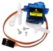 |  |
| ------------------------ | ------------------------ | ------------------------------ | ------------------------ | ------------------------ | ------------------------ |
| Raspberry Pi*1           | GPIO Extension Board*1   | 40 pin Colorful Jumper Wires*1 | Breadboard*1             | Servo Motor*1            | Jumper Wires             |

 Component Knowledge：

**Servo:**

A location(angle) driver which can rotate a certain angle with high accuracy. It has three external wires which are brown, red and orange,. Brown one is grounded, red one is positive pole of power and orange one is signal wire.

The rotation angle of servo motor is controlled by regulating the duty cycle of PWM (Pulse-Width Modulation) signal. The standard cycle of PWM signal is 20ms (50Hz). Theoretically, the width is distributed between 1ms-2ms, but in fact, it's between 0.5ms-2.5ms. The width corresponds the rotation angle from 0° to 180°. But note that for different brand motor, the same signal may have different rotation angle.  

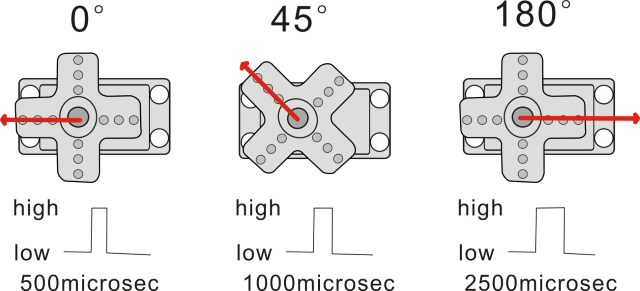

 Schematic Diagram：


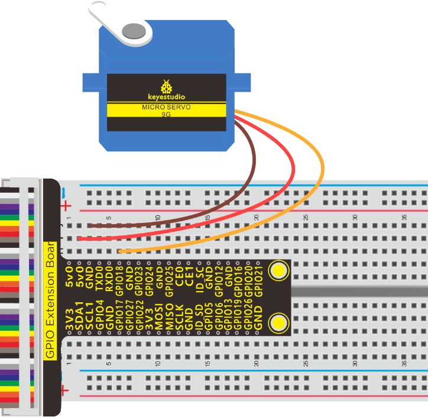

 Run Example Code：

Input the following commands and press "Enter":

cd /home/pi/C_code/lesson27_Servo

gcc Servo.c -o Servo -lwiringPi

sudo ./Servo

 Test Results：

Servo rotates in the range of 0°-180°.

Note: Press Ctrl + C on keyboard and exit code running.

 Example Code：

```c
##include <wiringPi.h>
##define serPin 1 //servo pin BCM GPIO 18

int main()
{
	wiringPiSetup();
	pinMode(serPin,OUTPUT);
	int i;
	for(;;)
	{
		for(i=0;i<50;i++)            
		{
			digitalWrite(serPin,HIGH);
			delayMicroseconds(500); //Pulse width 0.5ms, Angle 0
			digitalWrite(serPin,LOW);
			delay(20-0.5);	//Cycle 20 ms
		}
		
		delay(1000);
		for(i=0;i<50;i++)         
		{
			digitalWrite(serPin,HIGH);
			delayMicroseconds(2500);
			digitalWrite(serPin,LOW);
			delay(20-2.5);
		}
        delay(1000);
	}
	return 0;
}
```


### Project 28：L293D Driver Motor

 Description：

In generally, we use a DC motor to make smart car. What should we do if we want to control the rotation speed and direction? Here, we need an L293D driver motor.

 Experiment Components:

|  | 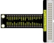 |        |  |  |
| ------------------------ | ------------------------ | ------------------------------ | ------------------------ | ------------------------ |
| Raspberry Pi*1           | GPIO Extension Board*1   | 40 pin Colorful Jumper Wires*1 | Breadboard*1             | Jumper Wires             |
| 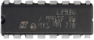 |  |                                |                          |                          |
| L293D Chip*1             | Motor*1                  |                                |                          |                          |

 Component Knowledge:

**L293D Chip:**

It is a DC current DC IC which is applied to drive DC motor and stepper motor. In addition, it has 16 pins driving two-way DC motor at same time.

Input voltage range: 4.5 V ~ 36 V

Output current: MAX 600mA, can drive inductive loaded, especially its input end can be connected to MCU directly, controlled by MCU easily.

The two-channel motor can be driven and rotate clockwise and anticlockwise when changing the high and low level on input port.


|  \##  | Pin Name | Description                                         |
| :--: | :------: | --------------------------------------------------- |
|  1   | Enable1  | Enable pin input 1(2) and Input 2(7)                |
|  2   |   In1    | Control output1 and controlled  by digital circuit  |
|  3   |   Out1   | Connect one end of motor1                           |
|  4   |    0V    | Connected to 0V of circuit.                         |
|  5   |    0V    | Connected to 0V of circuit.                         |
|  6   |   Out2   | Connect the other end of motor1                     |
|  7   |   In2    | Control output2 and controlled  by digital circuit  |
|  8   | +V motor | Connect to 4.5V-36V) of motor                       |
|  9   | Enable2  | Enable pin input 3(10) and 4(15)                    |
|  10  |   In3    | Control output pin 3                                |
|  11  |   Out3   | Connect one end of motor 2                          |
|  12  |    0V    | Connected to 0V of circuit.                         |
|  13  |    0V    | Connected to 0V of circuit.                         |
|  14  |   Out4   | Connect the other end of motor 2                    |
|  15  |   In4    | Control output 4 and controlled by  digital circuit |
|  16  |    +V    | Connect to + 5V to enable IC function               |

 Schematic Diagram：

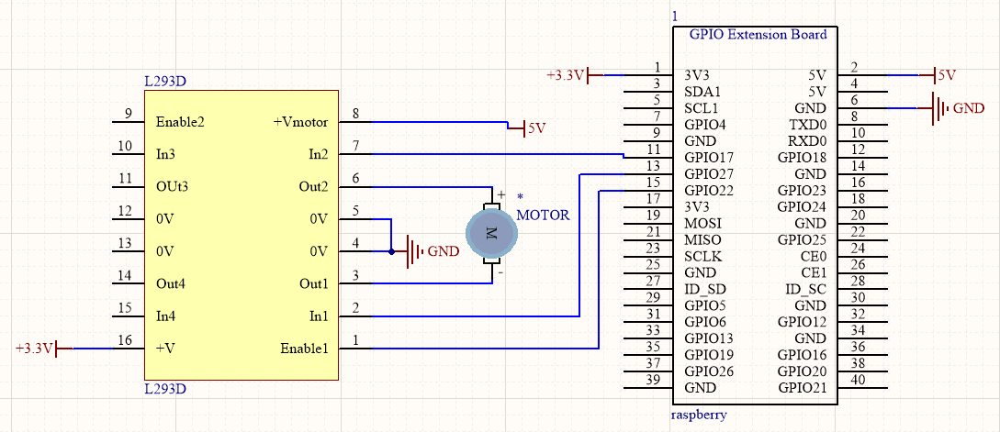


 Run Example Code：

Input the following commands and press "Enter":

cd /home/pi/C_code/lesson28_L293D

gcc L293D.c -o L293D -lwiringPi

sudo ./L293D

 Test Results：

Motor rotates clockwise for 3s, stops for 2s, anticlockwise for 3s and stops for 2 s.

Note: Press Ctrl + C on keyboard and exit code running.

 Example Code：

```c
##include <stdio.h>
##include <stdlib.h>
##include <stdint.h>
##include <wiringPi.h>
##include <softPwm.h>

//define L293D pin
##define INA1 0  //BCM GPIO 17
##define INA2 2  //BCM GPIO 27
##define ENA  3  //BCM GPIO 22

void forward()
{
	digitalWrite(INA1,HIGH);
	digitalWrite(INA2,LOW);
	softPwmWrite(ENA, 80); //pwm : 0~100
}
void reverse()
{
	digitalWrite(INA1,LOW);
	digitalWrite(INA2,HIGH);
	softPwmWrite(ENA, 80);  //pwm : 0~100
}
void stop()
{
	digitalWrite(INA1,LOW);
	digitalWrite(INA2,LOW);
	softPwmWrite(ENA, 0);
}

int main(void)
{
	wiringPiSetup();
	pinMode(INA1,OUTPUT);
	pinMode(INA2,OUTPUT);
	softPwmCreate(ENA, 0, 100);
	
	while(1)
	{
		forward();
		delay(3000);
		stop();
		delay(2000);
		reverse();
		delay(3000);
		stop();
		delay(2000);
	}
	
	return 0;
}
```


### Project 29：ULN2003 Stepper Motor Driver

 Description：

Stepper motor is applied widely in our daily life, such as hard drives, 3D printers, CNC machine tools, robots, etc.

Let’s get started with stepper motor.

 Experiment Components：

| 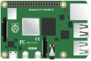 | 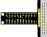              |        | 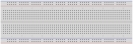 |
| ------------------------ | ------------------------------------- | ------------------------------ | ------------------------ |
| Raspberry Pi*1           | GPIO Extension Board*1                | 40 pin Colorful Jumper Wires*1 | Breadboard*1             |
| 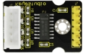 | 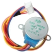              |        |  |
| Driver Board ULN2003*1   | Keyestudio 5V 4-Phase Stepper Motor*1 | M-F Dupont Line                | Jumper Wires             |

 Component Knowledge:

**28BYJ-48 Stepper Motor：**

Stepper motor consists of stators and rotors. Stators are fixed, as shown below, which are the part A, B, C and D coils surround. The coil set will produce magnetic field when electrified. The rotor is the rotation part( the centre part of stators), as shown below:


**Single -Phase four Beat**

The poles of rotor point at A coil when it is electrified, then it is disconnected, B is connected, rotor rotates to C; then C is disconnected and D is connected, rotor rotates to D; however, D is disconnected and A is electrified, rotor rotates to A. Therefore, rotor turns 180° and continuously rotates B-C-D-A, which means it runs a circle (eight phase). As shown below, the rotation principle of stepper motor is A - B - C - D - A 

The poles of rotor points at A coil when A is electrified; then it is cut, B coil is connected.

You make order inverse(D - C - B - A - D .....) if you want to make stepper motor rotate anticlockwise.

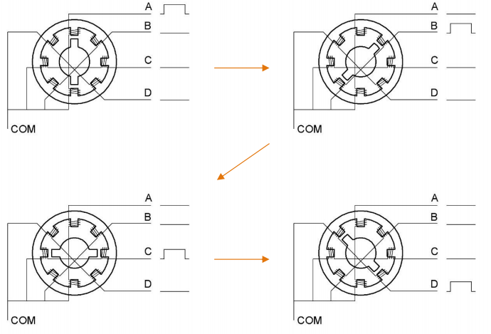

**Half-phase and eight beat**

8 beat adopts single and dual beat way，A - AB - B - BC - C - CD - D - DA - A ...... ，rotor will rotate half phase in this order. 

For example, when A coil is electrified，rotor faces to A coil  then A and B coil are connected, on this condition, the strongest magnetic field produced lies in the central part of AB coil, which means rotating half-phase clockwise.

**Stepper Motor Parameters**：

The rotor rotates one circle when the stepper motor we provide rotates 32 phases and with the output shaft driven by 1:64 reduction geared set.

Therefore the rotation (a circle) of output shaft requires 2048 phases.

The step angle of 4-beat mode of 5V and 4-phase stepper motor is 11.25. And the step angle of 8-beat mode is 5.625, the reduction ratio is 1:64.

More details about ULN2003 chip, you could look through chip specification folder.

 Schematic Diagram:

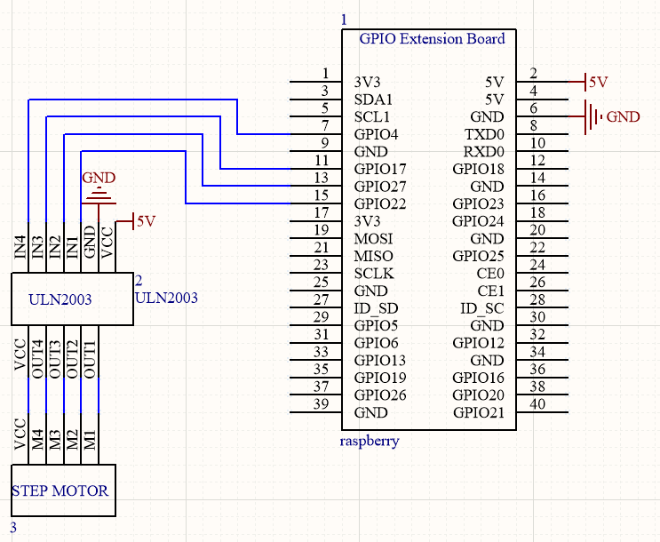


 Run Example Code：

Input the following commands and press "Enter":

cd /home/pi/C_code/lesson29_ULN2003

gcc ULN2003.c -o ULN2003 -lwiringPi

sudo ./ULN2003

 Test Results：

Rotate anticlockwise for one circle and stop for 3s and one circle in clockwise orientation, stop for 3s.

Note: Press Ctrl + C on keyboard and exit code running.

 Example Code：

For single-phase four beat

```c
##include <wiringPi.h>
int IN1 = 3;  //BCM GPIO 22
int IN2 = 2;  //BCM GPIO 27
int IN3 = 0;  //BCM GPIO 17
int IN4 = 7;  //BCM GPIO 4
void set_step(int a,int b,int c,int d)
{
 digitalWrite(IN1,a);
 digitalWrite(IN2,b);
 digitalWrite(IN3,c);
 digitalWrite(IN4,d);
}
int main()
{
  wiringPiSetup();
 
  {
  pinMode(IN1,OUTPUT);
  pinMode(IN2,OUTPUT);
  pinMode(IN3,OUTPUT); 
  pinMode(IN4,OUTPUT); 
  }
  
  while(1)
  { 
     //One cycle, four beats, four steps, so 2048/4 = 512 cycles to make one rotation
     int x = 512;
     int y = 512;
     while(x--) //Counterclockwise rotation
     {
         set_step(0,0,0,1);
         delay(3);
         set_step(0,0,1,0);
         delay(3);
         set_step(0,1,0,0);
         delay(3);
         set_step(1,0,0,0);
         delay(3);
     }
     set_step(0,0,0,0);
     delay(3000);
     while(y--)  //Clockwise rotation
     {
         set_step(1,0,0,0);
         delay(3);
         set_step(0,1,0,0);
         delay(3);
         set_step(0,0,1,0);
         delay(3);
         set_step(0,0,0,1);
         delay(3);
     }
     set_step(0,0,0,0);
     delay(3000);
  }	
}
```


### Project 30：Thermometer

 Description：

We will teach you how to make a thermometer. Does it sound interesting?

 Experiment Components：

|  | 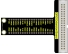 |        |  | 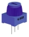 |
| ------------------------ | ------------------------ | ------------------------------ | ------------------------ | ------------------------ |
| Raspberry Pi*1           | GPIO Extension Board*1   | 40 pin Colorful Jumper Wires*1 | Breadboard*1             | Potentiometer*1          |
| 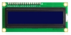 | 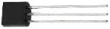 | 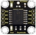       |  |                          |
| LCD 1602 display*1       | LM35-DZ * 1              | PCF8591 A/D Converter Module*1 | Jumper Wires             |                          |

 Component Knowledge：

**LM35-DZ：**

It is widely used temperature sensor whose output voltage proportional to temperature. It outputs 0°at the beginning since it adopts internal compensation. Its sensitivity is 10mV/℃ and output temperature in the range of 0℃～100℃.

Transfer formula: output 0V when 0°, plus 1° each time, output voltage increases 10mV.

Working Voltage is 4-30V;

Accuracy: ±1℃.

Maximum linear error: ±0.5℃;

Quiescent current: 80uA.

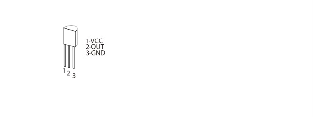

Note: VCC is connected to （+）, GND to （-）. LM35-DZ will be burned if connecting inversely.

 Schematic Diagram：

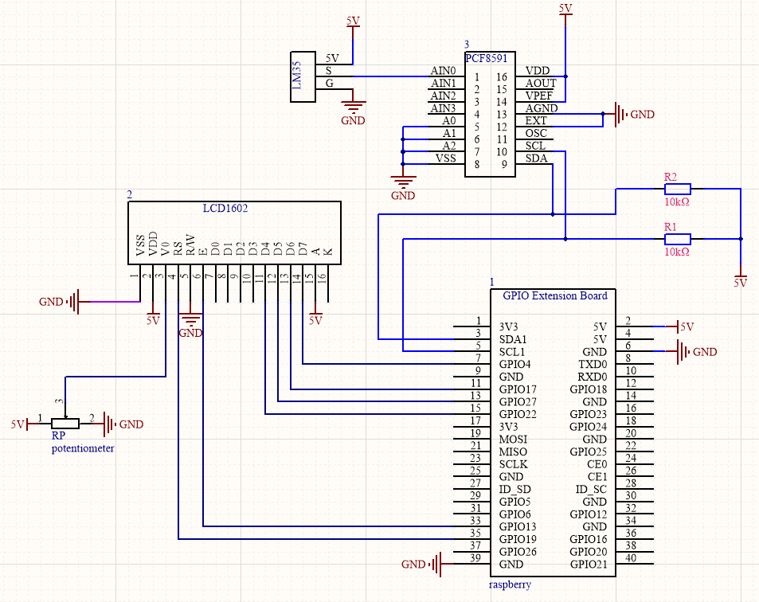

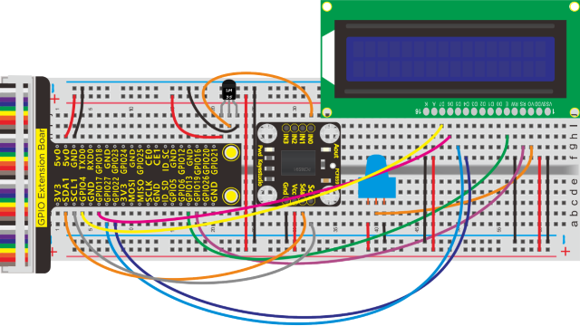

 Run Example Code：

Note: in the experiment, I2C communication is used. We need to check the iic address first( enter command：i2cdetect -y 1 and press“Enter”. If failed, check the wiring is correct or not. If correct, you need to enable I2C communication function of Raspberry Pi, project 19 is for your reference.

After activating the I2C communication function of Raspberry Pi, input the following commands and press "Enter":

cd /home/pi/C_code/lesson30_LM35

gcc LM35.c -o LM35 -lwiringPiDev -lwiringPi

sudo ./LM35

 Test Results：

LCD1602 displays the temperature value.

Note: Press Ctrl + C on keyboard and exit code running.

 Example Code：

```c
##include <stdio.h>
##include <stdlib.h>
##include <string.h>
##include <wiringPi.h>
##include <pcf8591.h>
##include <lcd.h>
##define Address 0x48
##define BASE 64
##define A0 BASE+0
##define A1 BASE+1
##define A2 BASE+2
##define A3 BASE+3
void change(int num,char *src) //This function changes 1234 to 4321 of the string
{
	char temp = '\0';
	int m = 0;
	int i = 0;

	while(num != 0)
	{
		m = num%10;
		temp = m+'0';
		src[i] = temp;
		i++;
		num = num/10;
	}
	src[i] = '\0';
}

int main(void)
{
	unsigned char value;
	unsigned char dat;
	wiringPiSetup();
	pcf8591Setup(BASE,Address);            
	int fd;
	int i;
	if (wiringPiSetup() == -1){
		exit(1);
	}

	fd = lcdInit(2,16,4, 24,23, 3,2,0,7,0,0,0,0); //see /usr/local/include/lcd.h
	printf("%d", fd);
	if (fd == -1){
		printf("lcdInit 1 failed\n") ;
		return 1;
	}
    lcdClear(fd);
	while(1){
		value=analogRead(A0); 
		dat=(500 *  value) /256;
		int i = 0;
		int len = 0;
		char temp;                                           //Define an intermediate variable
		char  *src = (char*)malloc(sizeof(char)*100);
		change(dat,src);
		len = strlen(src);
		for(i = 0;i < len/2;i++)                              //Output the string in reverse order
		{
			temp = src[i];
			src[i] = src[len-i-1];
			src[len-i-1] = temp;
		}
		printf("Temperature:%dC\n",dat);
		lcdPosition(fd, 0, 0); 
		lcdPuts(fd, "Temperature");
		lcdPosition(fd, 0, 1); 
		lcdPuts(fd, src);
		delay(1000);
		lcdClear(fd);
	}
	return 0;
}
```


### Project 31：DHT11 Temperature and Humidity Sensor

 Description：

In this lesson, we will show you how temperature and humidity sensor works.

 Experiment Components：

|                 | 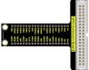 |        |      |
| --------------------------------------- | ------------------------ | ------------------------------ | ---- |
| Raspberry Pi*1                          | GPIO Extension Board*1   | 40 pin Colorful Jumper Wires*1 |      |
| 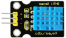                |  | 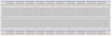       |      |
| DHT11 Temperature and Humidity Sensor*1 | Jumper Wires             | Breadboard*1                   |      |

 Component Knowledge：

**DHT11 Temperature Humidity Sensor：**

It is a composite sensor which contains a calibrated digital signal output of the temperature and humidity.

The sensor can measure temperature from 0°C to 50°C and humidity from 20% to 90% with an accuracy of ±1°C and ±1%. So if you are looking to measure in this range then this sensor might be the right choice for you.

DHT11 temperature and humidity sensor uses dedicated digital module acquisition technology and temperature and humidity sensing technology to ensure that the product has extremely high reliability and excellent long-term stability. DHT11 The temperature and humidity sensor includes a resistive humidity sensing element and an NTC temperature measurement element, which is very suitable for temperature and humidity measurement occasions that do not require high accuracy and real-time. The working voltage is in the range of 3.3V-5.5V.

In addition, it comes with a dedicated NTC to measure temperature and an 8-bit microcontroller to output the values of temperature and humidity as serial data. 

DHT11 has three pins which are VCC，GND and S.

S is data output pin and uses serial communication.

**DHT11 Temperature and Humidity 1-wire Bus Format Definition**

|    **Name**     | **1-wire Bus Format Definition**                             |
| :-------------: | ------------------------------------------------------------ |
| Initial Signal  | MCU pulls data bus（SDA）down at least 18ms（no more than 30ms）and inform sensor to prepare data |
| Response Signal | Sensor pulls data bus（SDA）down for 83µs and up for 87µs to response the initial signal of host |
|    Humidity     | Humidity high bit is part humidity integer data and humidity low bit is the part decimal data |
|   Temperature   | Humidity high bit is part humidity integer data and humidity low bit is the part decimal data. <br />Bit8 means negative temperature, otherwise positive temperature |
|   Parity Bit    | Humidity high bit+ Humidity low bit+temperature high bit+temperature low bit |

**Sequence Diagram：**

DHT11 switches low consumption mode to high consumption mode after the user host（MCU）sends a start signal. Then DHT11 will emit a response signal and 40bit data and trigger a information collection, as shown below:

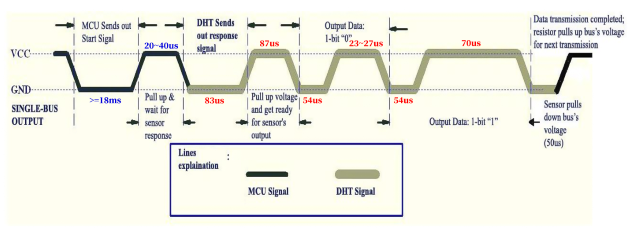

Detailed DHT11 protocol：

<https://www.mouser.com/datasheet/2/758/DHT11-Technical-Data-Sheet-Translated-Version-1143054.pdf>

 Schematic Diagram：

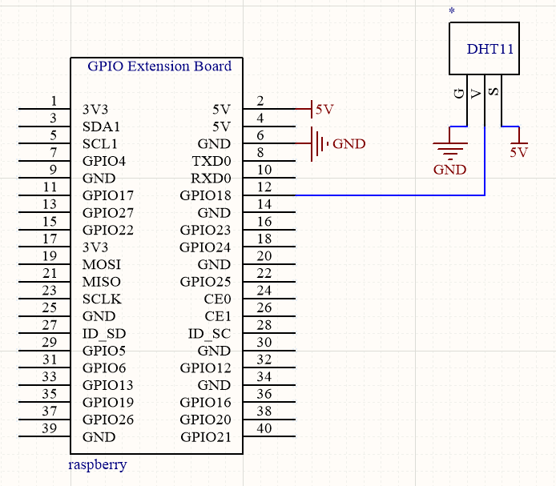

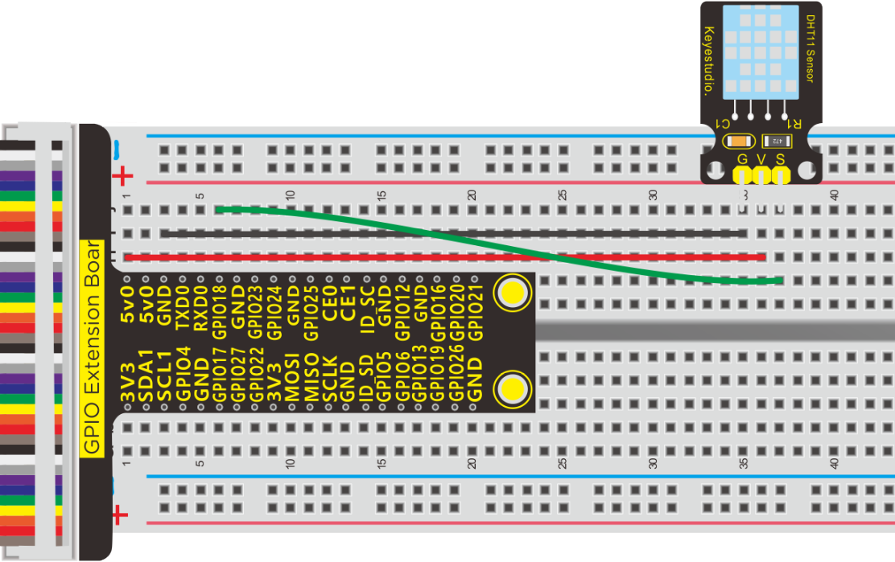

 Run Example Code：

Input the following commands and press "Enter":

cd /home/pi/C_code/lesson31_DHT11

gcc DHT11.c -o DHT11 -lwiringPi

sudo ./DHT11

 Test Results：

Terminal prints the temperature and humidity value.

Note: Press Ctrl + C on keyboard and exit code running.

 Example Code：

```c
##include <wiringPi.h>
##include <stdio.h>
##include <stdlib.h>
##include <stdint.h>
##define MAX_TIME 85
##define DHT11PIN 1   //BCM GPIO 18
##define ATTEMPTS 5                 //retry 5 times when no response
int dht11_val[5]={0,0,0,0,0};

int dht11_read_val(){
    uint8_t lststate=HIGH;         //last state
    uint8_t counter=0;
    uint8_t j=0,i;
    for(i=0;i<5;i++)
        dht11_val[i]=0;
         
    //host send start signal    
    pinMode(DHT11PIN,OUTPUT);      //set pin to output 
    digitalWrite(DHT11PIN,LOW);    //set to low at least 18ms 
    delay(18);
    digitalWrite(DHT11PIN,HIGH);   //set to high 20-40us
    delayMicroseconds(40);
     
    //start recieve dht response
    pinMode(DHT11PIN,INPUT);       //set pin to input
    for(i=0;i<MAX_TIME;i++)         
    {
        counter=0;
        while(digitalRead(DHT11PIN)==lststate){     //read pin state to see if dht responsed. if dht always high for 255 + 1 times, break this while circle
            counter++;
            delayMicroseconds(1);
            if(counter==255)
                break;
        }
        lststate=digitalRead(DHT11PIN);             //read current state and store as last state. 
        if(counter==255)                            //if dht always high for 255 + 1 times, break this for circle
            break;
        // top 3 transistions are ignored, maybe aim to wait for dht finish response signal
        if((i>=4)&&(i%2==0)){
            dht11_val[j/8]<<=1;                     //write 1 bit to 0 by moving left (auto add 0)
            if(counter>16)                          //long mean 1
                dht11_val[j/8]|=1;                  //write 1 bit to 1 
            j++;
        }
    }
    // verify checksum and print the verified data
    if((j>=40)&&(dht11_val[4]==((dht11_val[0]+dht11_val[1]+dht11_val[2]+dht11_val[3])& 0xFF))){
        printf("RH:%d,TEMP:%d\n",dht11_val[0],dht11_val[2]);
        return 1;
    }
    else
        return 0;
}
  
int main(void){
    int attempts=ATTEMPTS;
    if(wiringPiSetup()==-1)
        exit(1);
    while(1)
    {
        dht11_read_val();     //get result including printing out
        delay(3000);  //The read cycle needs to be greater than 2 seconds
    }
    return 0;
}
```


### Project 32：DS3231

 Description：

Clock module could be taken as timer and time display. In this lesson, we will learn about DS3231 module.

 Experiment Components：

|  | 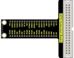 |        |  | 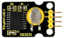 |  |
| ------------------------ | ------------------------ | ------------------------------ | ------------------------ | ------------------------ | ------------------------ |
| Raspberry Pi*1           | GPIO Extension Board*1   | 40 pin Colorful Jumper Wires*1 | Breadboard*1             | DS3231 Clock Module*1    | Jumper Wires             |

 Component Knowledge：

**DS3231 Clock Module：**

DS3231 also has dual power supply functions for main power supply and backup power supply.

DS3231 provides a reset output, 2 programmable calendar alarms and 1 programmable square wave output. It monitors the VCC status through a precise, temperature-compensated voltage reference and comparator, detects power failures, and automatically switches to a backup power supply when necessary. In addition, the DS3231 clock module has a rechargeable battery to ensure that the clock can still move normally after the system is powered off.

DS3231 is a real-time clock chip, which can provide information such as seconds, minutes, hours, date, month, and year, and can read the calendar before 2100 .

The DS1302 can communicate with the single-chip microcomputer through the synchronous serial way and only three ports needed which are RST reset , I/O data line and SCLK serial clock. 

The real-time clock/calendar circuit provides information about seconds, minutes, hours, days, weeks, months, and years. In addition, the number of days in a month and ones of a leap year can be adjusted automatically. 

Compatible with DS1202, it has a 31×8 RAM register for temporary storage of data.

The clock operation can adopt 24 or 12 hour format through AM/PM indication.

DS3231 clock module has pin GND, VCC, SDA and SCL, and use iic communication agreement，VCC is for positive of main power；GND is grounded；SDA is serial data input, output；SCL is serial clock input.

More details about DS3231 chip, you could look through chip specification folder. 

1)Temperature range: -40 to +85; Timing accuracy : ± 5ppm (±0.432 seconds / day)

2)Provide battery backup for continuous timing

3)Low power consumption

4)Device package and function compatible with DS3231

5)Complete clock calendar function contains seconds and minutes, hour, week, date, month, and year timing and provides leap year compensation until 2100.

6)Two calendar clock

7)Output: 1Hz and 32.768kHz

8)Reset output and Input Debounce of Pushbutton

9)High speed (400kHz), I2C serial bus

10)Supply voltage: +3.3V to +5.5V

11)Digital temperature sensor with a precision of±3℃

12)Working temperature: -40 \~ C to +85 \~ C

13)16 pins Small Outline Package (300mil)

 Schematic Diagram：

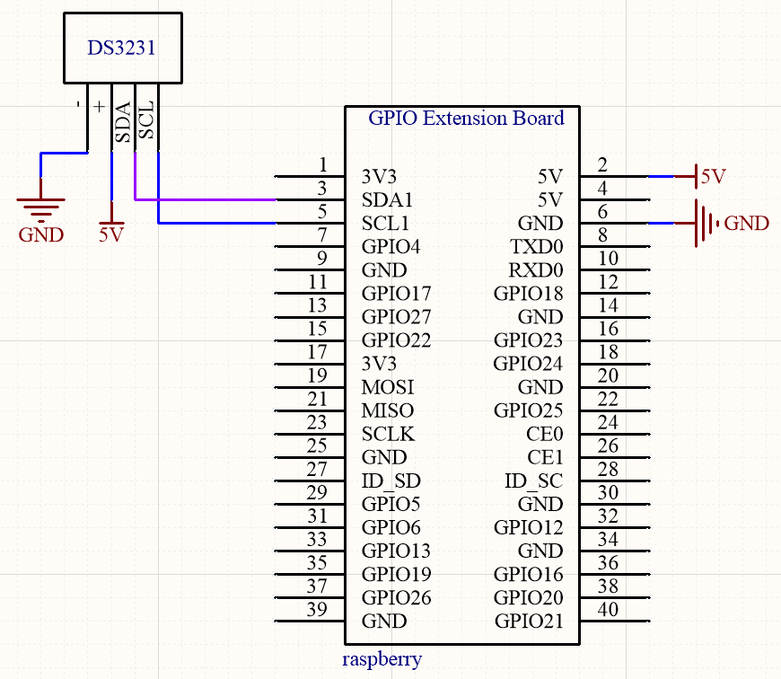

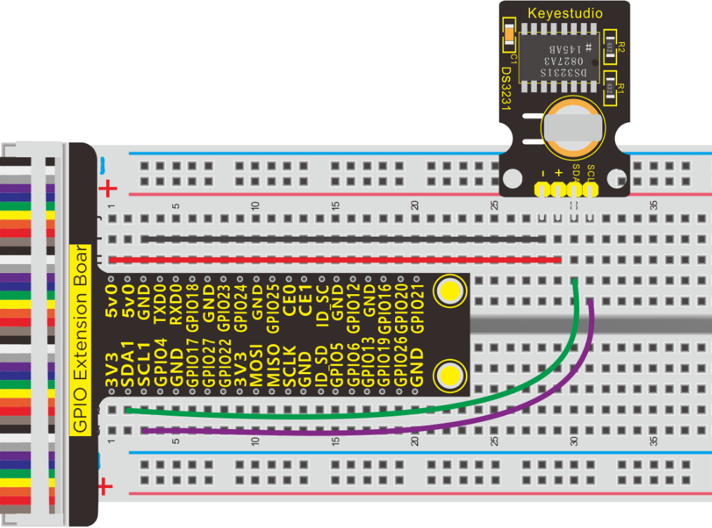

 Run Example Code1：

Note: in the experiment, I2C communication is used. We need to check the iic address first( enter command：i2cdetect -y 1 and press“Enter”. If failed, check the wiring is correct or not. If correct, you need to enable I2C communication function of Raspberry Pi, project 19 is for your reference.

After enabling the I2C communication，Input the following commands and press "Enter":

cd /home/pi/C_code/lesson32_DS3231

gcc setTime.c ds3231lib.c -o setTime -lwiringPi

sudo ./setTime

 Test Results 1：

Set the time of DS3231 to the current time .

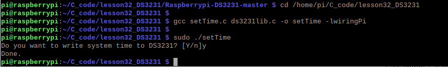

 Example Code1：

```c
##include <stdio.h>
##include "ds3231lib.h"

int main()
{
  char choose;
  fd = DS3231_Init();
  if(fd)
  {
    printf("Do you want to write system time to DS3231? [Y/n]");
	  scanf("%c", &choose);
  }
  else
	  printf("Failed to Connect!");
	  
  if (choose == 'y' || choose == 'Y')
  {	
	  //writeSysTimetoDS() function will synchronize DS3231's time with system time.
	  //Attention: the time will be same as shell command "date",it won't care about the timezone.
	  writeSysTimetoDS();
	  printf("Done.\n");
  }
  else 
	  return 0;
  return 0;
}
```

 Run Example Code2:

After enabling the I2C communication，Input the following commands and press "Enter":

cd /home/pi/C_code/lesson32_DS3231

gcc readTime.c ds3231lib.c -o readTime -lwiringPi

sudo ./readTime

 Test Results2

Display temperature value and time.

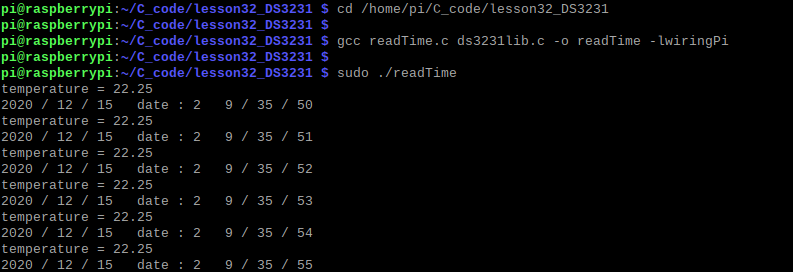

 Example Code2 :

```c
##include <stdio.h>
##include "ds3231lib.h"
##include <wiringPi.h>

int main(int argc, char **argv)
{
	fd = DS3231_Init();
	while(1)
	{
		//in TimeOutput function,you have 3 choices(from 1 to 3) to decide how to display the info from DS3231.
		//case 1 : YYYY/MM/DD 
		//case 2 : HH:MM:SS (AM/PM)
		//case 3 : YYYY/MM/DD DoW HH:MM:SS (AM/PM) 
		
		//TimeOutput(3);

		//temperature is represented as a 10-bit code with a resolution of +0.25°C.
		//The temperature is read on initial application of VCCand once every 64 seconds afterwards.
		//this function can set the CONV bit to 1 forces the temperature sensor to convert the temperature into digital code and execute the TCXO algorithmto update the capacitance array to the oscillator.
		TemperatureOutput();

		//to use specific data,you need to run FormatTime() function,then you can use struct Clock which includes every single data read from DS3231 registers.
		FormatTime();
		long year_data = Clock.year + 2000;
		printf("%d / %d / %d   date : %d   %d / %d / %d\n", year_data, Clock.month, Clock.date, Clock.day, Clock.hour, Clock.min, Clock.sec);
		delay(1000);
	}
		
 	return 0;
}
```


### Project 33：Joystick Module

 Description：

Many a people play games with gamepad. But do you know who it work?

Let’s learn about it.

 Experiment Components：

|  | 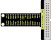       | 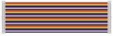       |  |
| ------------------------ | ------------------------------ | ------------------------------ | ------------------------ |
| Raspberry Pi*1           | GPIO Extension Board*1         | 40 pin Colorful Jumper Wires*1 | Breadboard*1             |
| 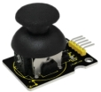 | 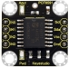       |        |  |
| Joystick Module*1        | PCF8591 A/D Converter Module*1 | Jumper Wires                   | M-F Dupont Line          |

 Component Knowledge：

**Joystick Module：**

This is a joystick very similar to the ‘analog’ joysticks on PS2 (PlayStation 2) controllers. It is a self-centering spring loaded joystick, meaning when you release the joystick it will center itself. It also contains a comfortable cup-type knob/cap which gives the feel of a thumb-stick.

It has three signal pins which are connected GND, VCC and signal end（B, X, Y). The X pin is **X-axis** (left to right), the Y pin is **Y-axis** (front and back) and signal B end is Z-axis(usually used as digital port and pushbutton)

VCC is connected to V/VCC（3.3/5V）of MCU, GND to G/GND of MCU and the voltage is around 1.65V/2.5V in initial status

X axis gives readout of the joystick in the horizontal direction (X-coordinate) i.e. how far left and right the joystick is pushed.

Y axis gives readout of the joystick in the vertical direction (Y-coordinate) i.e. how far up and down the joystick is pushed.

Z axis is the output from the pushbutton. It’s normally open, meaning the digital readout from the SW pin will be HIGH. When the button is pushed, it will connect to GND, giving output LOW.

 Schematic Diagram：

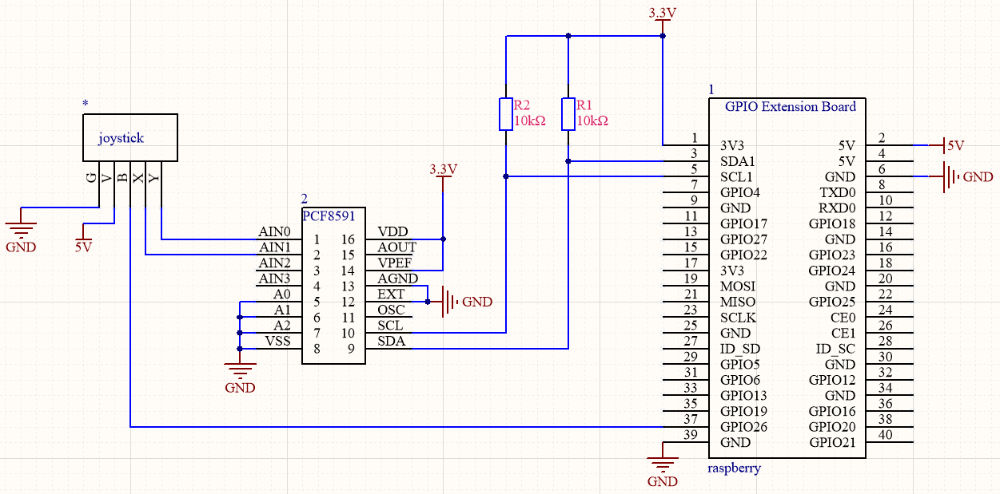

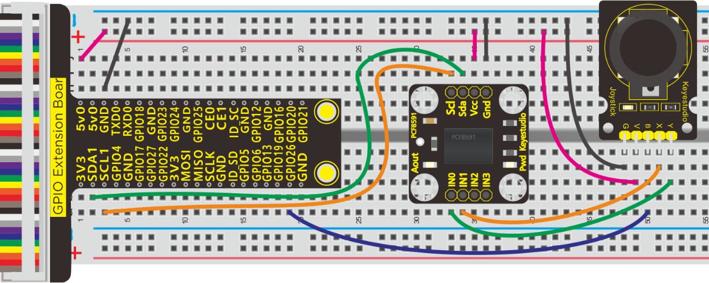

 Run Example Code：

Note: in the experiment, I2C communication is used. We need to check the iic address first( enter command：i2cdetect -y 1 and press“Enter”. If failed, check the wiring is correct or not. If correct, you need to enable I2C communication function of Raspberry Pi, project 19 is for your reference.

After enabling the I2C communication，Input the following commands and press "Enter":

cd /home/pi/C_code/lesson33_joystick

gcc joystick.c -o joystick -lwiringPi

sudo ./joystick

 Test Results：

Rotate Joystick , terminal will show the responding data change and press it,“The key is pressed”is displayed in the terminal.

Note: Press Ctrl + C on keyboard and exit code running.

 Example Code：

```c
##include <wiringPi.h>
##include <pcf8591.h>
##include <stdio.h>

##define Address 0x48
##define BASE 64
##define A0 BASE+0
##define A1 BASE+1
##define A2 BASE+2
##define A3 BASE+3

##define btnPin 25 //GPIO 26

int main(void)
{
   unsigned char x_val;
   unsigned char y_val;
   unsigned char z_val;
   wiringPiSetup();
   pcf8591Setup(BASE,Address);
   pinMode(25,INPUT);
        
   while(1)
   {
      x_val=analogRead(A0);  //read x
      y_val=analogRead(A1);  //read y
      z_val=digitalRead(25); //read z, button
      printf(" x:%d  y:%d  z:%d\n", x_val,y_val,z_val);
      if(z_val==1)
      printf("The key is presed!\n");
      delay(100);
   }
}
```


### Project 34：Ultrasonic Sensor

 Description：

An ultrasonic sensor is an electronic device that measures the distance of a target object by emitting ultrasonic sound waves, and converts the reflected sound into an electrical signal.

 Experiment Components：

|  | 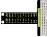 |        |  | 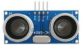    |  |
| ------------------------ | ------------------------ | ------------------------------ | ------------------------ | --------------------------- | ------------------------ |
| Raspberry Pi*1           | GPIO Extension Board*1   | 40 pin Colorful Jumper Wires*1 | Breadboard*1             | HC-SR04 Ultrasonic Sensor*1 | Jumper Wires             |

 Component Knowledge：

The ultrasonic module will emit the ultrasonic waves after trigger signal. When the ultrasonic waves encounter the object and are reflected back, the module outputs an echo signal, so it can determine the distance of object from the time difference between trigger signal and echo signal. 

The t is the time that emitting signal meets obstacle and returns.

and the propagation speed of sound in the air is about 343m/s, therefore,  distance = speed * time, because the ultrasonic wave emits and comes back, which is 2 times of distance, so it needs to be divided by 2, the distance measured by ultrasonic wave = (speed * time)/2

\1. Use method and timing chart of ultrasonic module:

\2. Setting the delay time of Trig pin of SR04 to 10μs at least, which can trigger it to detect distance.

\3. After triggering, the module will automatically send eight 40KHz ultrasonic pulses and detect whether there is a signal return. This step will be completed automatically by the module.

\4. If the signal returns, the Echo pin will output a high level, and the duration of the high level is the time from the transmission of the ultrasonic wave to the return.

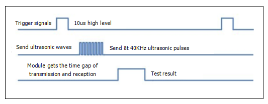

 Schematic Diagram：

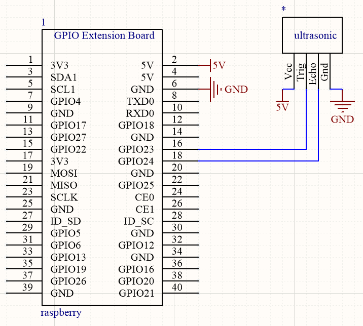


 Run Example Code：

Input the following commands and press "Enter":

cd /home/pi/C_code/lesson34_Ultrasonic

gcc Ultrasonic.c -o Ultrasonic -lwiringPi

sudo ./Ultrasonic

 Test Results：

Terminal prints the detected distance, unit is cm.

Note: Press Ctrl + C on keyboard and exit code running.

 Example Code：

```c
##include <wiringPi.h>
##include <stdio.h>
##include <sys/time.h>   //Import the time system header file

//define the pin
##define Trig    4   //BCM GPIO 23
##define Echo    5   //BCM GPIO 24

//set pin mode
void ultraInit(void)
{
	pinMode(Echo, INPUT);
	pinMode(Trig, OUTPUT);
}

//Write programs based on sequence diagrams
float disMeasure(void)
{
	struct timeval tv1;  //Create the Timeval structure tv1
	struct timeval tv2;  //Create the Timeval structure tv2
	long start, stop;
	float dis;

	digitalWrite(Trig, LOW);
	delayMicroseconds(2);

	digitalWrite(Trig, HIGH);
	delayMicroseconds(10);      	
    digitalWrite(Trig, LOW);
	
	while(!(digitalRead(Echo) == 1));  //Wait for the low level received by the Echo pin to pass
	gettimeofday(&tv1, NULL);   //function gettimeofday, The time it took the system to get here

	while(!(digitalRead(Echo) == 0));  //Wait for the high level received by the Echo pin to pass
	gettimeofday(&tv2, NULL);   //function gettimeofday, The time it took the system to get here
	    
    //Tv1.tv_sec is the seconds obtained, tv1.TV_USec is the subtlety obtained
    //Calculate the first time
	start = tv1.tv_sec * 1000000 + tv1.tv_usec;
	 
	//Calculate the second time
	stop  = tv2.tv_sec * 1000000 + tv2.tv_usec;
    
    //stop - start , the time difference is the high level time acquired by the echo pin
    //34000cm/s, speed of sound
    //Calculate the distance measured(cm)
	dis = (float)(stop - start) / 1000000 * 34000 / 2;  

	return dis;
}

int main(void)
{
	float dis;

	if(wiringPiSetup() == -1){ //when initialize wiring failed,print messageto screen
		printf("setup wiringPi failed !");
		return 1; 
	}

	ultraInit();
	
	while(1){
		dis = disMeasure();
		printf("distance = %0.2f cm\n",dis);
		delay(100);
	}

	return 0;
}
```

\<sys/time.h\> link：

<https://pubs.opengroup.org/onlinepubs/9699919799/basedefs/sys_time.h.html>

### Project 35：Accelerometer and Gyroscope Module

 Description：

When creating balance robot car, we need to take account of the balanced angles. This requires a sensor detecting posture------MPU6050

 Experiment Components：

|  |  |        |      |
| ------------------------ | ------------------------ | ------------------------------ | ---- |
| Raspberry Pi*1           | GPIO Extension Board*1   | 40 pin Colorful Jumper Wires*1 |      |
| 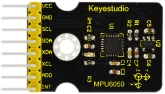 |  | 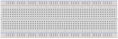       |      |
| MPU6050*1                | Jumper Wires             | Breadboard*1                   |      |

 Component Knowledge：

**MPU6050：**

The MPU6050 is a Micro Electro-Mechanical Systems (MEMS) which integrates a 3-axis MEMS accelerometer, 3-axis Gyroscope inside it and digital motion processor, using IIC communication.

This helps us to measure acceleration, velocity, orientation, displacement and many other motion related parameter of a system or object.

It can interface the external 3-axis compass and provide complete 9-axis output thanks to I2C. It is also designed to be interfaced with non-inertial digital sensor interface. 

The MPU-6050 has 3 16-bit analog-to-digital converters (ADCs) for digital gyroscope output and 3 16-bit ADCs for digital accelerometer output. 

For accurate tracking of fast and slow motion, the measurable range of the gyroscope is ±250, ±500, ±1000, ±2000°/s (dps); the measurable range of the accelerometer is ±2, ±4, ±8, ±16g.

**Technical Parameter：**

1\. Chip: MPU-6050

2\. Working voltage: 3-5V (internal low bias voltage)

3\. Communication method: standard IIC protocol

4\. Built-in 16-bit analog-to-digital converter, 16-bit data output

5\. The measurable range of the gyroscope is ±250, ±500, ±1000, ±2000°/s (dps); the measurable range of the accelerometer is ±2, ±4, ±8, ±16g.

6\. Needle pitch: 2.54mm

More details about mpu6050 chip, you could look through chip specification folder.

 Schematic Diagram：

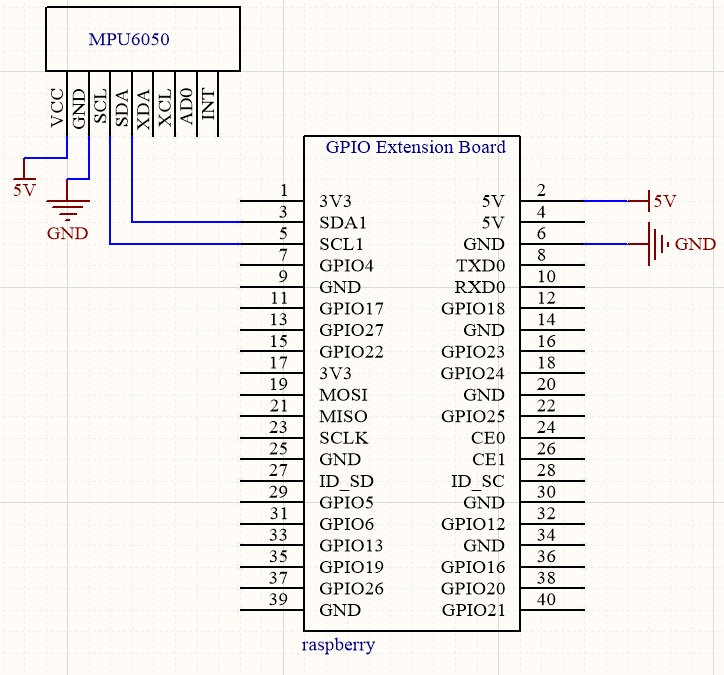

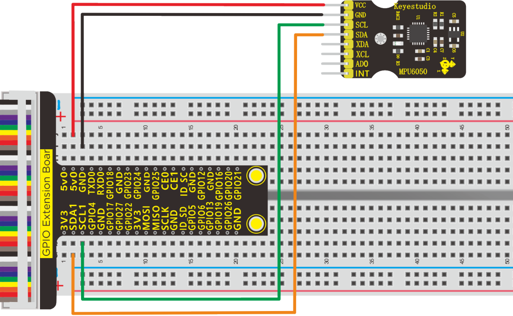

 Run Example Code：

Note: in the experiment, I2C communication is used. We need to check the iic address first(enter command：i2cdetect -y 1 and press“Enter”. If failed, check the wiring is correct or not. If correct, you need to enable I2C communication function of Raspberry Pi, project 19 is for your reference.

After enabling the I2C communication，Input the following commands and press "Enter":

cd /home/pi/C_code/lesson35_MPU6050

gcc MPU6050RAW.cpp MPU6050.cpp I2Cdev.cpp -o MPU6050RAW

sudo ./MPU6050RAW

 Test Results：

Note: wait a moment until data appears.

Terminal shows the data detected by MPU6050 accelerator and gyroscope and switches to the data about Gravitational acceleration and angular velocity, as shown below:

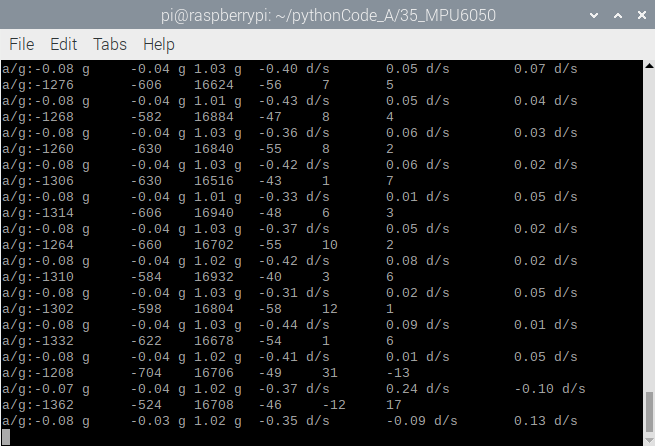

Note: Press Ctrl + C on keyboard and exit code running.

 Example Code：

```c
##include <stdio.h>
##include <stdint.h>
##include <unistd.h>
##include "I2Cdev.h"
##include "MPU6050.h"

MPU6050 accelgyro;      //creat MPU6050 class object

int16_t ax, ay, az;     //store acceleration data
int16_t gx, gy, gz;     //store gyroscope data

void setup() {
    // initialize device
    printf("Initializing I2C devices...\n");
    accelgyro.initialize();     //initialize MPU6050

    // verify connection
    printf("Testing device connections...\n");
    printf(accelgyro.testConnection() ? "MPU6050 connection successful\n" : "MPU6050 connection failed\n");
}

void loop() {
    // read accel/gyro values of MPU6050
    accelgyro.getMotion6(&ax, &ay, &az, &gx, &gy, &gz);
    // display accel/gyro x/y/z values
    printf("a/g: %6hd %6hd %6hd   %6hd %6hd %6hd\n",ax,ay,az,gx,gy,gz);
    printf("a/g: %.2f g %.2f g %.2f g   %.2f d/s %.2f d/s %.2f d/s \n",(float)ax/16384,(float)ay/16384,(float)az/16384,
        (float)gx/131,(float)gy/131,(float)gz/131);
}

int main()
{
    setup();
    while(1){
        loop();
    }
    return 0;
}
```


### Project 36：4*4 Membrane Switch Keypad

 Description：

Matrix keypads are the kind of keypads you see on cell phones, calculators, microwaves ovens, door locks, etc. They’re practically everywhere.

However, in DIY electronics, they let users interact with your project and are often needed to navigate menus, punch in passwords and control robots.

Membrane keypads are made of a thin, flexible membrane material. They do come in may sizes 4×3, 4×4, 4×1 etc. Regardless of their size, they all work in the same way.

 Experiment Components:

|        | 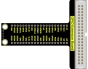                                     |                                      |                                      |
| ------------------------------ | ------------------------------------------------------------ | ------------------------------------------------------------ | ------------------------------------------------------------ |
| Raspberry Pi*1                 | GPIO Extension Board*1                                       | 40 pin Colorful Jumper Wires*1                               | Breadboard*1                                                 |
| 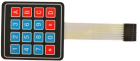       |  | 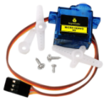 |  |
| 4\*4 Membrane Switch Keypad\*1 | 10KΩ Resistor*4                                              | Servo Motor*1                                                | Jumper Wires                                                 |

 Component Knowledge：

**Membrane Switch Keypad：**

This keypad integrates many a keys, as shown below, it has 16 keys


If you had used 16 individual push buttons, you would have required 17 input pins (one for each key and a ground pin) in order to make them work. However, with matrix arrangement, you only need 8 microcontroller pins (4-columns and 4-rows) to scan through the pad.

The working principle is very simple. Pressing a button shorts one of the row lines to one of the column lines, allowing current to flow between them. For example, when key‘4’is pressed, column 1 and row 2 are shorted.


 Schematic Diagram：

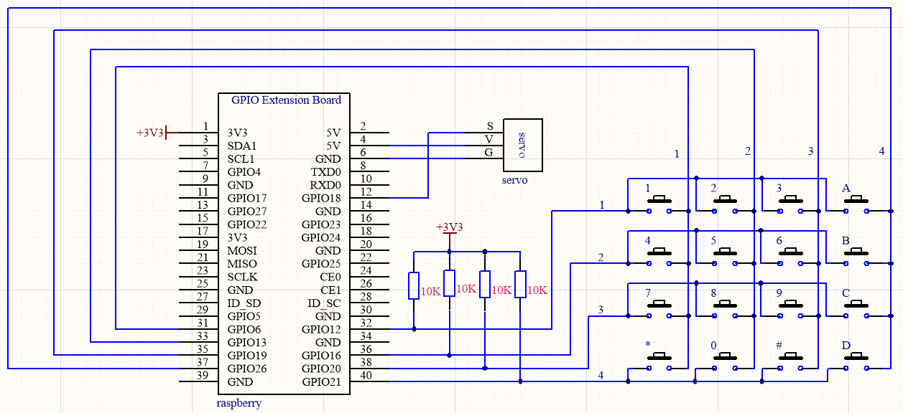

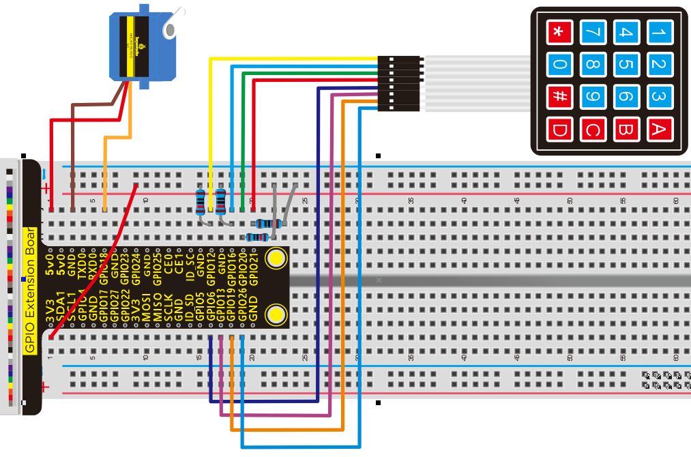

 Run Example Code1：

Input the following commands and press "Enter":

cd /home/pi/C_code/lesson36_keypad

gcc MatrixKeypad1.cpp Keypad.cpp Key.cpp -o MatrixKeypad1 -lwiringPi

sudo ./MatrixKeypad1

 Test Result1：

Terminal prints the key values of 4\*4 membrane switch keypad

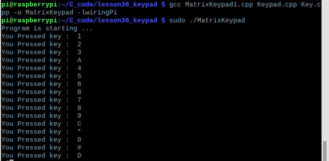

Note: Press Ctrl + C on keyboard and exit code running.

 Example Code1：

```c
##include "Keypad.hpp"
##include <stdio.h>
const byte ROWS = 4; //four rows
const byte COLS = 4; //four columns
char keys[ROWS][COLS] = {  //key code
  {'1','2','3','A'},
  {'4','5','6','B'},
  {'7','8','9','C'},
  {'*','0','##','D'}
};
byte rowPins[ROWS] = {26,27,28,29}; //define the row pins for the keypad
byte colPins[COLS] = {22,23,24,25 }; //define the column pins for the keypad
//create Keypad object
Keypad keypad = Keypad( makeKeymap(keys), rowPins, colPins, ROWS, COLS );

int main(){
    printf("Program is starting ... \n");
    
    wiringPiSetup();
    //The pin of the connection button is set to pull up
    pullUpDnControl(26, PUD_UP);
    pullUpDnControl(27, PUD_UP);
    pullUpDnControl(28, PUD_UP);
    pullUpDnControl(29, PUD_UP);
    
	char key = 0;
	keypad.setDebounceTime(50);
    while(1){
        key = keypad.getKey();  //get the state of keys
        if (key){       //if a key is pressed, print out its key code
            printf("You Pressed key :  %c \n",key);
        }
    }
    return 1;
}
```

 Run Example Code 2：

Input the following commands and press "Enter":

cd /home/pi/C_code/lesson36_keypad

gcc MatrixKeypad2.cpp Keypad.cpp Key.cpp -o MatrixKeypad2 -lwiringPi

sudo ./MatrixKeypad2

 Test Result 2：

（Password：123D）

Terminal will print open the door and servo will rotate 180 ° if the password is correct； if not, error will be shown and servo will rotate 0°.

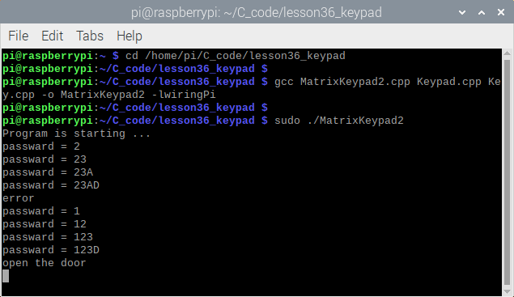

Note: Press Ctrl + C on keyboard and exit code running.

 Example Code 2：

```c
##include "Keypad.hpp"
##include <stdio.h>
##include <cstring>

##define serPin 1 //servo pin
char key_rec[50];
char password[] = "123D";
char Enter[] = "D";
int i = 0;
const byte ROWS = 4; //four rows
const byte COLS = 4; //four columns
char keys[ROWS][COLS] = {  //key code
  {'1','2','3','A'},
  {'4','5','6','B'},
  {'7','8','9','C'},
  {'*','0','##','D'}
};
byte rowPins[ROWS] = {26,27,28,29}; //define the row pins for the keypad
byte colPins[COLS] = {22,23,24,25 }; //define the column pins for the keypad
//create Keypad object
Keypad keypad = Keypad( makeKeymap(keys), rowPins, colPins, ROWS, COLS );

int main(){
    printf("Program is starting ... \n");
    
    wiringPiSetup();
    
    pinMode(serPin,OUTPUT);  //set servo pin OUTPUT
	char key = 0;
	keypad.setDebounceTime(50);
    while(1){
        key = keypad.getKey();  //get the state of keys
        if (key){       //if a key is pressed, print out its key code
            //printf("You Pressed key :  %d \n",key);
            key_rec[i] = key;
            printf("passward = %s\n",key_rec);
            i++;
            
            if(key == 68)   //The ASCII value of character D is 68
            {
                if(strcmp(key_rec, password) == 0)
                {
                    printf("open the door\n");
                    for(i=0;i<50;i++)   //servo
                    {
                        digitalWrite(serPin,HIGH);
                        delayMicroseconds(2500); //Pulse width 0.5ms, Angle 0
                        digitalWrite(serPin,LOW);
                        delay(20-0.5);	//Cycle 20 ms
                    }
                }
                else
                {
                    printf("error\n");
                    for(i=0;i<50;i++)   //servo         
                    {
                        digitalWrite(serPin,HIGH);
                        delayMicroseconds(500); //Pulse width 0.5ms, Angle 0
                        digitalWrite(serPin,LOW);
                        delay(20-0.5);	//Cycle 20 ms
                    }
                }
                for(int c=0; c<i; c++)
                {
                    key_rec[c] = 0;  //clean key_rec[]
                }
                i = 0;
            }
        }
    }
    return 1;
}
```

### Project 37：Intelligent Access Control System

 Description：

The intelligent access control system is applied to many communities in China, the door can be open automatically when touching it with access key carrying RFID-RC522 module.

 Experiment Components：

|  |  |        | 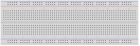 |                          |
| ------------------------ | ------------------------ | ------------------------------ | ------------------------ | ------------------------ |
| Raspberry Pi*1           | GPIO Extension Board*1   | 40 pin Colorful Jumper Wires*1 | Breadboard*1             |                          |
| 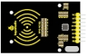 |  |        | 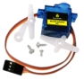 |  |
| RFID-RC522 Module*1      | Access Key*1             | RFID Card*1                    | Servo Motor*1            | Jumper Wires             |

 Component Knowledge：

**RFID-RC522 Module：**

Radio-frequency identification (RFID) uses electromagnetic fields to automatically identify and track tags attached to objects.

More details about c522 chip, you could look through chip specification folder.

Communication protocol is spi

Input sudo raspi-configin the terminal，and press Enter to open the configuration page of raspberry pi.

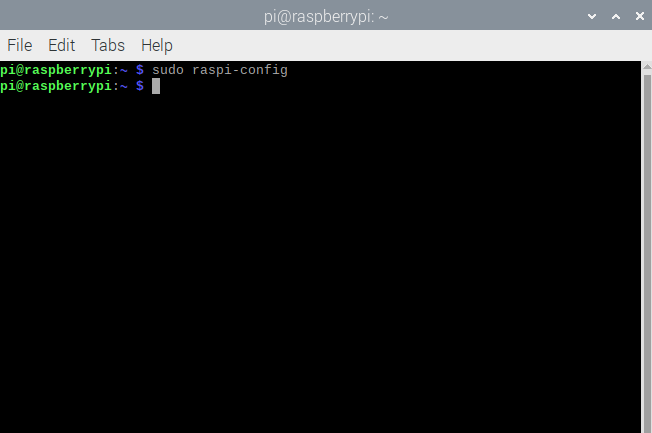

Activate the spi communication function according to the picture below.(Press （↑）, （↓）, （←）,（→) and“Enter”keys on keyboard)

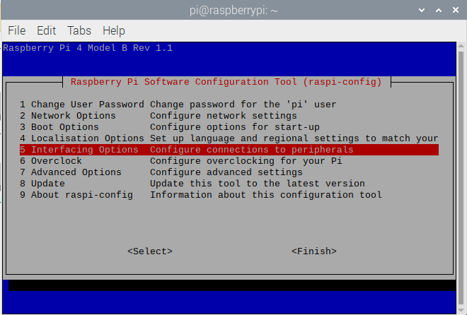

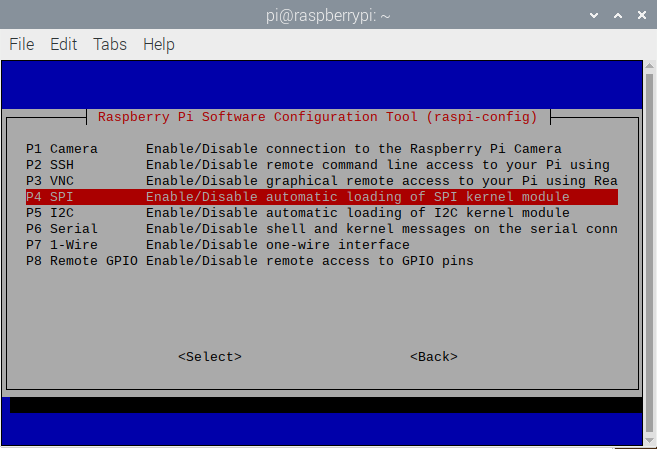

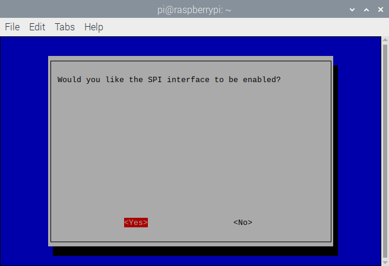

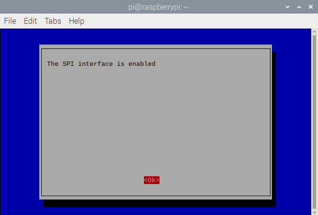

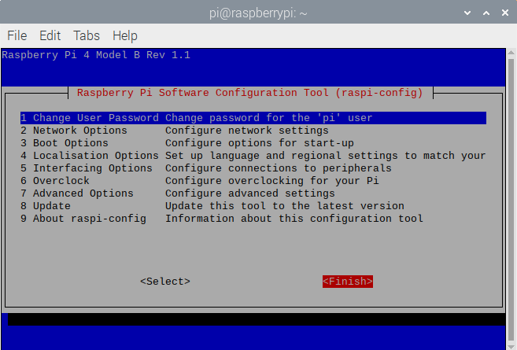

You could look through the SPI communication agreement in the following link.

<https://en.wikipedia.org/wiki/Serial_Peripheral_Interface>

**Input the command to installBCM2835 library**

cd /home/pi/C_code/lesson37_RC522

wget
[http://www.airspayce.com/mikem/bcm2835/bcm2835-1.68.tar.gz](http://www.airspayce.com/mikem/bcm2835/bcm2835-1.56.tar.gz)

tar -zxf bcm2835-1.68.tar.gz

cd bcm2835-1.68

./configure

sudo make check

sudo make install

cd ..

sudo reboot

 Schematic Diagram：

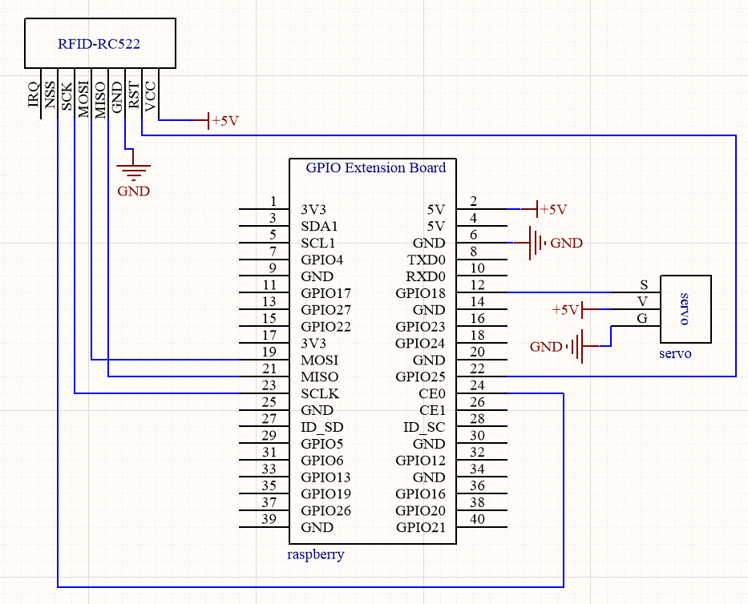

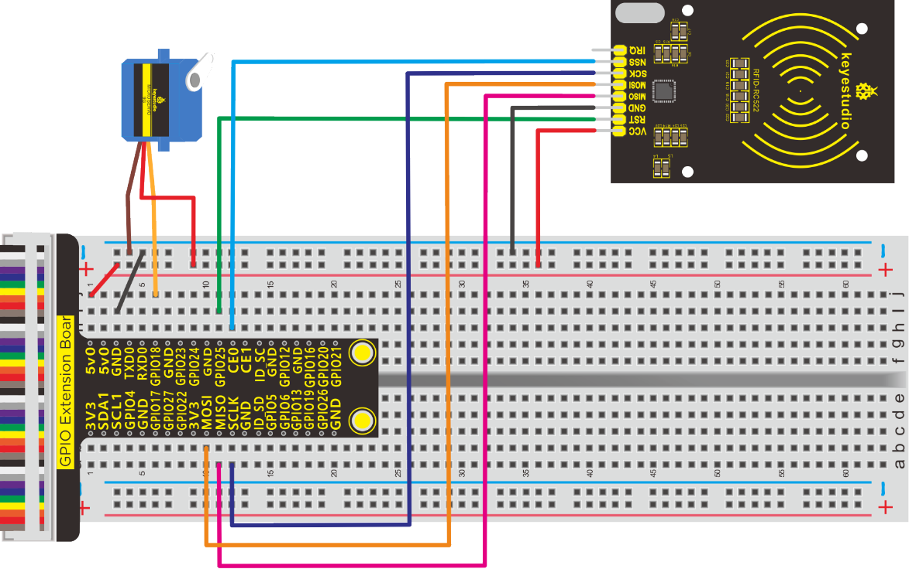

 Run Example Code 1：

Input the following commands and press "Enter":

cd /home/pi/C_code/lesson37_RC522/rc522

gcc -Wall -Wextra value.c config.c rfid.c rc522.c main.c -o rc522 -lbcm2835

sudo cp RC522.conf /etc

sudo chmod 666 /etc/RC522.conf

sudo ./rc522

 Test Result 1：

Terminal prints card number, as shown below:

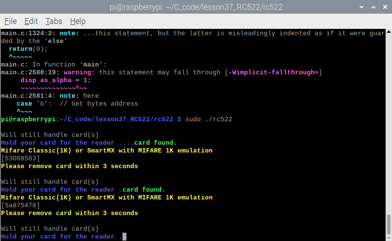

Note: Press Ctrl + C on keyboard and exit code running.

 **Example Code1：**

Double-click main.c(in the rc522 folder）

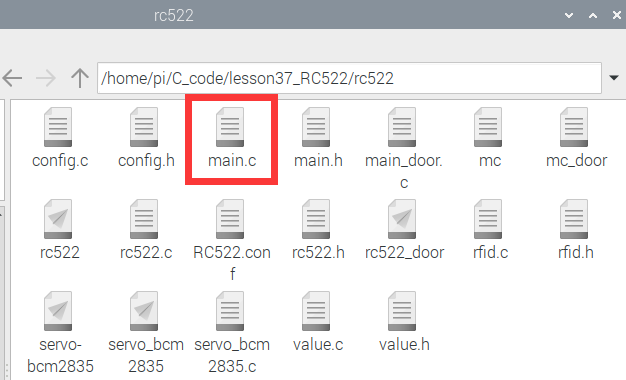

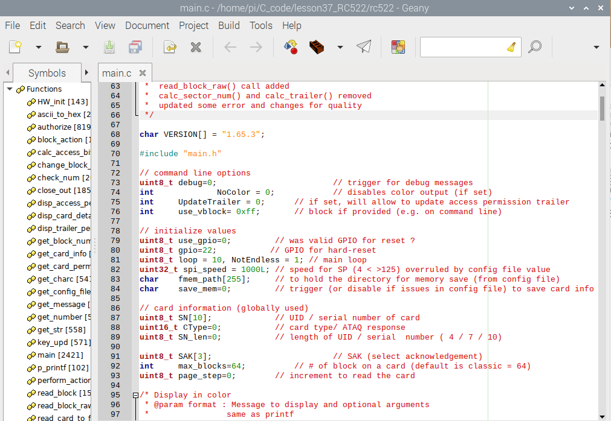

 Run the servo programmed by bcm2835 library

Input the following commands and press "Enter"

cd /home/pi/C_code/lesson37_RC522/rc522

gcc servo_bcm2835.c -o servo_bcm2835 -lbcm2835

sudo ./servo_bcm2835

 Test Result2：

Servo rotates forth and back.

Note: Press Ctrl + C on keyboard and exit code running.

BCM2835 library

 Example Code2：

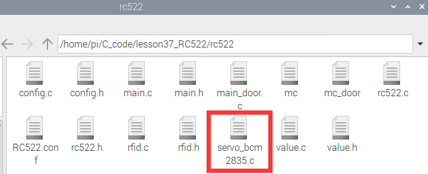

```c
##include <bcm2835.h>

##define  serPin   RPI_GPIO_P1_12   //set  servo  pin (BCM GPIO18)

int main()
{
	if(!bcm2835_init())  //bcm 2835 init
	{
		return 1;
	}
	bcm2835_gpio_fsel(serPin, BCM2835_GPIO_FSEL_OUTP);  //set servo pin OUTPUT mode
	
	while(1)
	{
		for(int i=0;i<50;i++)            
		{
			bcm2835_gpio_write(serPin, HIGH);  //set servo pin HIGH
			bcm2835_delayMicroseconds(500);    //delay 500us
			bcm2835_gpio_write(serPin, LOW);   //set servo pin LOW
			bcm2835_delay(19.5);  //delay 20 - 0.5 = 19.5ms
		}
		bcm2835_delay(1000); //delay 1s
		for(int i=0;i<50;i++)            
		{
			bcm2835_gpio_write(serPin, HIGH);
			bcm2835_delayMicroseconds(2500);   //delay 2500us
			bcm2835_gpio_write(serPin, LOW);
			bcm2835_delay(17.5);  //delay 20 - 2.5 = 17.5ms
		}
		bcm2835_delay(1000); //delay 1s
	}
	
	bcm2835_close();  //close bcm2835
	return 0;
}
```

 Run Example Code3：

Input the following commands and press "Enter":

cd /home/pi/C_code/lesson37_RC522/rc522

gcc -Wall -Wextra value.c config.c rfid.c rc522.c main_door.c -o rc522_door \-lbcm2835

sudo ./rc522_door

 Test Result3：

Terminal will print open the door and servo will rotate to 180° if password is correct; otherwise, “close the door” will be shown and servo will rotate to 0°.

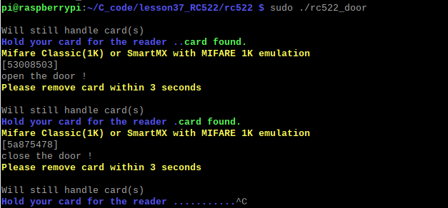

Note: Press Ctrl + C on keyboard and exit code running.

 Example Code 3：

Double-click main.c(in the rc522 folder）

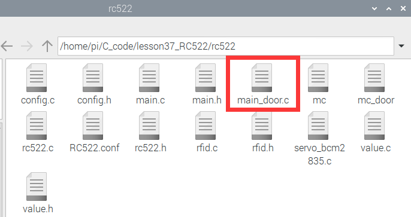

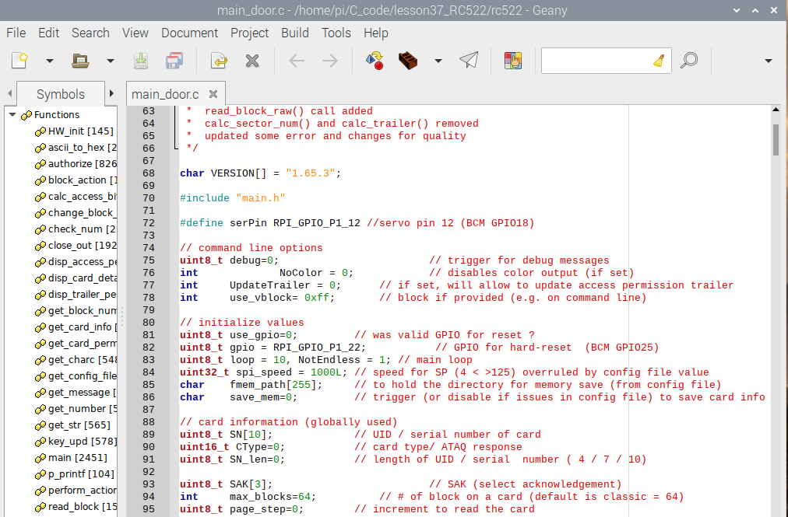

### Project 38：IR Remote Control

 Description：

IR remote control is everywhere, for instance, remote control to TV. Next, let’s learn about its principle

 Experiment Components：

|  |  |        |  |      |
| ------------------------ | ------------------------ | ------------------------------ | ------------------------ | ---- |
| Raspberry Pi*1           | GPIO Extension Board*1   | 40 pin Colorful Jumper Wires*1 | Breadboard*1             |      |
|  |  |        |  |      |
| 10KΩ Resistor*1          | Jumper Wires             | IR Remote Control*1            | IR Receiver *1           |      |

 Component Knowledge：

**IR Remote Control：**

It transmits data via near infrared light. The wave length of near infrared light is 0.76um~1.5um. However, IR remote control’s is 0.8um~0.94um. It has the feature of high transmission efficiency and anti-interference

IR Transmission Protocol: **NEC Protocol**

The emitting element is IR transmission tube, IR remote emits data in modulation way and adjust data to fixed carrier wave. The modulation emission has high anti-interference and long-distance transmission.

**IR Receiver：**

The integrated infrared receiver is used to integrate infrared receiving, amplification, filtering, comparator output and other functions to convert the received signal into a TTL signal that can be recognized by the MCU.

**NEC Protocol：**

-   8 bit address and 8 bit command length.

-   Extended mode available, doubling the address size.

-   Address and command are transmitted twice for reliability.

-   Pulse distance modulation.

-   Carrier frequency of 38kHz.

-   Bit time of 1.125ms or 2.25ms.

-   NEC IR transmission protocol：

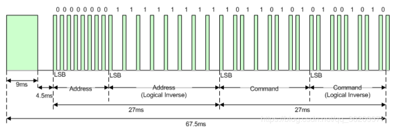

Notice from Figure 1 that it takes:

Send 9ms+4.5ms leading code firstly, then address, inverse, command  and inverse.

The inverse code is used to verify and improve the accuracy of keys value.

The four bytes of data bits are each sent least significant bit first. Figure 1 illustrates the format of an NEC IR transmission frame, for an address of 00h (00000000b) and a command of ADh (10101101b).

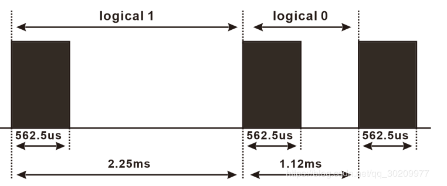

The NEC protocol uses pulse distance encoding of the bits. Each pulse is a 562.5µs long 38kHz carrier burst (about 21 cycles). A logical "1" takes 2.25ms to transmit, while a logical "0" is only half of that, being 1.125ms. The recommended carrier duty-cycle is 1/4 or 1/3.

Logical‘0’– a 562.5µs pulse burst followed by a 562.5µs space, with a total transmit time of 1.125ms

Logical‘1’– a 562.5µs pulse burst followed by a 1.6875ms space, with a total transmit time of 2.25ms

Note: a 562.5µs pulse and a 1.6875ms space combine 2.23ms, 562.5µs pulse is high level, therefore, the rest is low level.

 Schematic Diagram：

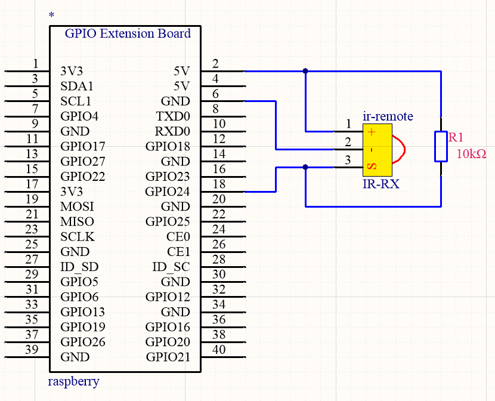

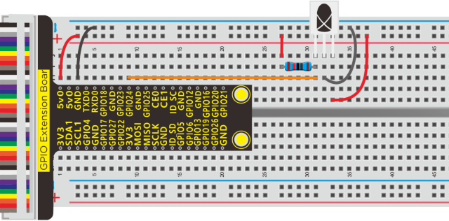

 Run Example Code：

Input the following commands and press "Enter":

cd /home/pi/C_code/lesson38_IR_Remote

gcc irm.c -o irm -lwiringPi

sudo ./irm

 Test Results：

Terminal will display the corresponding key value when you point at IR reception and press keys of remote control.

Note: Press Ctrl + Z to exit the code running.

 Example Code：

```c
##include <wiringPi.h>
##include <stdio.h>
##define PIN 5 //BCM GPIO 24
##define IO digitalRead(PIN)
unsigned char i,idx,cnt;
unsigned char count;
unsigned char data[4];

int main()
{
    if (wiringPiSetup() < 0)return 1;
    pinMode(PIN, INPUT);
    pullUpDnControl(PIN, PUD_UP);
	printf("IRM Test Program ... \n");

	while (1)
	{	
		if(IO == 0)
		{
			count = 0;
			while(IO == 0 && count++ < 200)   //9ms
		    	delayMicroseconds(60);
			
			count = 0;
			while(IO == 1 && count++ < 80)	  //4.5ms
		    	delayMicroseconds(60);
			
			idx = 0;
			cnt = 0;
			data[0]=0;
			data[1]=0;
			data[2]=0;
			data[3]=0;
			for(i =0;i<32;i++)
			{
				count = 0;
				while(IO == 0 && count++ < 15)  //0.56ms
		    		delayMicroseconds(60);
				
				count = 0;
				while(IO == 1 && count++ < 40)  //0: 0.56ms; 1: 1.69ms
		    		delayMicroseconds(60);

				if (count > 25)data[idx] |= (1<<cnt);
				if(cnt == 7)
				{
					cnt = 0;
					idx++;
				}
				else cnt++;
			}

			if(data[0]+data[1] == 0xFF && data[2]+data[3]==0xFF)	//check	
				printf("Get the key: 0x%02x\n",data[2]);
		}
	}
}
```


### Project 39：IR Remote Controlled LED

 Experiment Components：

|  |  |        |  |  |
| ------------------------ | ------------------------ | ------------------------------ | ------------------------ | ------------------------ |
| Raspberry Pi*1           | GPIO Extension Board*1   | 40 pin Colorful Jumper Wires*1 | Breadboard*1             | IR Receiver *1           |
|  |  |        |  |  |
| 10KΩ Resistor*1          | 220Ω Resistor  * 1       | Jumper Wires                   | IR Remote Control*1      | LED - Red *1             |

 Schematic Diagram：

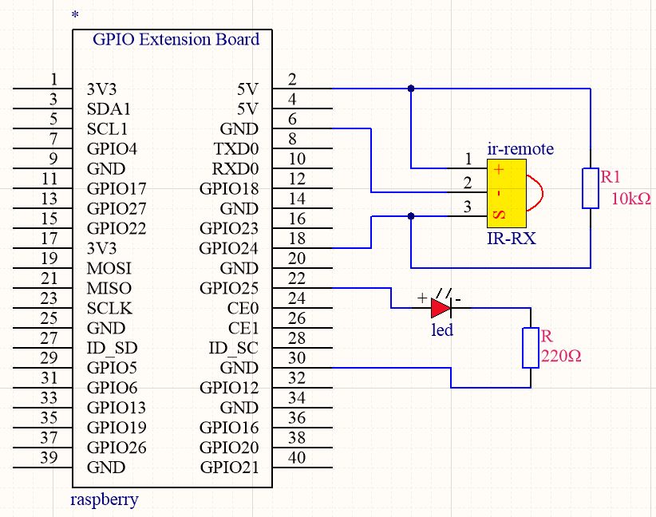

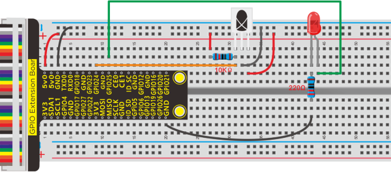

 Run Example Code：

Input the following commands and press "Enter":

cd /home/pi/C_code/lesson39_IR_LED

gcc IR_LED.c -o IR_LED -lwiringPi

sudo ./IR_LED

 Test Results：

LED will turn on when pressing“forward”button and it will be off when pressing“OK”key.

Note: Press Ctrl + Z to exit the code running.

 Example Code：

```c
##include <wiringPi.h>
##include <stdio.h>
##define PIN 5  //BCM GPIO 24
##define IO digitalRead(PIN)
unsigned char i,idx,cnt;
unsigned char count;
unsigned char data[4];
##define ledPin 6  //BCM GPIO 25

int main()
{
    if (wiringPiSetup() < 0)return 1;
    pinMode(PIN, INPUT);
    pullUpDnControl(PIN, PUD_UP);
	printf("IRM Test Program ... \n");
	pinMode(ledPin, OUTPUT);

	while (1)
	{
		if(IO == 0)
		{
			count = 0;
			while(IO == 0 && count++ < 200)   //9ms
		    	delayMicroseconds(60);
			
			count = 0;
			while(IO == 1 && count++ < 80)	  //4.5ms
		    	delayMicroseconds(60);
			
			idx = 0;
			cnt = 0;
			data[0]=0;
			data[1]=0;
			data[2]=0;
			data[3]=0;
			for(i =0;i<32;i++)
			{
				count = 0;
				while(IO == 0 && count++ < 15)  //0.56ms
		    		delayMicroseconds(60);
				
				count = 0;
				while(IO == 1 && count++ < 40)  //0: 0.56ms; 1: 1.69ms
		    		delayMicroseconds(60);

				if (count > 25)data[idx] |= (1<<cnt);
				if(cnt == 7)
				{
					cnt = 0;
					idx++;
				}
				else cnt++;
			}

			if(data[0]+data[1] == 0xFF && data[2]+data[3]==0xFF)	//check	
			{
				printf("Get the key: 0x%02x\n",data[2]);
				if(data[2] == 0x46)
				{
					digitalWrite(ledPin, HIGH);
				}
				if(data[2] == 0x40)
				{
					digitalWrite(ledPin, LOW);
				}
			}
				
		}
	}
}
```


### Project 40：Smart Home Kit

 Description：


This Smart Home Learning Kit based on the Arduino platform is newly-launched by Keyestudio DIY Robot Co. Ltd.

It's meant for those who dream of living a more comfortable life using technology.

Envision and build a remotely-operated smart home, and control its systems with your phone or computer, even when you're out.

Turn on the air conditioning, boot up the water heater, secure your home with an electronic lock, and set your LED lights and smart curtains to turn on automatically when you get home, conserving electricity for only when its use will be appreciated.

The intelligent lighting system allows you to choose from a variety of preset lighting scenes to create a comfortable, tranquil atmosphere. And you can create these presets easily via the controller app.

 Experiment Components：

|  | 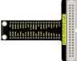 |        | 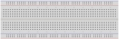 |  |
| ------------------------ | ------------------------ | ------------------------------ | ------------------------ | ------------------------ |
| Raspberry Pi*1           | GPIO Extension Board*1   | 40 pin Colorful Jumper Wires*1 | Breadboard*1             | IR Receiver *1           |
|  |  |        |  |  |
| 10KΩ resistor*1          | 100Ω resistor * 3        | IR Remote Control*1            | RGB*1                    | Jumper Wires             |
| 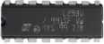 | 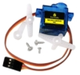 | 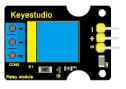       | 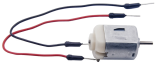 |                          |
| L293D Chip*1             | Servo Motor*1            | Relay Module*1                 | Motor*1                  |                          |

 Schematic Diagram：

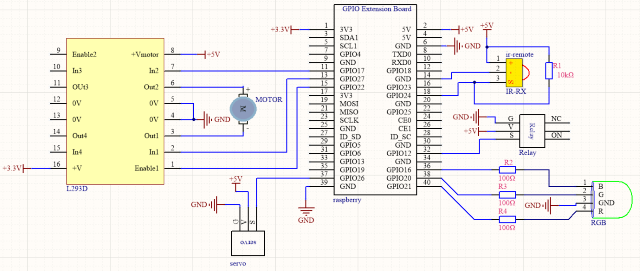

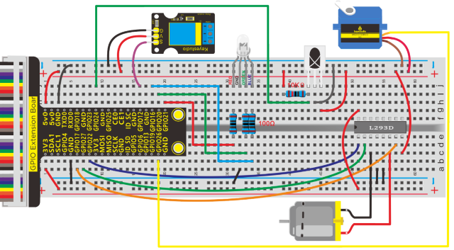

 Run Example Code：

Input the following commands and press "Enter":

cd /home/pi/C_code/lesson40_IR_control_some

gcc IR_control_some.c -o IR_control_some -lwiringPi

sudo ./IR_control_some

 Test Results：

|                     BUTTON                      | RESULT                                                       |
| :---------------------------------------------: | ------------------------------------------------------------ |
|  | DC motor rotate clockwise                                    |
|  | DC motor rotate anticlockwise                                |
|                       OK                        | DC motor stops                                               |
|  | DC motor speeds up （need to press left or right button again) |
|  | DC motor speeds down （need to press left or right button again） |
|                       1~6                       | Control RGB light                                            |
|                        7                        | Open relay module                                            |
|                        8                        | Turn off RGB light                                           |
|                        9                        | Turn off relay module                                        |
|                        *                        | Servo rotates clockwise 10 degree                            |
|                        ##                        | Servo rotates anticlockwise 10 degree                        |

Note: Press Ctrl + Z to exit the code running.

 Example Code：

```c
##include <stdio.h>
##include <stdlib.h>
##include <stdint.h>
##include <wiringPi.h>
##include <math.h>
##include <softPwm.h>

##define PIN 5  //ir pin  BCM GPIO 24
##define IO digitalRead(PIN)
unsigned char i,idx,cnt;
unsigned char count;
unsigned char data[4];

//define L293D pin
##define INA1 0  //BCM GPIO 17
##define INA2 2  //BCM GPIO 20
##define ENA  3  //BCM GPIO 22
int speed = 50;

//define RGB pin
##define R_pin 29  //BCM GPIO 21
##define G_pin 28  //BCM GPIO 20
##define B_pin 27  //BCM GPIO 16

##define relay_pin 26  //BCM GPIO 12

##define servo_pin 25  //BCM GPIO 26
int angle = 1500;

//motor forward
void motor_forward()
{
	digitalWrite(INA1,LOW);
	digitalWrite(INA2,HIGH);
	softPwmWrite(ENA,speed);
}
//motor reverse
void motor_reverse()
{
	digitalWrite(INA1,HIGH);
	digitalWrite(INA2,LOW);
	softPwmWrite(ENA,speed);
}
//motor stop
void motor_stop()
{
	digitalWrite(INA1,LOW);
	digitalWrite(INA2,LOW);
	softPwmWrite(ENA,0);
}
//Increase the speed
void speed_add()
{
	speed = speed + 10;
	if(speed >= 100)
	{
		speed = 100;
	}
}
//Reduce speed
void speed_sub()
{
	speed = speed - 10;
	if(speed <= 0)
	{
		speed = 0;
	}
}
//Set the color of the RGB lamp
void rgb(int rVal, int gVal, int bVal)
{
	softPwmWrite(R_pin,rVal);
	softPwmWrite(G_pin,gVal);
	softPwmWrite(B_pin,bVal);
}
//Set the steering gear Angle
void set_servo(int angle_val)
{
	angle = angle + angle_val;
	printf("angle = %d", angle);
	if(angle >= 2500)
	{
		angle = 2500;
	}
	if(angle <= 500)
	{
		angle = 500;
	}
	for(i=0;i<50;i++)            
	{
		digitalWrite(servo_pin,HIGH);
		delayMicroseconds(angle);
		digitalWrite(servo_pin,LOW);
		delay(20-(angle*0.001));
	}
}

//The main function, the program starts here
int main()
{
    if (wiringPiSetup() < 0)return 1;  //Determines if wiringPi is initialized
    //Set the state of the individual pins
    pinMode(PIN, INPUT);
    pullUpDnControl(PIN, PUD_UP);
	printf("IRM Test Program ... \n");
	pinMode(INA1, OUTPUT);
	pinMode(INA2, OUTPUT);
	softPwmCreate(ENA, 0, 100);  //motor pwm
	
	softPwmCreate(R_pin, 0, 100);
	softPwmCreate(G_pin, 0, 100);
	softPwmCreate(B_pin, 0, 100);
	
	pinMode(relay_pin, OUTPUT);
	
	pinMode(servo_pin, OUTPUT);
	set_servo(0);
	delay(300);

	while (1)  //The main loop
	{	
		if(IO == 0)
		{
			count = 0;
			while(IO == 0 && count++ < 200)   //9ms
		    	delayMicroseconds(60);
			
			count = 0;
			while(IO == 1 && count++ < 80)	  //4.5ms
		    	delayMicroseconds(60);
			
			idx = 0;
			cnt = 0;
			data[0]=0;
			data[1]=0;
			data[2]=0;
			data[3]=0;
			for(i =0;i<32;i++)
			{
				count = 0;
				while(IO == 0 && count++ < 15)  //0.56ms
		    		delayMicroseconds(60);
				
				count = 0;
				while(IO == 1 && count++ < 40)  //0: 0.56ms; 1: 1.69ms
		    		delayMicroseconds(60);

				if (count > 25)data[idx] |= (1<<cnt);
				if(cnt == 7)
				{
					cnt = 0;
					idx++;
				}
				else cnt++;
			}

			if(data[0]+data[1] == 0xFF && data[2]+data[3]==0xFF)	//check	
			{
				printf("Get the key: 0x%02x\n",data[2]);
				switch(data[2])
				{
					case 0x44: motor_forward(); break;
					case 0x43: motor_reverse(); break;
					case 0x40: motor_stop(); break;
					case 0x46: speed_add(); break;
					case 0x15: speed_sub(); break;
					
					case 0x16: rgb(100, 0, 0); break;
					case 0x19: rgb(0, 100, 0); break;
					case 0x0d: rgb(0, 0, 100); break;
					case 0x0c: rgb(1024, 100, 0); break;
					case 0x18: rgb(0, 100, 100); break;
					case 0x5e: rgb(100, 100, 100); break;
					case 0x1c: rgb(0, 0, 0); break;
					
					case 0x08: digitalWrite(relay_pin, HIGH); break;
					case 0x5a: digitalWrite(relay_pin, LOW); break;
					
					case 0x42: set_servo(150); break;
					case 0x4a: set_servo(-150); break;
				}
			}
				
		}
	}
}
```


