# **Processing JAVA Tutorial**

## Getting Started With Processing JAVA

We recommend you to learn the Python and C language tutorials about this kit firstly. We demonstrate how to install Raspberry Pi OS, fix IP address and remote login

### 1.Install processing IDE

Processing Website：https://pi.processing.org/get-started/

 Download processing IDE installation package

<https://github.com/processing/processing/releases/download/processing-0269-3.5.3/processing-3.5.3-linux-armv6hf.tgz>

You could download zip file to the download folder of Raspberry Pi.

Equally, you could save it into Downloads folder in the windows system, as shown below:


 Unzip installation package

Right-click it and select Extract Here


Then right-click to unzip folder and choose Open in Terminal


Input installation command: sudo ./install.sh and press“Enter”.


After the download, a sketchbook folder generates in the pi folder, which is default route of saving code.


 Open processing IDE

Then click Programming→Processing IDE

Input processing in terminal to open processing IDE, as shown below:


Its interface is shown below:


### 2.Use Processing IDE

Enter the code in the editor

| ellipse(50, 50 , 60, 100); |
| -------------------------- |


This code refers to“drawing an oval with a center 50 pixels from left to bottom, 50 pixels from top to bottom, width 60 and height 100 pixels."

Click the "Run" button (the triangle button in the toolbar) .


You will view an oval if all content is correct, as shown below:


Click to stop or close, the program will stop running.

A notification will appear if the input code is wrong. Don’t worry about it. Check the code immediately. numbers are separated with a comma and enclosed in parentheses and each line should end with a semicolon. The wrong code is as follows:


### 3.Copy Example Code to Raspberry Pi

Copy the Processing-Code.zip to sketchbook folder and unzip it, as shown below:


## Projects

**Note: G, - and GND marked on sensors and modules are so-called negative, which are connected to GND of GPIO extension board or “-” of breadboard; V、+、VCC are known as positive, which are interfaced 3V3 or 5V on extension board and“+”on breadboard**

### Project 1：Print Hello World

 Run example code：

Input the following command and press“Enter”. Then Processing IDE will boot, click“RUN”

processing /home/pi/sketchbook/Processing_Code/sketch_1_hello_world/sketch_1_hello_world.pde

Another method for your reference as below:

Click  to find out the route：

/home/pi/sketchbook/Processing_Code/sketch_1_hello_world, then right-click sketch_1_hello_world.pde to select Processing IDE.


 Test Result：

Input“hello world”in the control window and hello world！”appears in graphical display window, as shown below:


 Example Code：

```java
void setup() {  //execute only once when the program starts running
  size(480, 200); //set window size
  textSize(48);  //set the font size
  frameRate(1);  //To set the refresh rate, set the number of flushes per second for the draw () function
}
void draw() { //every frame is called once
  background(1); //full screen filled with solid color
  fill(255); //set the fill color of the words
  text("hello world!", 75, 120); //draw text, the lower left corner of the text coordinates are (75,120)
  println("hello world!"); //Output in the console window
}
```


### Project 2：LED Blink

 Description：

Let’s start from a rather basic and simple experiment----LED Blink

 Component：

|  |  |  |                                                 |
| ------------------------------------------------------------ | ------------------------------------------------------------ | ------------------------------------------------------------ | ----------------------------------------------- |
| Raspberry Pi*1                                               | GPIO Extension Board*1                                       | 40pin Colorful Jumper Wires*1                                |                                                 |
|  |  |  |  |
| LED - Red *1                                                 | 220Ω Resistor*1                                              | Breadboard*1                                                 | Jumper Wires                                    |

 Component Description：

**LED**: 

A light-emitting diode, the current is connected when anode(long pin) is connected to VCC, and cathode(short pin)is connected to GND. Its brightness is 2V and current is 6mA. LED must be connected to a resistor in the circuit, otherwise, the components will be burned.

**Resistor**: 

We use a carbon film resistor, 220Ωand its accuracy is 5%, why choose 220Ω resistor?

Since the high-level output voltage of GPIO pin of the Raspberry Pi is 3.3V, and the voltage of the LED is about 2V, and the current is about 6mA, we need to use a resistor to bear the voltage (3.3V-2V) = 1.3V, according to ohm The law: U/I = R knows: (3.3-2)/6 \* 1000 ≈ 217Ω.

**Breadboard**: 

Below is a short instruction of breadboard. The holes on the board are connected. The inner board is structure diagram.


 Schematic Diagram：

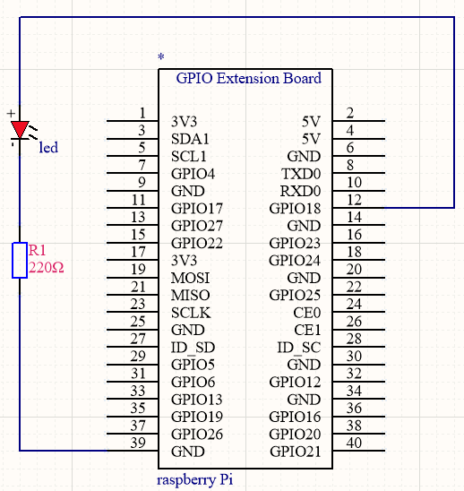

 Connection Diagram


Since the PIN numbers of GPIO Extension Board and RPi GPIO are same, the part of breadboard and GPIO Extension Board is only shown on further connection diagram.


 Working Principle：

The positive pole of LED is connected to GPIO18, when the pin of GPIO18 outputs 3.3V, LED will be on; when its pin outputs 0V, LED will be off.

 Run Example Code：

Input the following command, press“Enter”and click“RUN”on Processing IDE

processing /home/pi/sketchbook/Processing_Code/sketch_2_LED_Blinking/sketch_2_LED_Blinking.pde

**Test Result：**

LED starts blinking and the background of display window varies with the state of LED, as shown below:


**Example Code：**

```java
import processing.io.*;

int ledPin = 18;    //define ledPin
boolean ledState = false;    //define ledState

void setup() {
  size(100, 100);   //Set the size of the graphics display box to 100*100 pixels
  frameRate(1);        //set frame rate
  GPIO.pinMode(ledPin, GPIO.OUTPUT);    //set the ledPin to output mode  
}

void draw() {
  ledState = !ledState;  //Turn back the LED light
  if (ledState) {
    GPIO.digitalWrite(ledPin, GPIO.HIGH);    //led on 
    background(255, 0, 0); //set the fill color of led on
  } else {
    GPIO.digitalWrite(ledPin, GPIO.LOW);    //led off
    background(102); //set the fill color of led off
  }
}
```

The function of the above code is included in Processing Software. You could look through detailed information and reference by clicking “Help” → “Reference”, as shown below:

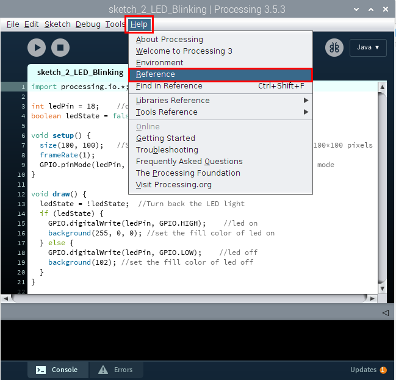


Equally, you could navigate the official website：http://processing.org/reference

### Project 3：Mouse-controlled LED

 Description：

In this program, we will control the status of LED by mouse. The components, connection and schematic diagrams are same as the lesson 2.

 Working Principle：

Left-click the display window, LED is on; right-click the display window, LED is off.

 Run Example Code：

Input the following command, press“Enter”and click“RUN”on Processing IDE:

processing /home/pi/sketchbook/Processing_Code/sketch_3_mouse_led/sketch_3_mouse_led.pde

**Test Result：**

After running example code, LED is off and display window is gray color. Left-click the gray area, LED is on and window turns into red color; right-click display window, LED is off and its background color is gray-black color, as shown below:


**Example Code：**

```java
import processing.io.*;

int ledPin = 18;    //define ledPin

void setup()
{
  size(100, 100);
  GPIO.pinMode(ledPin, GPIO.OUTPUT);
}

void draw() {
  if (mousePressed && (mouseButton == LEFT)) {
    background(255, 0, 0); //set the fill color of led on
    GPIO.digitalWrite(ledPin, GPIO.HIGH);
  } 
  if (mousePressed && (mouseButton == RIGHT)) {
    background(102);
    GPIO.digitalWrite(ledPin, GPIO.LOW);
  }
}
```


### Project 4：Flow Light

 Description：

What is flow light? Maybe you see it on the wall of buildings and billboards. It is a scene that LED gradually brightens then darkens one by one.

 Component：

|  |  |  |  |
| ------------------------------------------------------------ | ------------------------------------------------------------ | ------------------------------------------------------------ | ------------------------------------------------------------ |
| Raspberry Pi*1                                               | GPIO Extension Board*1                                       | 40 pinColorful Jumper Wires*1                                | Breadboard*1                                                 |
|  |  |               |                                                              |
| LED - Red *8                                                 | 220Ω Resistor*8                                              | Jumper Wires                                                 |                                                              |

 Schematic Diagram：

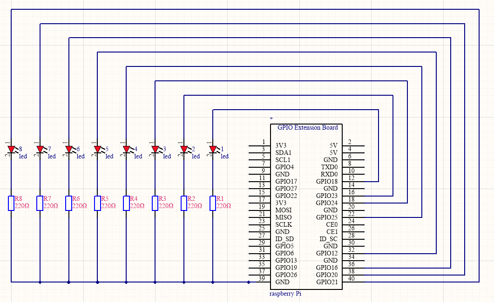


 Run Example Code：

Input the following command, press“Enter”and click“RUN”on Processing IDE:

processing/home/pi/sketchbook/Processing_Code/sketch_4_LED_Chasing_Effect/sketch_4_LED_Chasing_Effect.pde

**Test Result：**

The rectangle will turn out to be red if you leave the mouse pointer on it, as shown below, you could make them display red color one by one, equally, the status of LED will vary with the rectangle’s.


**Example Code：**

```java
import processing.io.*;

int leds[]={18, 23, 24, 25, 12, 16, 20, 21}; //define ledPins

void setup() {
  size(520, 360);  //display window size
  for (int i=0; i<8; i++) {  //set led Pins to output mode
    GPIO.pinMode(leds[i], GPIO.OUTPUT);
  }
  background(102);
  textAlign(CENTER);    //set the text centered
  textSize(40);        //set text size
  text("LED Chasing Effect", width / 2, 40);    //title
  textSize(16);
  text("www.keyestudio.com", width / 2, height - 20);    //site
}

void draw() {
  for (int i=0; i<8; i++) {    //draw 10 rectanglar box
    if (mouseX>(25+60*i)) {    //if the mouse cursor on the right of rectanglar box 
      fill(255, 0, 0);        //fill the rectanglar box in red color
      GPIO.digitalWrite(leds[i], GPIO.HIGH);  //turn on the corresponding led
    } else {
      fill(255, 255, 255);  //else fill the rectanglar box in white color and turn off the led
      GPIO.digitalWrite(leds[i], GPIO.LOW);  
    }
    rect(25+60*i, 90, 50, 180);    //draw a rectanglar box
  }
}
```


### Project 5：Breathing LED

 Description：

A“breathing LED” is a phenomenon where an LED's brightness smoothly changes from dark to bright and back to dark, continuing to do so and giving the illusion of an LED“breathing.” This phenomenon is similar to a lung breathing in and out. So how to control LED’s brightness? We need to take advantage of PWM.

 Component：

|  |  |  |  |
| ------------------------------------------------------------ | ------------------------------------------------------------ | ------------------------------------------------------------ | ------------------------------------------------------------ |
| Raspberry Pi*1                                               | GPIO Extension Board*1                                       | 40 pin Colorful Jumper Wires*1                               | Breadboard*1                                                 |
|  |  |               |                                                              |
| LED - Red *1                                                 | 220ΩResistor *1                                              | Jumper Wires                                                 |                                                              |

 Working Principle：

We use the PWM output of GPIO, PWM outputs analog signals and output value is 0~100 which is equivalent to output voltage 0~3.3V from GPIO port.

According to Ohm's law: U/R = I, the resistance is 220Ω, and the value of voltage U changes, so does the value of current I, which can control the brightness of the LED lamp.

PWM (Pulse Width Modulation) is the control of the analog circuit through the digital output of microcomputer and a method that making digital coding on analog signal levels.

It sends square waves with certain frequency through digital pins, that is, high level and low level are output alternately for a period of time. Total time of each group high and low level is fixed, which is called cycle. 

The time of high level output is pulse width whose percentage is called Duty Cycle. The longer that high level lasts, the larger the duty cycle of analog signals is, the corresponding voltage as well.

Below chart is pulse width 50%, then the output voltage is 3.3 * 50% = 1.65V，the brightness of LED is medium.


 Schematic Diagram：


 **Connection Diagram**


 Run Example Code：

Input the following the command and press“Enter”, open Processing IDE and click“RUN”

processing/home/pi/sketchbook/Processing_Code/sketch_5_Breathing_LED/sketch_5_Breathing_LED.pde

**Test Result：**

LED gradually brightens, and the color of red dot in the display window gets darker as well. progress bar can adjust the LED’s brightness, as shown below:


**Example Code：**

Except main program code, there is a “SOFTPWM” custom page in processing software, as shown below:


```java
import processing.io.*;

int ledPin = 18;    //led Pin
int borderSize = 40;  //
float t = 0.0;      //progress percent
float tStep = 0.004;    // speed
SOFTPWM p = new SOFTPWM(ledPin, 10, 100);    //Create a PWM pin,initialize the duty cycle and period
void setup() {
  size(640, 360);  //display window size
  strokeWeight(4);  //stroke Weight
}

void draw() {
  // Show static value when mouse is pressed, animate otherwise
  if (mousePressed) {
    //Gets the value of the X-axis coordinate when the mouse is pressed, within the (borderSize, width-bordersize) range
    int a = constrain(mouseX, borderSize, width - borderSize);
    t = map(a, borderSize, width - borderSize, 0.0, 1.0); //Gets the value after the mapping
  } else {
    t += tStep;  //The value of the variable T increases automatically
    if (t > 1.0) t = 0.0;
  }
  p.softPwmWrite((int)(t*100)); //wirte the duty cycle according to t
  background(255);  //A white background
  titleAndSiteInfo();  //title and Site infomation
  
  //The brightness of the red circle varies with the value of T
  fill(255, 255-t*255, 255-t*255);
  //The center of the display box is a circle with a diameter of 100px
  ellipse(width/2, height/2, 100, 100);
  
  pushMatrix();
  translate(borderSize, height - 45);  //Set the new origin of coordinates
  int barLength = width - 2*borderSize;  //Define the length of the line
  
  barBgStyle();  //progressbar bg
  line(0, 0, barLength, 0);  //A horizontal line
  //Draw a 10px vertical line at the end of the horizontal line
  line(barLength, -5, barLength, 5);  
  barStyle();  //progressbar 
  //Draw a 10px vertical line at the beginning of the horizontal line
  line(0, -5, 0, 5); 
  //Draw the length of the black line according to the value of the variable t
  line(0, 0, t*barLength, 0);

  barLabelStyle();    //progressbar label
  text("progress : "+nf(t*100,2,2),barLength/2,-25);
  popMatrix();
}

void titleAndSiteInfo() {
  fill(0);
  textAlign(CENTER);    //set the text centered
  textSize(40);        //set text size
  text("Breathing Light", width / 2, 40);    //title
  textSize(16);
  text("www.keyestudio.com", width / 2, height - 20);    //site
}
void barBgStyle() {
  stroke(220);
  noFill();
}

void barStyle() {
  stroke(50);
  noFill();
}

void barLabelStyle() {
  noStroke();
  fill(120);
}
```

 Reference：

**class SOFTPWM**

1\. **public SOFTPWM(int iPin, int dc, int pwmRange)**

constructed function，used to create PWM pin，set pwmRange and initial duty cycle

The time of minimum duty cycle of pwmRange is 0.1ms

pwmRange=100 means than PWM duty cycle is 0.1ms*100=10ms

2\. **public void softPwmWrite(int value)**

Set PMW Duty Cycle

3\. **public void softPwmStop()**  

Stop outputting PWM

### Project 6：RGB

 Description：

In this chapter, we will demonstrate how RGB lights show different colors via programming.

 Component：

|  |  |  |  |
| ------------------------------------------------------------ | ------------------------------------------------------------ | ------------------------------------------------------------ | ------------------------------------------------------------ |
| Raspberry Pi*1                                               | GPIO Extension Board*1                                       | 40 pin Colorful Jumper Wires*1                               | Breadboard*1                                                 |
|  |  |               |                                                              |
| RGB - LED *1                                                 | 100Ω Resistor*3                                              | Jumper Wires                                                 |                                                              |

 **Working Principle：**

RGB LED integrated three LEDs emitting red,green and blue light. It has 4 pins，long pin (-) is a shared pin, that is, the negative port of 3LED, as shown below, we control three LEDs to emit light with different brightness to make RGB show different colors.

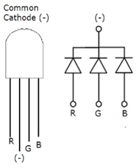

Red, green and blue are three primary colors. They could produce all kinds of visible lights when mixing them up. Computer screen, single pixel mobile phone screen, neon light work under this principle.


Next, we will make a RGB LED displaying all kinds of colors

 Schematic Diagram：


 Run Example Code：

Input the following command, press“Enter”and click“RUN”on Processing IDE

processing/home/pi/sketchbook/Processing_Code/sketch_6_RGB_led/sketch_6_RGB_led.pde

**Test Result：**

RGB LED is off when the code is executed.

The window shows round dot and red, green and blue progress bars are 0%.

The round dot will change color when dragging the progress bar to set PWM duty cycle for each color channel.

The color of RGB is as same as round dot.


**Example Code：**

This project contains a lot of code files, the core code is contained in the file sketch_6_RGB_led.pde.

Other files are customized. As shown below:


```java
import processing.io.*;

int bluePin = 18;    //blue Pin
int greenPin = 23;  //green Pin
int redPin = 24;    //red Pin
int borderSize = 40;  //picture border size
//Create a PWM pin,initialize the duty cycle and period
SOFTPWM pRed = new SOFTPWM(redPin, 100, 100);    
SOFTPWM pGreen = new SOFTPWM(greenPin, 100, 100);
SOFTPWM pBlue = new SOFTPWM(bluePin, 100, 100);
//instantiate three ProgressBar Object
ProgressBar rBar, gBar, bBar;
boolean rMouse = false, gMouse = false, bMouse = false;
void setup() {
  size(640, 360);  //display window size
  strokeWeight(4);  //stroke Weight
  //define the ProgressBar length
  int barLength = width - 2*borderSize;
  //Create ProgressBar Object
  rBar = new ProgressBar(borderSize, height - 85, barLength);
  gBar = new ProgressBar(borderSize, height - 65, barLength);
  bBar = new ProgressBar(borderSize, height - 45, barLength);
  //Set ProgressBar's title
  rBar.setTitle("Red");gBar.setTitle("Green");bBar.setTitle("Blue");
}

void draw() {
  background(200);  //A white background
  titleAndSiteInfo();  //title and Site infomation

  fill(rBar.progress*255, gBar.progress*255, bBar.progress*255);  //cycle color
  ellipse(width/2, height/2, 100, 100);  //show cycle

  rBar.create();  //Show progressBar
  gBar.create();
  bBar.create();
}

void mousePressed() {
  if ( (mouseY< rBar.y+5) && (mouseY>rBar.y-5) ) {
    rMouse = true;
  } else if ( (mouseY< gBar.y+5) && (mouseY>gBar.y-5) ) {
    gMouse = true;
  } else if ( (mouseY< bBar.y+5) && (mouseY>bBar.y-5) ) {
    bMouse = true;
  }
}
void mouseReleased() {
  rMouse = false;
  bMouse = false;
  gMouse = false;
}
void mouseDragged() {
  int a = constrain(mouseX, borderSize, width - borderSize);
  float t = map(a, borderSize, width - borderSize, 0.0, 1.0);
  if (rMouse) {
    pRed.softPwmWrite((int)(100-t*100)); //wirte the duty cycle according to t
    rBar.setProgress(t);
  } else if (gMouse) {
    pGreen.softPwmWrite((int)(100-t*100)); //wirte the duty cycle according to t
    gBar.setProgress(t);
  } else if (bMouse) {
    pBlue.softPwmWrite((int)(100-t*100)); //wirte the duty cycle according to t
    bBar.setProgress(t);
  }
}

void titleAndSiteInfo() {
  fill(0);
  textAlign(CENTER);    //set the text centered
  textSize(40);        //set text size
  text("Colorful LED", width / 2, 40);    //title
  textSize(16);
  text("www.keyestudio.com", width / 2, height - 20);    //site
}
```

 Reference：

**class ProgressBar（used to create progress bar）**  

1. public ProgressBar**(**int ix**,** int iy**,** int barlen**)**  : Constructed function, used to create ProgressBar, coordinates X, Y of ProgressBar and length
2. public void setTitle**(**String str**)**: Used to set the name of progress bar and display it in the middle of progress bar
3. public void setProgress**(**float pgress**)**: Used to set the process of progress bar parameter：0\<pgress\<1.0.
4. public void create**() &** public void create**(**float pgress**)**: Used to draw the progress bar


### Project 7：Active Buzzer

 Description：

In this project, we will demonstrate how doorbell works.

 Component：

|  |  |  |
| ------------------------------------------------------------ | ------------------------------------------------------------ | ------------------------------------------------------------ |
| Raspberry Pi*1                                               | GPIO Extension Board*1                                       | 40 pin Colorful Jumper Wires*1                               |
|  |  |               |
| Breadboard*1                                                 | Active Buzzer *1                                             | Jumper Wires                                                 |

 Component Knowledge：

**Active buzzer：**

An active buzzer will generate a tone using an internal oscillator, so all that is needed is a DC voltage. A passive buzzer requires an AC signal to make a sound. It is like an electromagnetic speaker, where a changing input signal produces the sound, rather than producing a tone automatically.

**Schematic Diagram：**


 Wiring Diagram


 Run Example Code：

Input the following command, press“Enter”and click“RUN”on Processing IDE:

processing/home/pi/sketchbook/Processing_Code/sketch_7_active_buzzer/sketch_7_active_buzzer.pde

**Test Result：**

Click any area of display window, active buzzer emits sound and the icon on display window varies with the status of active buzzer.


**Example Code：**

```java
import processing.io.*;

int buzzerPin = 27;
boolean buzzerState = false;
void setup() {
  size(640, 360);
  GPIO.pinMode(buzzerPin, GPIO.OUTPUT);
}

void draw() {
  background(255);
  titleAndSiteInfo();    //title and site infomation
  drawBuzzer();       //buzzer img
  if (buzzerState) {
    GPIO.digitalWrite(buzzerPin, GPIO.HIGH);
    drawArc();      //Sounds waves img
  } else {
    GPIO.digitalWrite(buzzerPin, GPIO.LOW);
  }
}

void mouseClicked() { //if the mouse Clicked
  buzzerState = !buzzerState;  //Change the buzzer State
}
void drawBuzzer() {
  strokeWeight(1);
  fill(0);
  ellipse(width/2, height/2, 50, 50);  
  fill(255);
  ellipse(width/2, height/2, 10, 10);
}
void drawArc() {
  noFill();
  strokeWeight(8);
  for (int i=0; i<3; i++) {
    arc(width/2, height/2, 100*(1+i), 100*(1+i), -PI/4, PI/4, OPEN);
  }
}
void titleAndSiteInfo() {
  fill(0);
  textAlign(CENTER);    //set the text centered
  textSize(40);        //set text size
  text("Active Buzzer", width / 2, 40);    //title
  textSize(16);
  text("www.keyestudio.com", width / 2, height - 20);    //site
}
```


### Project 8：Button-controlled LED

 Description：

Usually, a complete open loop control is made of external information input. Controller and actuator.

The external information is input into controller which can analyze the input data and send to control signals to make actuator to react.


A button-controlled LED is decided by an open loop control. Next, we will make a desk lamp with a button, an LED and RPi. LED is on when button is pressed, on the contrary, it will be off.

 Component：

|  |  |  |
| ------------------------------------------------------------ | ------------------------------------------------------------ | ------------------------------------------------------------ |
| Raspberry Pi*1                                               | GPIO Extension Board*1                                       | 40 pin Colorful Jumper Wires*1                               |
|  |               |  |
| Breadboard*1                                                 | LED - Red *1                                                 | Button Switch *1                                             |
|  |  |  |
| 220Ω Resistor*1                                              | Jumper Wires                                                 | 10KΩ Resistor*1                                              |

 Component Knowledge：

**Button Switch:** 

It can control circuit. Before pressed, the current can’t pass from one end to the other end. Both ends are like two mountains. There is a river in between. We can't cross this mountain to another mountain. When pressed, my internal metal piece is connecting the two sides to let the current pass, just like building a bridge to connect the two mountains.

Inner structure: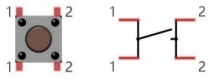

1 and 1 , 2 and 2 are connected , however, 1 and 2 are disconnected when the button is not pressed; 1 and 2 are connected when pressing the button.

**10KΩ resistor**：

It is pull-up resistor. The high and low levels of Raspberry Pi will be unstable if connecting only GPIO pins instead of resistors.

Resistor could stabilize the electronic signal and protect circuit.

The circuit will be shorten and components will be burnt if without wiring 10kΩ resistor, as shown below;

 Schematic Diagram：


 Eliminate Button Shaking

The LED status won’t jump into new state immediately when button is pressed. There will be a short continuous shaking before into new status, which is similar with release status.


Therefore, there will be many a presses and release actions. The shaking will misleads the high speed movement of MCU, causing wrong judgement. That requires that we need to judge the button’ status frequently.

The button means being pressed when its status is stable.

 Run Example Code：

Input the following command, press“Enter”and click“RUN”on Processing IDE

processing/home/pi/sketchbook/Processing_Code/sketch_8_button_led/sketch_8_button_led.pde

**Test Result：**

After running example code, the display window is dark gray color. Press button, LED is on and window turns into red color; Press button again, LED is off and its background color is dark gray color, as shown below:


**Example Code：**

```java
import processing.io.*;

int ledPin = 27; //define ledPin
int btnPin = 18; //define btnPin
int count = 0;
int flag = 0;
int ledState = 0;

void setup() {
  size(100, 100);
  GPIO.pinMode(btnPin, GPIO.INPUT_PULLUP);
  GPIO.pinMode(ledPin, GPIO.OUTPUT);
}

void draw() {
  
  if (GPIO.digitalRead(btnPin) == GPIO.LOW) { // button is pressed
    delay(10);
    flag = 1;
    if(flag == 1)
    {
      delay(10);
      if (GPIO.digitalRead(btnPin) == GPIO.HIGH)
      {
        count = count + 1;
        println(count);
        flag = 0;
      }
    }
  }
  ledState = count % 2;
  if(ledState == 1)
  {
    GPIO.digitalWrite(ledPin, GPIO.HIGH);  //led on
    background(255, 0, 0);
  }
  else
  {
    GPIO.digitalWrite(ledPin, GPIO.LOW);  //led off
    background(102);
  }
}
```


### Project 9：PIR Motion Sensor

 Description：

In this lesson, we will learn about PIR motion sensor.

 Component：

|  |  |  |  |
| ------------------------------------------------------------ | ------------------------------------------------------------ | ------------------------------------------------------------ | ------------------------------------------------------------ |
| Raspberry Pi*1                                               | GPIO Extension Board*1                                       | 40 pin Colorful Jumper Wires*1                               | Breadboard*1                                                 |
|               |  |  |               |
| LED - Red *1                                                 | 220Ω Resistor*1                                              | PIR Motion Sensor*1                                          | Jumper Wires                                                 |

 Component Knowledge：

**PIR Motion Sensor：**

The principle of human infrared sensor is that when certain crystals, such as lithium tantalate and triglyceride sulfate, are heated, the two ends of the crystal will generate an equal number of charges, with opposite signs, which can be converted into voltage output by an amplifier.

Human body will emit IR ray, although weak but can be detected. Sensor will output high level(1) when human being is detected by sensor, otherwise, it will output low level 0.

Note: Nothing but moving person can be detected, with the detection distance is up to 3m.

 Schematic Diagram：

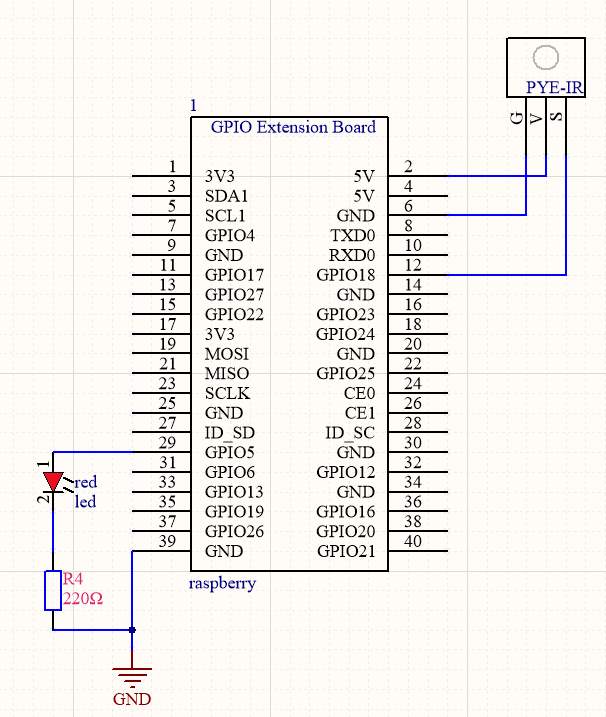


 Run Example Code：

Input the following command, press “Enter”and click“RUN”on Processing IDE

processing/home/pi/sketchbook/Processing_Code/sketch_9_PIR_led/sketch_9_PIR_led.pde

**Test Result：**

If PIR motion sensor doesn’t detect moving person, LED will be off and display window will show black dot and“Nobody”; on the contrary, LED will be on, and window will show red dot and “Somebody”, as shown below:


**Example Code：**

```java
import processing.io.*;

final int sensorPin = 18;  //connect to sensor pin
final int ledPin = 5;    //connect to led pin
void setup() {
  size(640,360);    //window size
  GPIO.pinMode(sensorPin, GPIO.INPUT); 
  GPIO.pinMode(ledPin, GPIO.OUTPUT);
}

void draw() {
  background(255);
  titleAndSiteInfo();
  //if read sensor for high level
  if (GPIO.digitalRead(sensorPin) == GPIO.HIGH) {
    GPIO.digitalWrite(ledPin, GPIO.HIGH);  //led on
    fill(255,0,0);    //fill in red
    textAlign(CENTER);    //set the text centered
    textSize(40);        //set text size
    text("Somebody", width / 2, 275);    //title
  } else {
    GPIO.digitalWrite(ledPin, GPIO.LOW);  //led off
    fill(100);        //fill in white
    textAlign(CENTER);    //set the text centered
    textSize(40);        //set text size
    text("Nobody", width / 2, 275);    //title
  }
  ellipse(width/2,height/2.5,height/3,height/3);
}

void titleAndSiteInfo() {
  fill(0);
  textAlign(CENTER);    //set the text centered
  textSize(45);        //set text size
  text("PIR LED", width / 2, 40);    //title
  textSize(16);
  text("www.keyestudio.com", width / 2, height - 20);    //site
}
```


### Project 10：Fire Alarm

 Description：

A flame detector is a sensor designed to detect and respond to the presence of a flame or fire, allowing flame detection.

 Component：

|  |  |  |  |
| ------------------------------------------------------------ | ------------------------------------------------------------ | ------------------------------------------------------------ | ------------------------------------------------------------ |
| Raspberry Pi*1                                               | GPIO Extension Board*1                                       | 40 pin Colorful Jumper Wires*1                               | Breadboard*1                                                 |
|  |  |  |               |
| Active Buzzer *1                                             | Flame Sensor *1                                              | 10KΩ Resistor*1                                              | Jumper Wires                                                 |

 Component Knowledge：

**Flame Sensor：**

Flame sensor is made based on the principle that infrared ray is highly sensitive to flame. It has an infrared receiving tube specially designed to detect fire, and then convert the flame brightness to fluctuating level signal. The signals are then input into the central processor and be dealt with accordingly.

Flame sensor is used to detect fire source with wavelength in 760nm～1100nm, detection angle is 60°. When its IR waves length is close to 940nm, and its sensitivity is highest.

Notice that keep flame sensor away from fire source to defend its damage for its working temperature is between -25°-85°

 Schematic Diagram：


 Run Example Code：

Input the following command, press“Enter”and click“RUN”on Processing IDE

processing/home/pi/sketchbook/Processing_Code/sketch_10_flame_buzzer/sketch_10_flame_buzzer.pde

**Test Result：**

Active buzzer will emit sound and window display will show arc lines and “Fire” as follows, when flame is detected; otherwise, active buzzer won’t emit sound, arc lines and“Fire”will disappear.


**Example Code：**

```java
import processing.io.*;

int sensorPin = 18;  //connect to sensor pin
int buzzerPin = 27;    //connect to buzzer pin
boolean buzzerState = false;
void setup() {
  size(640,360);    //window size
  GPIO.pinMode(sensorPin, GPIO.INPUT); 
  GPIO.pinMode(buzzerPin, GPIO.OUTPUT);
}

void draw() {
  background(255);
  titleAndSiteInfo();  //title and site infomation
  drawBuzzer();       //buzzer img
  //if read sensor for high level
  if (GPIO.digitalRead(sensorPin) == GPIO.HIGH) {
    GPIO.digitalWrite(buzzerPin, GPIO.HIGH);  
    drawArc();      //Sounds waves img
    fill(0);
    textAlign(CENTER);    //set the text centered
    textSize(40);        //set text size
    text("Fire", width / 3, 250);    //title
  } else {
    GPIO.digitalWrite(buzzerPin, GPIO.LOW);  //led off  
  } 
}

void drawBuzzer() {
  strokeWeight(1);
  fill(0);
  ellipse(width/2, height/2, 50, 50);  
  fill(255);
  ellipse(width/2, height/2, 10, 10);
}
void drawArc() {
  noFill();
  strokeWeight(8);
  for (int i=0; i<3; i++) {
    arc(width/2, height/2, 100*(1+i), 100*(1+i), -PI/4, PI/4, OPEN);
  }
}
void titleAndSiteInfo() {
  fill(0);
  textAlign(CENTER);    //set the text centered
  textSize(40);        //set text size
  text("Fire Alarm", width / 2, 40);    //title
  textSize(16);
  text("www.keyestudio.com", width / 2, height - 20);    //site
}
```


### Project 11：74HC595 & 1-digit Segment Display

 Description：

In previous lesson, we control a 1-digit LED display with eight, which is wasteful. We need to figure out a method to save the use of GPIO ports. In fact, we need a 74HC595 CHIP.

 Component：

|  |  |  |  |
| ------------------------------------------------------------ | ------------------------------------------------------------ | ------------------------------------------------------------ | ------------------------------------------------------------ |
| Raspberry Pi*1                                               | GPIO Extension Board*1                                       | 40 pin Colorful Jumper Wires*1                               | Breadboard*1                                                 |
|               |  |  |               |
| 1-digit 7-seg LED*1                                          | 220Ω Resistor*8                                              | 74HC595N*1                                                   | Jumper Wires                                                 |

**74HC595**：

The 74HC595 consists of an 8−bit shift register and an 8−bit D−typelatch with three−state parallel outputs. The shift register accepts serial data  and  provides  a  serial  output.  The  shift  register  also  provides parallel  data  to  the  8−bit  latch.  The  shift  register  and  latch  have independent clock inputs. This device also has an asynchronous reset for the shift register.

74HC595 Pinout：


74HC595 Control Protocol

|     PIN     | FUNCTION                                                     |
| :---------: | ------------------------------------------------------------ |
|  13 PIN OE  | Enable pin, not controlled by program when high level; make it connect to GND when low level |
|  14 PIN SI  | This is pin receiving data, enter a bit each time and compose a byte if inputting eight times |
| 10 PIN SCLK | Shift register clear pin, used to clear out all data in shift register, when low level, data will be cleared out. |
| 11 PIN SCK  | Clock pin of shift register, the data inside will move backward and receive the data input when it is on rising edge. |
| 12 PIN RCK  | Clock input pin of latch register, data from shift register will saved in latch register when it is on rising edge. The data will be output from QA\~QH |
|  9 Pin SQH  | Cascade pin，connected to multiple 74HC595 chips             |

More details about 74HC595 chip, you could look through chip specification folder.

 Schematic Diagram：

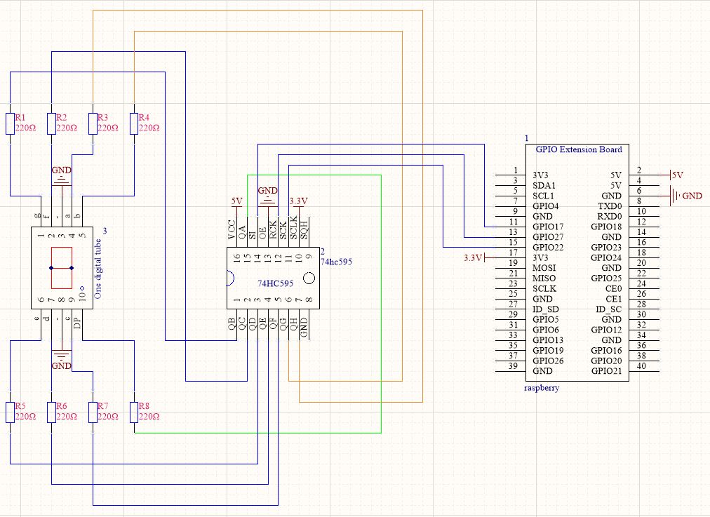


The output end QA\~QH of 74HC595 respond to the pin DP, and g\~a.

Why? Since the binary is counted from the right, programming will be convenient. For example, 1-digit display shows 0011 1111 , the first bit is 1 which equals to QA saved in 74HC595, then when the rest numbers are sent to 74HC595, 1 will be pushed to QH, and last bit 0 is placed on QA. However, the wiring is so inverse that the first bit of binary corresponds to a and last one to DIP controlling 1-digit display.

| 74HC595 |    |    |    |    |    |    |    |    |         |
|---------|----|----|----|----|----|----|----|----|---------|
|         | QH | QG | QF | QE | QD | QC | QB | QA |         |
|         | a  | b  | c  | d  | e  | f  | g  | dp |         |
| **0**   | 1  | 1  | 1  | 1  | 1  | 1  | 0  | 0  | **252** |
| **1**   | 0  | 1  | 1  | 0  | 0  | 0  | 0  | 0  | **96**  |
| **2**   | 1  | 1  | 0  | 1  | 1  | 0  | 1  | 0  | **218** |
| **3**   | 1  | 1  | 1  | 1  | 0  | 0  | 1  | 0  | **242** |
| **4**   | 0  | 1  | 1  | 0  | 0  | 1  | 1  | 0  | **102** |
| **5**   | 1  | 0  | 1  | 1  | 0  | 1  | 1  | 0  | **182** |
| **6**   | 1  | 0  | 1  | 1  | 1  | 1  | 1  | 0  | **190** |
| **7**   | 1  | 1  | 1  | 0  | 0  | 0  | 0  | 0  | **224** |
| **8**   | 1  | 1  | 1  | 1  | 1  | 1  | 1  | 0  | **254** |
| **9**   | 1  | 1  | 1  | 1  | 0  | 1  | 1  | 0  | **246** |

 Run Example Code：

Input the following command, press “Enter”and click“RUN”on Processing IDE

processing/home/pi/sketchbook/Processing_Code/sketch_11_74HC595_one_digital_LED/sketch_11_74HC595_one_digital_LED.pde

**Test Result：**

Display window will show“0-9”, and you could increase the change speed of numbers by dragging progress bar, as shown below:


**Example Code：**

This program includes many code files, the core code is sketch_11_74HC595_one_digital_LED.pde, other files are customized, as shown below:


Main program code:

```java
import processing.io.*;

int dataPin = 17;    //connect to the 74HC595
int latchPin = 27;
int clockPin = 22;
final int borderSize = 45;    //border size 
ProgressBar mBar;    //ProgressBar Object
IC74HC595 ic;      //IC74HC595 Object
boolean mMouse = false;    //determined whether a mouse click the ProgressBar
int index = -1;           // index of number
int lastMoveTime = 0;      //led last move time point
//encoding for character 0-9 of common anode SevenSegmentDisplay
final int[] numCode = {0xFC, 0x60, 0xDA, 0xF2, 0x66, 0xB6, 0xBE, 0xE0, 0xFE, 0xF6};
PFont mFont;

void setup() {
  size(640, 360);
  mBar = new ProgressBar(borderSize, height-borderSize, width-borderSize*2);
  mBar.setTitle("Speed");    //set the ProgressBar's title
  ic = new IC74HC595(dataPin, latchPin, clockPin);
  mFont = loadFont("DigifaceWide-100.vlw");  //create DigifaceWide font
}

void draw() {
  background(255);
  titleAndSiteInfo();  //title and site information
  strokeWeight(4);    //border weight
  mBar.create();      //create the ProgressBar
  //control the speed of number change
  if (millis() - lastMoveTime > 50/(0.05+mBar.progress)) {
    lastMoveTime = millis();
    index++;
    if (index > 9) {
      index = 0;
    }
  }
  ic.write(ic.MSBFIRST, numCode[index]);    //write 74HC595
  showNum(index);    //show the number in dispaly window
}
void showNum(int num) {
  fill(0);
  textSize(100);
  textFont(mFont);    //digiface font
  textAlign(CENTER, CENTER);
  text(num, width/2, height/2);
}
void mousePressed() {
  if ( (mouseY< mBar.y+5) && (mouseY>mBar.y-5) ) {
    mMouse = true;    //the mouse click the progressBar
  }
}
void mouseReleased() {
  mMouse  = false;
}
void mouseDragged() {
  int a = constrain(mouseX, borderSize, width - borderSize);
  float t = map(a, borderSize, width - borderSize, 0.0, 1.0);
  if (mMouse) {
    mBar.setProgress(t);
  }
}
void titleAndSiteInfo() {
  fill(0);
  textAlign(CENTER);    //set the text centered
  textFont(createFont("", 100));  //default font
  textSize(40);        //set text size  
  text("Seven-segment Display", width / 2, 40);    //title
  textSize(16);
  text("www.keyestudio.com", width / 2, height - 20);    //site
}
```

**loadFont()** Reference:

<https://processing.org/reference/loadFont_.html>

### Project 12：74HC595 & 4-digit Segment Display

 Description：

In previous lesson, the LED display only shows 1 digit number, whereas, we could try to operate 4 digit LED display.

 Component：

|  |  |  |  |
| ------------------------------------------------------------ | ------------------------------------------------------------ | ------------------------------------------------------------ | ------------------------------------------------------------ |
| Raspberry Pi*1                                               | GPIO Extension Board*1                                       | 40 pin Colorful Jumper Wires*1                               | Breadboard*1                                                 |
|               |  |  |               |
| 4-digit 7-seg LED*1                                          | 220Ω Resistor*8                                              | 74HC595N*1                                                   | Jumper Wires                                                 |

**Digit Segment LED display:**

The 4-digit LED display is divided into common anode and common cathode. Similar to 1-digit segment LED display, it is controlled display segment by 8 GPIO ports(8 LED lights). However, this is 4 digit display, 4 GPIO ports are required to control the bit selection terminal.

Ours is common cathode.

**4-digit LED Display Pinouts**

Pin 1, 2, 3 and 4 are control pin of control bit


 Schematic Diagram：


 Run Example Code：

Input the following command, press “Enter” and click “RUN” on Processing IDE

processing/home/pi/sketchbook/Processing_Code/sketch_12_74HC595_four_digital_LED/sketch_12_74HC595_four_digital_LED.pde

**Test Result：**

The number in the window is as same as the number on 4-digit 7-segment display. The window continuously displays the number from 0 to 9999. Dragging the progress bar can change the display speed of number, as shown below:


**Example Code：**


```java
import processing.io.*;

int dataPin = 24;    //connect to the 74HC595
int latchPin = 23;
int clockPin = 18;
int[] digitPin = {17, 27, 22, 10};  //Connected to a common anode digital tube through the transistor
final int borderSize = 45;    //border size 
ProgressBar mBar;    //ProgressBar Object
IC74HC595 ic;      //IC74HC595 Object
boolean mMouse = false;    //determined whether a mouse click the ProgressBar
int index = 0;           // index of number
int lastMoveTime = 0;      //led last move time point
//encoding for character 0-9 of common anode SevenSegmentDisplay
final int[] numCode = {0x3f, 0x30, 0x5b, 0x4f, 0x66, 0x6d, 0x7d, 0x07, 0x7f, 0x6f};
PFont mFont;

void setup() {
  size(640, 360);
  for (int i =0; i<4; i++) {
    GPIO.pinMode(digitPin[i], GPIO.OUTPUT);
  }
  mBar = new ProgressBar(borderSize, height-borderSize, width-borderSize*2);
  mBar.setTitle("Speed");    //set the ProgressBar's title
  ic = new IC74HC595(dataPin, latchPin, clockPin);
  mFont = loadFont("DigifaceWide-100.vlw");  //create DigifaceWide font
  thread("displaySSD");
}

void draw() {
  background(255);
  titleAndSiteInfo();  //title and site information
  strokeWeight(4);    //border weight
  mBar.create();      //create the ProgressBar
  //control the speed of number change
  if (millis() - lastMoveTime > 50/(0.05+mBar.progress)) {
    lastMoveTime = millis();
    index++;
    if (index > 9999) {
      index = 0;
    }
  }
  showNum(index);    //show the number in dispaly window
}
void showNum(int num) {
  fill(0);
  textSize(100);
  textFont(mFont);    //digiface font
  textAlign(CENTER, CENTER);
  text(nf(num,4,0), width/2, height/2);
}

void displaySSD() {
  while (true) {
    display(index);
  }
}
void selectDigit(int digit) {
  GPIO.digitalWrite(digitPin[0], ((digit&0x08) == 0x08) ? GPIO.LOW : GPIO.HIGH);
  GPIO.digitalWrite(digitPin[1], ((digit&0x04) == 0x04) ? GPIO.LOW : GPIO.HIGH);
  GPIO.digitalWrite(digitPin[2], ((digit&0x02) == 0x02) ? GPIO.LOW : GPIO.HIGH);
  GPIO.digitalWrite(digitPin[3], ((digit&0x01) == 0x01) ? GPIO.LOW : GPIO.HIGH);
}
void display(int dec) {
  selectDigit(0x00);  
  ic.write(ic.MSBFIRST, numCode[dec%10]);  
  selectDigit(0x01);      //select the first, and display the single digit
  delay(1);               //display duration
  selectDigit(0x00);  
  ic.write(ic.MSBFIRST, numCode[dec%100/10]);
  selectDigit(0x02);      //select the second, and display the tens digit
  delay(1);
  selectDigit(0x00);  
  ic.write(ic.MSBFIRST, numCode[dec%1000/100]);
  selectDigit(0x04);      //select the third, and display the hundreds digit
  delay(1);
  selectDigit(0x00);  
  ic.write(ic.MSBFIRST, numCode[dec%10000/1000]);
  selectDigit(0x08);      //select the fourth, and display the thousands digit
  delay(1);
}
void mousePressed() {
  if ( (mouseY< mBar.y+5) && (mouseY>mBar.y-5) ) {
    mMouse = true;    //the mouse click the progressBar
  }
}
void mouseReleased() {
  mMouse  = false;
}
void mouseDragged() {
  int a = constrain(mouseX, borderSize, width - borderSize);
  float t = map(a, borderSize, width - borderSize, 0.0, 1.0);
  if (mMouse) {
    mBar.setProgress(t);
  }
}
void titleAndSiteInfo() {
  fill(0);
  textAlign(CENTER);    //set the text centered
  textFont(createFont("", 100));  //default font
  textSize(40);        //set text size  
  text("4-Digit 7-Segment Display", width / 2, 40);    //title
  textSize(16);
  text("www.keyestudio.com", width / 2, height - 20);    //site
}
```


### Project 13：Potentiometer

 Description：

In this project, we will read the voltage value by PCF8591 A/D Converter Module and display it in the window.

 Component：

|  |  |  |  |
| ------------------------------------------------------------ | ------------------------------------------------------------ | ------------------------------------------------------------ | ------------------------------------------------------------ |
| Raspberry Pi*1                                               | GPIO Extension Board*1                                       | 40 pin Colorful Jumper Wires*1                               | Breadboard*1                                                 |
|               |  |               |                                                              |
| Potentiometer*1                                              | Keyestudio PCF8591 A/D Converter Module*1                    | Jumper Wires                                                 |                                                              |

 Component Knowledge：

**Keyestudio PCF8591 A/D Converter Module：**

Raspberry Pi doesn’t come with AD/DA function. It has to be connected AD/DA shield if it is connected to analog sensor. We use pcf8591 AD/DA converter which adopts iic communication. Therefore, the operation steps are shown below:

a. Input sudo raspi-config and press“Enter”to navigate the configuration page.

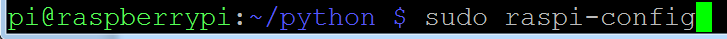

b. Enable the I2C function according to the following pictures( press（↑）,（↓）,（←）,（→）on the keyboard and“Enter”k）


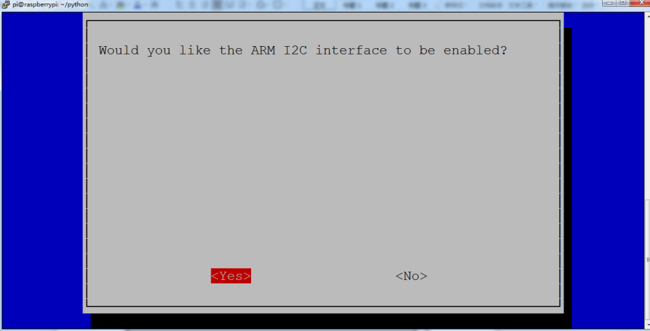

You could check more detail about I2C communication protocol in the following link:

<https://www.nxp.com/docs/en/user-guide/UM10204.pdf>

**PCF8591 Pins:**

More details about PCF8591 chip, you could look through chip specification folder

From the below figure, PCF8591 has an analog output pin Aout and four analog input pin A0-A3.

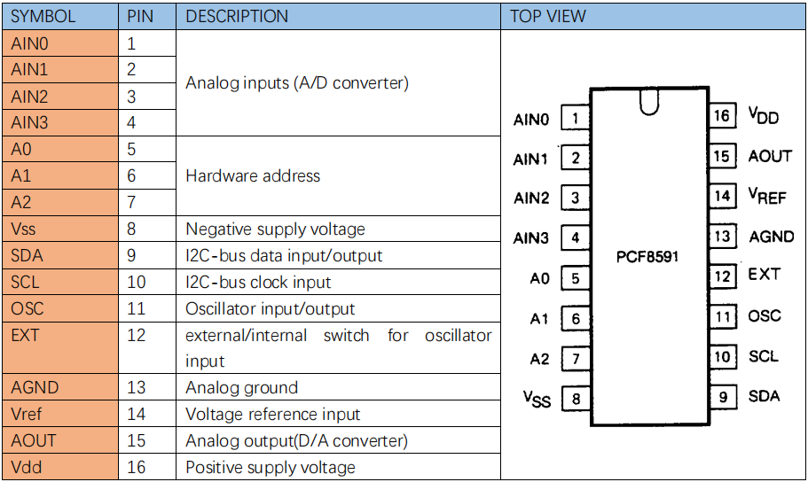

Check the address of iic module（PCF8591）of Raspberry Pi, enter command i2cdetect -y 1 and press “Enter”.

The iic address of PCF8591 is 0x48.


Used to read the address of pin A0\~A3.

The address of analog output pin AOUT: 0x40, that is, 64 converting from hexadecimal to decimal

A0 = 0x40 \##\##A0 ----\> port address

A1 = 0x41

A2 = 0x42

A3 = 0x43

**Adjustable Potentiometer**

The rotary potentiometer means the change of resistance.

We could convert the resistance’s change into the voltage’s when setting circuit. Then, voltage changes will be output to GPIO port through module signals.

Wiring according to the below figure and rotate clockwise, resistance value reduces.

 Schematic Diagram：

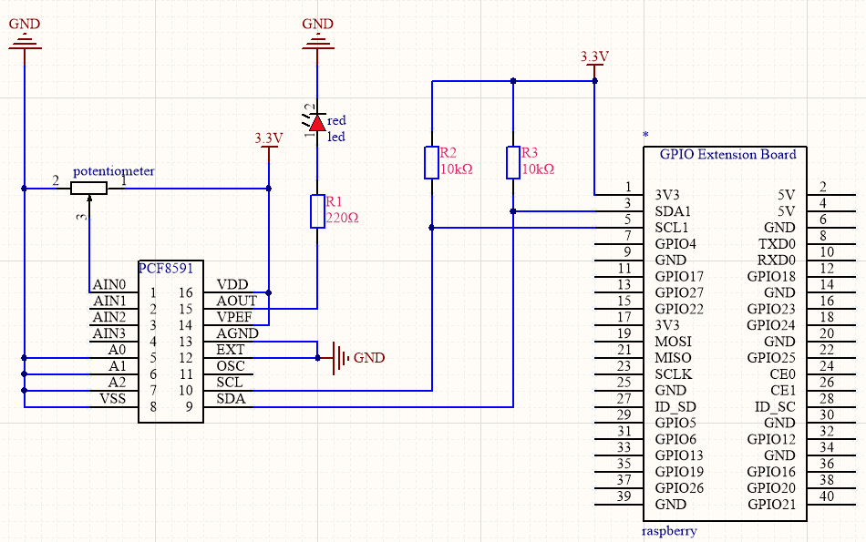

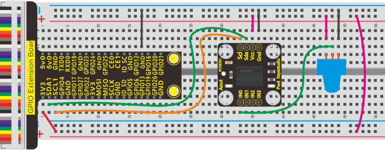

Note: PCF8591 module comes with an LED connected to Aout pint

 Run Example Code：

Input the following command, press“Enter”and click“RUN”on Processing IDE

processing/home/pi/sketchbook/Processing_Code/sketch_13_potentiometer/sketch_13_potentiometer.pde

**Test Result：**

Window shows voltage value and ADC value. You could change the output voltage by rotating the potentiometer, as shown below:


**Example Code：**

This program includes many code files, the core code is included in sketch_13\_potentiometer.pde file, others are customized, as shown below:


Main Program Code

```java
import processing.io.*;
//Create a object of class ADCDevice
ADCDevice adc = new ADCDevice();
void setup() {
  size(640, 360);
  if (adc.detectI2C(0x48)) {
    adc = new PCF8591(0x48);
  }else {
    println("Not found ADC Module!");
    System.exit(-1);
  }
}
void draw() {
  int adcValue = adc.analogRead(0);    //Read the ADC value of channel 0
  float volt = adcValue*3.3/255.0;    //calculate the voltage
  background(255);
  titleAndSiteInfo();

  fill(0);
  textAlign(CENTER);    //set the text centered
  textSize(30);
  text("ADC: "+nf(adcValue, 3, 0), width / 2, height/2+50);
  textSize(40);        //set text size
  text("Voltage: "+nf(volt, 0, 2)+"V", width / 2, height/2);    //
}
void titleAndSiteInfo() {
  fill(0);
  textAlign(CENTER);    //set the text centered
  textSize(40);        //set text size
  text("ADC", width / 2, 40);    //title
  textSize(16);
  text("www.keyestudio.com", width / 2, height - 20);    //site
}
```

 Reference：

1\. **class ADCDevice**（This is a base class which means all ADC module class is its subclass . And it provides two basic member functions.)

- public int analogRead**(**int chn**)**

  This is a uniform function name. Different chips have different implementation methods. Therefore, specific methods are implemented in subclasses.

- public boolean detectI2C**(**int addr**)**

  Used to check the I2C device with address. If it exists, return true，otherwise, return false

2\. **class PCF8591 extends ADCDevice**  (This is a custom class used to operate ADC and DAC of PCF8591)

- public PCF8591**(**int addr**)**

  Constructed function，used to create PCF8591class， Parameter is the device address of I2C PCF8591

- public int analogRead**(**int chn**)**

  Used to read ADC value of one channel of PCF8591 Parameter CHN implies channel number 0,1,2,3

- public byte**[ ]** analogRead**( )**

  Read the value of ADC on all channels on PCF8591

- public void analogWrite**(**int data**)**

  Input DAC value to PCF8591

### Project 14：Photoresistor

 Description：

Photo resistor (Photovaristor) is a resistor whose resistance varies according to different incident light strength. It's made based on the photoelectric effect of semiconductor. In this lesson, let’s explain how it works.

 Component：

|  |  |  |  |
| ------------------------------------------------------------ | ------------------------------------------------------------ | ------------------------------------------------------------ | ------------------------------------------------------------ |
| Raspberry Pi*1                                               | GPIO Extension Board*1                                       | 40 pin Colorful Jumper Wires*1                               | Breadboard*1                                                 |
|  |  |  |               |
| 220Ω Resistor*1                                              | Photo Resistor*1                                             | 10KΩ Resistor*1                                              | LED - Red *1                                                 |
|  |               |                                                              |                                                              |
| Keyestudio PCF8591 A/D Converter Module*1                    | Jumper Wires                                                 |                                                              |                                                              |

 Component Knowledge

**Photoresistor：**

Photo resistor (Photovaristor) is a resistor whose resistance varies according to different incident light strength. It's made based on the photoelectric effect of semiconductor. If the incident light is intense, its resistance reduces; if the incident light is weak, the resistance increases. 

If incident light on a photoresistor exceeds a certain frequency, photons absorbed by the semiconductor give bound electrons enough energy to jump into the conduction band. The resulting free electrons (and their hole partners) conduct electricity, thereby lowering resistance. 

 Schematic Diagram：


 Run Example Code：

Note: in the experiment, I2C communication is used. We need to check the iic address first( enter command：i2cdetect -y 1 and press“Enter”. If failed, check the wiring is correct or not. If correct, you need to enable I2C communication function of Raspberry Pi, project 13 is for your reference.

After enabling the I2C communication function, input the following command, press “Enter”and click“RUN”on Processing IDEAfter enabling I2C communication, input the following commands and press "Enter".

processing/home/pi/sketchbook/Processing_Code/sketch_14_photo_resistor/sketch_14_photo_resistor.pde

**Test Result：**

Display window will show the voltage value, ADC value and LED icon. You could change voltage value and its brightness by changing the light intensity of photoresistor, as shown below:


**Example Code：**

This program includes many code files, the core code is included in sketch_14_photo_resistor.pde file, others are customized, as shown below:


```java
import processing.io.*;

int ledPin = 5;    //led
//Create a object of class ADCDevice
ADCDevice adc = new ADCDevice();
SOFTPWM p = new SOFTPWM(ledPin, 0, 100);
void setup() {
  size(640, 360);
  if (adc.detectI2C(0x48)) {
    adc = new PCF8591(0x48);
  } else {
    println("Not found ADC Module!");
    System.exit(-1);
  }
}
void draw() {
  int adcValue = adc.analogRead(0);    //Read the ADC value of channel 0
  float volt = adcValue*3.3/255.0;    //calculate the voltage
  float dt = adcValue/255.0;
  p.softPwmWrite((int)(dt*100));  //output the pwm
  background(255);
  titleAndSiteInfo();

  fill(255, 255-dt*255, 255-dt*255);  //cycle
  noStroke();  //no border
  ellipse(width/2, height/2, 100, 100);

  fill(0);
  textAlign(CENTER);    //set the text centered
  textSize(30);
  text("ADC: "+nf(adcValue, 3, 0), width / 2, height/2+130);
  text("Voltage: "+nf(volt, 0, 2)+"V", width / 2, height/2+100);    
}
void titleAndSiteInfo() {
  fill(0);
  textAlign(CENTER);    //set the text centered
  textSize(40);        //set text size
  text("SoftLight", width / 2, 40);    //title
  textSize(16);
  text("www.keyestudio.com", width / 2, height - 20);    //site
}
```


### Project 15：Water Level Monitor

 Description：

If you have ever had a water heater explode or ever tried to make submersible electronics, then you know how important it is to detect when water is around. Let’s know more about water level sensor.

 Component:

|  |  |  |
| ------------------------------------------------------------ | ------------------------------------------------------------ | ------------------------------------------------------------ |
| Raspberry Pi*1                                               | GPIO Extension Board*1                                       | 40 pin Colorful Jumper Wires*1                               |
|  |  |  |
| Breadboard*1                                                 | Active Buzzer *1                                             | Water sensor * 1                                             |
|  |  |  |
| PCF8591 A/D Converter Module*1                               | Jumper Wires                                                 | M-F Dupont Wire                                              |

 Component Knowledge

**Water Level Sensor：**

Our water sensor is easy- to-use, portable and cost-effective, designed to identify and detect water level and water drop. This sensor measures the volume of water drop and water quantity through an array of traces of exposed parallel wires.

It could convert water content to analog signals, and output analog value could be used by function of application. It has the features of low consumption as well.

 Schematic and Connection Diagram：


 Run Example Code：

Note: in the experiment, I2C communication is used. We need to check the iic address first( enter command：i2cdetect -y 1 and press“Enter”. If failed, check the wiring is correct or not. If correct, you need to enable I2C communication function of Raspberry Pi, project 13 is for your reference.

After enabling the I2C communication function，Input the following command, press “Enter”and click“RUN”on Processing IDEAfter enabling the I2C communication，input the following commands and press "Enter".

processing/home/pi/sketchbook/Processing_Code/sketch_15_water_buzzer/sketch_15_water_buzzer.pde

**Test Result：**

The window will show the voltage value, ADC value and buzzer icon after executing code.

The voltage value and ADC value vary with the depth of water level sensor in the water. Buzzer will emit , arc lines next to buzzer icon will be shown and “The water is full” appear, when the water level reaches the certain value. A shown below:


**Example Code：**

This program includes a few code files, the core code is in the sketch_15_water_buzzer.pde,other files consist of some customized ones, as shown below:


```java
import processing.io.*;

int buzzerPin = 18;    //connect to buzzer pin
boolean buzzerState = false;
//Create a object of class ADCDevice
ADCDevice adc = new ADCDevice();
void setup() {
  size(640, 360);
  GPIO.pinMode(buzzerPin, GPIO.OUTPUT);
  if (adc.detectI2C(0x48)) {
    adc = new PCF8591(0x48);
  } else if (adc.detectI2C(0x4b)) {
    adc = new ADS7830(0x4b);
  } else {
    println("Not found ADC Module!");
    System.exit(-1);
  }
}
void draw() {
  int adcValue = adc.analogRead(0);    //Read the ADC value of channel 0
  float volt = adcValue*3.3/255.0;    //calculate the voltage
  background(255);
  titleAndSiteInfo();
  
    fill(0);
    textAlign(LEFT);    //set the text lefted
    textSize(30);
    text("ADC: "+nf(adcValue, 3, 0), width / 28, height/1.5+70);
    textSize(30);        //set text size
    text("Voltage: "+nf(volt, 0, 2)+"V", width / 28, height/1.30); 
    drawBuzzer();       //buzzer img
    if (adcValue > 200) {
    GPIO.digitalWrite(buzzerPin, GPIO.HIGH);  
    drawArc();      //Sounds waves img
    fill(0);
    textAlign(LEFT);    //set the text lefted
    textSize(30);
    text("The water is full", width / 28, height/3+70);
  } else {
    GPIO.digitalWrite(buzzerPin, GPIO.LOW);  //led off  
  } 
}
void drawBuzzer() {
  strokeWeight(1);
  fill(0);
  ellipse(width/1.5, height/2, 50, 50);  
  fill(255);
  ellipse(width/1.5, height/2, 10, 10);
}
void drawArc() {
  noFill();
  strokeWeight(8);
  for (int i=0; i<3; i++) {
    arc(width/1.5, height/2, 100*(1+i), 100*(1+i), -PI/4, PI/4, OPEN);
  }
}
void titleAndSiteInfo() {
  fill(0);
  textAlign(CENTER);    //set the text centered
  textSize(40);        //set text size
  text("Water Level Monitoring Alarm", width / 2, 40);    //title
  textSize(16);
  text("www.keyestudio.com", width / 2, height - 20);    //site
}
```


### Project 16：Joystick Module

 Description：

Many a people play games with gamepad. But do you know who it work?

Let’s learn about it.

 Component：

|  |  |  |               |
| ------------------------------------------------------------ | ------------------------------------------------------------ | ------------------------------------------------------------ | ------------------------------------------------------------ |
| Raspberry Pi*1                                               | GPIO Extension Board*1                                       | 40 pin Colorful Jumper Wires*1                               | Breadboard*1                                                 |
|  |  |  |  |
| Joystick Module*1                                            | Keyestudio PCF8591 A/D Converter Module*1                    | Jumper Wires                                                 | M-F Dupont Line                                              |

 Component Knowledge：

**Joystick Module：**

This is a joystick very similar to the ‘analog’ joysticks on PS2 (PlayStation 2) controllers. It is a self-centering spring loaded joystick, meaning when you release the joystick it will center itself. It also contains a comfortable cup-type knob/cap which gives the feel of a thumb-stick.

It has three signal pins which are connected GND, VCC and signal end（B, X, Y). The X pin is **X-axis** (left to right), the Y pin is **Y-axis** (front and back) and signal terminal B is **Z-axis**(usually used as digital port and pushbutton)

VCC is connected to V/VCC（3.3/5V）of MCU, GND to G/GND of MCU and the voltage is around 1.65V/2.5V in initial status

X axis gives readout of the joystick in the horizontal direction (X-coordinate) i.e. how far left and right the joystick is pushed.

Y axis gives readout of the joystick in the vertical direction (Y-coordinate) i.e. how far up and down the joystick is pushed.

Z axis is the output from the pushbutton. It’s normally open, meaning the digital readout from the SW pin will be HIGH. When the button is pushed, it will connect to GND, giving output LOW.

 Schematic Diagram：


 Run Example Code：

Note: in the experiment, I2C communication is used. We need to check the iic address first( enter command：i2cdetect -y 1 and press“Enter”. If failed, check the wiring is correct or not. If correct, you need to enable I2C communication function of Raspberry Pi, project 13 is for your reference.

After enabling the I2C communication function，input the following command, press“Enter”and click“RUN”on Processing IDE

processing/home/pi/sketchbook/Processing_Code/sketch_16_joystick/sketch_16_joystick.pde

**Test Result：**

This window shows the position of joystick and values of X, Y and Z axis, as shown below:


The color of circle will change if button (Z axis/B)is pressed.


**Example Code：**

A few code files are included, as shown below:


```java
import processing.io.*;
//Create a object of class ADCDevice
ADCDevice adc = new ADCDevice();
int cx, cy, cd, cr;    //define the center point,side length & half.

void setup() {
  size(640, 360);
  if (adc.detectI2C(0x48)) {
    adc = new PCF8591(0x48);
  } else if (adc.detectI2C(0x4b)) {
    adc = new ADS7830(0x4b);
  } else {
    println("Not found ADC Module!");
    System.exit(-1);
  }
  cx = width/2;    //center of the display window
  cy = height/2;    //
  cd = (int)(height/1.5);
  cr = cd /2;
}
void draw() {
  int x=0, y=0, z=0;
  x = adc.analogRead(1);  //read the ADC of joystick
  y = adc.analogRead(0);  //
  z = adc.analogRead(2);
  background(102);
  titleAndSiteInfo();
  fill(0);
  textSize(20);
  textAlign(LEFT, TOP);
  text("X:"+x+"\nY:"+y+"\nZ:"+z, 10, 10);

  fill(255);    //wall color
  rect(cx-cr, cy-cr, cd, cd);    
  fill(constrain(z, 255, 0));    //joysitck color
  ellipse(map(x, 0, 255, cx-cr, cx+cr), map(y, 0, 255, cy-cr, cy+cr), 50, 50);
}
void titleAndSiteInfo() {
  fill(0);
  textAlign(CENTER);    //set the text centered
  textSize(40);        //set text size
  text("Joystick", width / 2, 40);    //title
  textSize(16);
  text("www.keyestudio.com", width / 2, height - 20);    //site
}
```


### Project 17：OLED Display

 Description：

OLED display is the most commonly used for cellphone screen, thanks to its characteristics of high resolution, small-sized and high brightness.

 Component：

|  |  |  |
| ------------------------------------------------------------ | ------------------------------------------------------------ | ------------------------------------------------------------ |
| Raspberry Pi*1                                               | GPIO Extension Board*1                                       | 40 pin Colorful Jumper Wires*1                               |
|  |  |               |
| Breadboard*1                                                 | OLED Display*1                                               | Jumper Wires                                                 |

 Component Knowledge

**OLED Display：**

-   Use SSD1306 chip to drive

-   Communication: IIC communication

-   Size: 0.96 inch

-   Resolution: 128\*96

-   Display Color: Blue

 Schematic Diagram：


 Run Example Code：

Note: in the experiment, I2C communication is used. We need to check the iic address first( enter command：i2cdetect -y 1 and press“Enter”. If failed, check the wiring is correct or not. If correct, you need to enable I2C communication function of Raspberry Pi, project 13 is for your reference.

After enabling the I2C communication function，Input the following command, press “Enter” and click “RUN” on Processing IDE

After enabling the I2C communication，input the following commands and press "Enter"

processing /home/pi/sketchbook/Processing_Code/sketch_17_OLED/sketch_17_OLED.pde

**Test Result：**

OLED display shoes patterns and character strings

**Example Code：**

This program includes a few code files, as shown below:


```java
import processing.io.*;

// 0.96" 128x64 OLED display ("SKU 346540")
SSD1306 oled;
String str = "keyestudio";

void setup() {
  size(128, 64);  //According to the pixels of the OLED

  // you might need to use a different interface on other SBCs
  oled = new SSD1306("i2c-1", 0x3c);
}

void draw() {
  background(0);
  stroke(0, 50, 255);  //The brush color
  line(0, 0, 127, 63);  //The two coordinate points are underlined
  line(0, 63, 127, 0);
  oled.sendImage(get()); //OLED displays processed graphics
  delay(1000);
  
  background(0);
  stroke(0, 50, 255);  //The brush color
  ellipse(64,32,30,30);
  oled.sendImage(get()); 
  delay(1000);
  
  background(0);
  fill(255); //set the fill color of the words
  text("display", 10, 20);  //Display string
  text(str, 10, 40);
  oled.sendImage(get()); 
  delay(1000);
}
```


### Project 18：L293D Driver Motor

 Description：

In generally, we use a DC motor to make smart car. What should we do if we want to control the rotation speed and direction? Here, we need an L293D driver motor.

 Component:

|  |  |  |  |
| ------------------------------------------------------------ | ------------------------------------------------------------ | ------------------------------------------------------------ | ------------------------------------------------------------ |
| Raspberry Pi*1                                               | GPIO Extension Board*1                                       | 40 pin Colorful Jumper Wires*1                               | Breadboard*1                                                 |
|  |              |               |                                                              |
| L293D Chip*1                                                 | Motor*1                                                      | Jumper Wires                                                 |                                                              |

 Component Knowledge:

**L293D Chip:**

It is a DC current DC IC which is applied to drive DC motor and stepper motor. In addition, it has 16 pins driving two-way DC motor at same time.

Input voltage range: 4.5 V \~ 36 V

Output current: MAX 600mA, can drive inductive loaded, especially its input end can be connected to MCU directly, controlled by MCU easily.

The two-channel motor can be driven and rotate clockwise and anticlockwise when changing the high and low level on input port.


| \## | Pin Name | Description                                         |
|----|----------|-----------------------------------------------------|
| 1  | Enable1  | Enable pin input 1(2) and Input 2(7)                |
| 2  | In1      | Control output1 and controlled  by digital circuit  |
| 3  | Out1     | Connect one end of motor1                           |
| 4  | 0V       | Connected to 0V of circuit.                         |
| 5  | 0V       | Connected to 0V of circuit.                         |
| 6  | Out2     | Connect the other end of motor1                     |
| 7  | In2      | Control output2 and controlled  by digital circuit  |
| 8  | +V motor | Connect to 4.5V-36V) of motor                       |
| 9  | Enable2  | Enable pin input 3(10) and 4(15)                    |
| 10 | In3      | Control output pin 3                                |
| 11 | Out3     | Connect one end of motor 2                          |
| 12 | 0V       | Connected to 0V of circuit.                         |
| 13 | 0V       | Connected to 0V of circuit.                         |
| 14 | Out4     | Connect the other end of motor 2                    |
| 15 | In4      | Control output 4 and controlled by  digital circuit |
| 16 | +V       | Connect to + 5V to enable IC function               |

 Schematic Diagram：


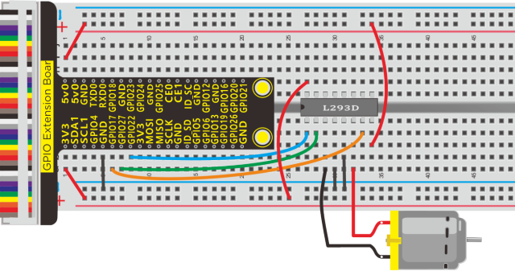

 Run Example Code：

Input the following command, press“Enter”and click“RUN”on Processing IDE

processing/home/pi/sketchbook/Processing_Code/sketch_18_L293D_motor/sketch_18_L293D_motor.pde

**Test Result：**

Window will shows a virtual fan, a green button and progress bar. The rotation speed of fan will change when dragging the progress bar. The rotation direction of motor is decided by green button, as shown below:


**Example Code：**

This program includes a few code files, the core code is in the sketch_18_L293D_motor.pde file,other files consist of some customized ones, as shown below:


```java
import processing.io.*;

int motorPin1 = 17;    //connect to the L293D
int motorPin2 = 27;
int enablePin = 22;
final int borderSize = 45;    //border size 
//MOTOR Object 
MOTOR motor = new MOTOR(motorPin1, motorPin2, enablePin);
ProgressBar mBar;    //ProgressBar Object
boolean mMouse = false;    //determined whether a mouse click the ProgressBar
BUTTON btn;    //BUTTON Object, For controlling the direction of motor 
int motorDir = motor.CW;    //motor direction
float rotaSpeed = 0, rotaPosition = 0;  //motor speed
void setup() {
  size(640, 360);
  mBar = new ProgressBar(borderSize, height-borderSize, width-borderSize*2);
  mBar.setTitle("Duty Cycle");    //set the ProgressBar's title
  btn = new BUTTON(45, height - 90, 50, 30);   //define the button
  btn.setBgColor(0, 255, 0);  //set button color
  btn.setText("CW");        //set button text
}

void draw() {
  background(255);
  titleAndSiteInfo();  //title and site information
  strokeWeight(4);    //border weight
  mBar.create();      //create the ProgressBar
  motor.start(motorDir, (int)(mBar.progress*100));  //control the motor starts to rotate
  btn.create();      //create the button
  rotaSpeed = mBar.progress * 0.02 * PI;  //virtual fan's rotating speed
  if (motorDir == motor.CW) {
    rotaPosition += rotaSpeed;
    if (rotaPosition >= 2*PI) {
      rotaPosition = 0;
    }
  } else {
    rotaPosition -= rotaSpeed;
    if (rotaPosition <= -2*PI) {
      rotaPosition = 0;
    }
  }
  drawFan(rotaPosition);    //show the virtual fan in Display window 
}
//Draw a clover fan according to the stating angle
void drawFan(float angle) {    
  constrain(angle, 0, 2*PI);
  fill(0);
  for (int i=0; i<3; i++) {
    arc(width/2, height/2, 200, 200, 2*i*PI/3+angle, (2*i+0.3)*PI/3+angle, PIE);
  }
  fill(0);
  ellipse(width/2, height/2, 30, 30);
  fill(128);
  ellipse(width/2, height/2, 15, 15);
}

void mousePressed() {
  if ( (mouseY< mBar.y+5) && (mouseY>mBar.y-5) ) {
    mMouse = true;    //the mouse click the progressBar
  } else if ((mouseY< btn.y+btn.h) && (mouseY>btn.y) 
    && (mouseX< btn.x+btn.w) && (mouseX>btn.x)) { // the mouse click the button
    if (motorDir == motor.CW) {    //change the direction of rotation of motor
      motorDir = motor.CCW;
      btn.setBgColor(255, 0, 0);
      btn.setText("CCW");
    } else if (motorDir == motor.CCW) {
      motorDir = motor.CW;
      btn.setBgColor(0, 255, 0);
      btn.setText("CW");
    }
  }
}
void mouseReleased() {
  mMouse  = false;
}
void mouseDragged() {
  int a = constrain(mouseX, borderSize, width - borderSize);
  float t = map(a, borderSize, width - borderSize, 0.0, 1.0);
  if (mMouse) {
    mBar.setProgress(t);
  }
}
void titleAndSiteInfo() {
  fill(0);
  textAlign(CENTER);    //set the text centered
  textSize(40);        //set text size
  text("Motor", width / 2, 40);    //title
  textSize(16);
  text("www.keyestudio.com", width / 2, height - 20);    //site
}
```

 Reference：

1\. class **MOTOR**（this is a custom class class which is used to control motor connected to L293D

- public MOTOR**(**int pin1**,** int pin2**,** int enablePin**)**

  In the constructed function, the first two parameters are connected to GPIO pin of L293D enablePin is used to produce PWM pin in the range of 0-100, whose frequency is 100Hz

- public void start**(**int dir**,** int speed**)**

  Used to drive motor. Parameter dir implies rotation direction, its value are CW, CCW and STOP. The rotation speed of parameter decides duty cycle of pulsewidth modulation. The value is in the range of 0-100

2\. class BUTTON （this is a custom class which is used to create buttons）

### Project 19：ULN2003 Stepper Motor Driver

 Description：

Stepper motor is applied widely in our daily life, such as hard drives, 3D printers, CNC machine tools, robots, etc.

Let’s get started with stepper motor

 Component：

|  |  |  |  |
| ------------------------------------------------------------ | ------------------------------------------------------------ | ------------------------------------------------------------ | ----------------------------------------------- |
| Raspberry Pi*1                                               | GPIO Extension Board*1                                       | 40 pin Colorful Jumper Wires*1                               | Breadboard*1                                    |
|  |  |  |  |
| Driver Board ULN2003*1                                       | Keyestudio 5V 4-Phase Stepper Motor*1                        | M-F Dupont Line                                              | Jumper Wires                                    |

 Component Knowledge:

**28BYJ-48 Stepper Motor：**

Stepper motor consists of stators and rotors. Stators are fixed, as shown below, which are the part A, B, C and D coils surround. The coil set will produce magnetic field when electrified. The rotor is the rotation part( the centre part of stators), as shown below:


**Single -Phase four Beat**

The poles of rotor point at A coil when it is electrified, then it is disconnected, B is connected, rotor rotates to C; then C is disconnected and D is connected, rotor rotates to D; however, D is disconnected and A is electrified, rotor rotates to A. Therefore, rotor turns 180° and continuously rotates B-C-D-A, which means it runs a circle (eight phase). As shown below, the rotation principle of stepper motor is A - B - C - D - A.

The poles of rotor points at A coil when A is electrified; then it is cut, B coil is connected.

You make order inverse(D - C - B - A - D .....) if you want to make stepper motor rotate anticlockwise.


**Half-phase and eight beat：**

8 beat adopts single and dual beat way，A - AB - B - BC - C - CD - D - DA - A ...... ，rotor will rotate half phase in this order. For example, when A coil is electrified，rotor faces to A coil then A and B coil are connected, on this condition, the strongest magnetic field produced lies in the central part of AB coil, which means rotating half-phase clockwise.

**Stepper Motor Parameters**：

The rotor rotates one circle when the stepper motor we provide rotates 32 phases and with the output shaft driven by 1:64 reduction geared set.

Therefore the rotation (a circle) of output shaft requires 2048 phases

The step angle of 4-beat mode of 5V and 4-phase stepper motor is 11.25. And the step angle of 8-beat mode is 5.625, the reduction ratio is 1:64.

More details about ULN2003 chip, you could look through chip specification folder

 Schematic Diagram:

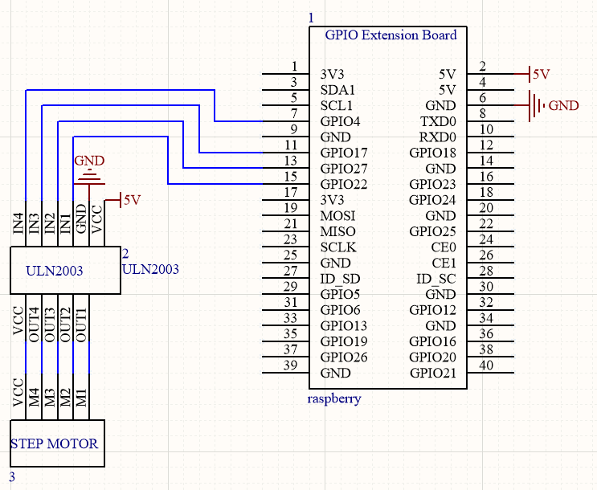


 Run Example Code：

Input the following command, press“Enter”and click“RUN”on Processing IDE

processing/home/pi/sketchbook/Processing_Code/sketch_19_ULN2003/sketch_19_ULN2003.pde

**Test Result：**

The status of fan is synchronized with the analog fan of window，as shown below:


**Example Code：**

for single phase and four beat mode:

This project includes a few code files, as shown below:


```java
import processing.io.*;

int[] pins = {22, 27, 17, 4};    //connect to motor phase A,B,C,D pins 
BUTTON btn;    //BUTTON Object, For controlling the direction of motor 
SteppingMotor m = new SteppingMotor(pins);    
float rotaSpeed = 0, rotaPosition = 0;  //motor speed
boolean isMotorRun = true;    //motor run/stop flag

void setup() {
  size(640, 360);
  btn = new BUTTON(45, height - 90, 50, 30);   //define the button
  btn.setBgColor(0, 255, 0);  //set button color
  btn.setText("RUN");        //set button text
  m.motorStart();            //start motor thread
  rotaSpeed = 0.002 * PI;  //virtual fan's rotating speed
}

void draw() {
  background(255);
  titleAndSiteInfo();  //title and site information
  btn.create();      //create the button
  if (isMotorRun) {   //motor is runnig
    fill(0);
    textAlign(LEFT,BOTTOM);
    textSize(20);
    if (m.dir == m.CW) {
      text("CW",btn.x,btn.y);    //text "CW "
      rotaPosition+=rotaSpeed;    
      if (rotaPosition>=TWO_PI) {
        rotaPosition = 0;
      }
    } else if (m.dir == m.CCW) {
      text("CCW",btn.x,btn.y);  //text "CCW"
      rotaPosition-=rotaSpeed;
      if (rotaPosition<=0) {
        rotaPosition = TWO_PI;
      }
    }
  }
  if (m.steps<=0) {      //if motor has stopped,
    if (m.dir == m.CCW) {        //change the direction ,restart.
      m.moveSteps(m.CW, 1, 512);    
    } else if (m.dir == m.CW) {     
      m.moveSteps(m.CCW, 1, 512);
    }
  }
  drawFan(rotaPosition);    //show the virtual fan in Display window
}
//Draw a clover fan according to the stating angle
void drawFan(float angle) {    
  constrain(angle, 0, 2*PI);
  fill(0);
  for (int i=0; i<3; i++) {
    arc(width/2, height/2, 200, 200, 2*i*PI/3+angle, (2*i+0.3)*PI/3+angle, PIE);
  }
  fill(0);
  ellipse(width/2, height/2, 30, 30);
  fill(128);
  ellipse(width/2, height/2, 15, 15);
}

void exit() {
  m.motorStop();
  println("exit");
  System.exit(0);
}
void mousePressed() {
  if ((mouseY< btn.y+btn.h) && (mouseY>btn.y) 
    && (mouseX< btn.x+btn.w) && (mouseX>btn.x)) { // the mouse click the button
    if (isMotorRun) {
      isMotorRun = false;
      btn.setBgColor(255, 0, 0);
      btn.setText("STOP");
      m.motorStop();
    } else {
      isMotorRun = true;
      btn.setBgColor(0, 255, 0);
      btn.setText("RUN");
      m.motorRestart();
    }
  }
}
void titleAndSiteInfo() {
  fill(0);
  textAlign(CENTER);    //set the text centered
  textSize(40);        //set text size
  text("Motor", width / 2, 40);    //title
  textSize(16);
  text("www.keyestudio.com", width / 2, height - 20);    //site
}
```

 Reference：

**class SteppinMotor**（This is a custom class which defines some ways to drive four-phase stepper motor)

- public SteppingMotor**(**int**[ ]** mPins**)**: Constructed function This parameter means GPIO pin connected to stepper motor

- public void motorStart**()**: Start the thread of stepper motor, thread is in wait-state, ready to be activated

- public void moveSteps**(**int idir**,** int ims**,** int isteps**)**: 

  Used to drive the rotation of stepper motor, it indicates direction, can be set as CW/CCW. Ims is the delay time between every two steps of stepper motor. The larger the ims value is, the smaller the rotation speed of stepper motor. Isteps determines the rotation steps of stepper motor. 4-phase stepper motor is 4-step cycle, set isteps=1, that is the four-step cycle of stepper motor.

- public void motorStop**()**: Stepper motor stops

- public void motorRestart**()**: Reboot stepper motor

### Project 20：4\*4 Membrane Switch Keypad

 Description：

Matrix keypads are the kind of keypads you see on cell phones, calculators, microwaves ovens, door locks, etc. They’re practically everywhere.

However, in DIY electronics, they let users interact with your project and are often needed to navigate menus, punch in passwords and control robots.

Membrane keypads are made of a thin, flexible membrane material. They do come in may sizes 4×3, 4×4, 4×1 etc. Regardless of their size, they all work in the same way.

 Component:

|  |  |  |  |
| ------------------------------------------------------------ | ------------------------------------------------------------ | ------------------------------------------------------------ | ----------------------------------------------- |
| Raspberry Pi*1                                               | GPIO Extension Board*1                                       | 40 pin Colorful Jumper Wires*1                               | Breadboard*1                                    |
|  |  |               |                                                 |
| 4*4 Membrane Switch Keypad *1                                | 10KΩ Resistor*4                                              | Jumper Wires                                                 |                                                 |

 Component Knowledge：

**Membrane Switch Keypad：**

This keypad integrates many a keys, as shown below, it has 16 keys


If you had used 16 individual push buttons, you would have required 17 input pins (one for each key and a ground pin) in order to make them work. However, with matrix arrangement, you only need 8 microcontroller pins (4-columns and 4-rows) to scan through the pad.

The working principle is very simple. Pressing a button shorts one of the row lines to one of the column lines, allowing current to flow between them. For example, when key‘4’is pressed, column 1 and row 2 are shorted.


 Schematic Diagram：


 Run Example Code：

Input the following command, press“Enter”and click“RUN”on Processing IDE

processing/home/pi/sketchbook/Processing_Code/sketch_20_Calculator/sketch_20_Calculator.pde

**Test Result：**

Window shows the page as follows, key “+”, “-”，“\*”, “/”,“C” and“=” separately imply character “A, B, C, D，\*，\##” of membrane keypad.


You could treat it as a calculator to solve many a math formulas, “C” represents clear, which means clear up the previous information. The color of corresponding key in the window will change into green when a key is pressed of membrane keypad, as shown below:


**Example Code：**

This program includes a few code folders, as shown below:


Main Program Code

```java
import processing.io.*;

final static char[]  keys = {  //key code
  '1', '2', '3', '+', 
  '4', '5', '6', '-', 
  '7', '8', '9', '*', 
  'C', '0', '=', '/'  };
final int[] rowsPins = {12, 16, 20, 21};  //Connect to the row pinouts of the keypad
final int[] colsPins = {6, 13, 19, 26};  //Connect to the column pinouts of the keypad
Keypad kp = new Keypad(keys, rowsPins, colsPins);    //class Object
Calculator cc = new Calculator(kp);    //class Object
void setup() {
  size(640, 360);
}
void draw() { 
  background(102);
  titleAndSiteInfo();  //Tile and site information
  cc.process();    //Get key and processing
  drawDisplay(cc.contentStr);  //Draw display area and content
  drawKeypad(width-kpSize, 70);    //draw virtual Keypad
}
void titleAndSiteInfo() {
  fill(0);
  textAlign(CENTER);    //set the text centered
  textSize(40);        //set text size
  text("Calculator", width / 4, 200);    //title
  textSize(20);
  text("www.keyestudio.com", width / 4, height - 20);    //site
}
```

 Reference：

1\. **void drawKeypad(int x, int y)**: Used to draw the keyboard with x and y in the upper left corner.

2\. **void drawDisplay(String content)**: draw the display area of calculator on the top of window, and align the display content right in display area.

3\. class **Key**（This is a custom class which defines related attributes of a key. There are some member variables and constructed function in it.）

- public Keypad**(**char**[ ]** usrKeyMap**,** int**[ ]** row_Pins**,** int**[ ]** col_Pins**)**: Constructed function, parameters are key code, row pins and column pins
- public char getKey**( )**: Get the key code, if the key is not pressed, the return value is '0'
- public void setDebounceTime**(**int ms**)**: Set the shaking time, default time is 10ms
- public void setHoldTime**(**int ms**)**: Set the time of stable state when button is pressed
- public boolean isPressed**(**char keyChar**)**: Determine if the ley of“keyChar”
- public char waitForKey**( )**: Wait the key to be pressed and return its key value
- public int getState**( )**: The state of key
- boolean keyStateChanged**( )**: Judge the key state, return True or False

4\. class **Calculator** (This is a custom class which defines the rule and calculation method of calculator.)

- String contentStr **=** " "**;**

  Member variable: save the current processing result of the calculator, and show it in the display area.

- public Calculator**(**Keypad kp**)**: Constructed function, it is used for keyboard class.

- public void process**( )**

  Obtain the password code and perform corresponding judgment and processing. Process results are saved in contentStr

- public double parse**(**String content**)**

  This is core of calculator and used to compile the four basic operation of a character string and return its double-precision floating point, for instance, enter character string “56-4+8\*5/2” and return value 72.0

### Project 21：Glutton Snake

 Description：

Most of us have played the classical game-glutton snake, in this program, let’s create our own game.

 Component:

|  |  |  |  |
| ------------------------------------------------------------ | ------------------------------------------------------------ | ------------------------------------------------------------ | ----------------------------------------------- |
| Raspberry Pi*1                                               | GPIO Extension Board*1                                       | 40 pin Colorful Jumper Wires*1                               | Breadboard*1                                    |
|  |  |               |                                                 |
| 10KΩ Resistor*4                                              | Button Switch *4                                             | Jumper Wires                                                 |                                                 |

 Schematic Diagram：


 Run Example Code：

Input the following command, press“Enter”and click“RUN”on Processing IDE

processing/home/pi/sketchbook/Processing_Code/sketch_21_Snake_Game/sketch_21_Snake_Game.pde

**Test Result：**

The display window is shown below:


Press Space to start game


You can move the blocks around, either left to right via four buttons or up/down/left/right keys on keyboard.


You could restart the game any time when pressing space.

**Example Code：**

This project consists of a few code files, as shown below:


```java
import processing.io.*;
int threshold = 400;

KeyPad keyUp = new KeyPad(23);
KeyPad keyDown = new KeyPad(27);
KeyPad keyLeft = new KeyPad(18);
KeyPad keyRight = new KeyPad(17);

Snake snake;
Food food;

void setup() {
  print("Starting ... \n");
  size(640, 360);
  background(102);
  textAlign(CENTER, CENTER);
  textSize(64);
  text("Starting...", width / 2, (height - 40) / 2);
  textSize(16);
  text("www.keyestudio.com", width / 2, height - 20);

  food = new Food(new GridMap(new Size(width, height), 20, 2));
  snake = new Snake(new GridMap(new Size(width, height), 20, 2));
  thread("keypadDetect");
}

void draw() {
  background(102);
  if (snake.gameState == GameState.WELCOME)
  {
    rectMode(CENTER);
    stroke(0, 0, 0);
    fill(0, 0, 0, 50);
    rect(width / 2, height / 2, width / 2, height / 3);
    fill(255, 255, 255);
    textSize(24);
    textAlign(CENTER, CENTER);
    text("Snake Game", width / 2, height / 2 - 24);
    text("Press Space to start", width / 2, height / 2 + 24);
  } else if (snake.gameState == GameState.PLAYING)
  {

    if (snake.body[0].x == food.position.x && snake.body[0].y == food.position.y)
    {
      snake.grow();
      food.generate(snake.body, snake.length);
      snake.speedUp();
    }
    snake.step();
    showGame();
  } else if (snake.gameState == GameState.LOSE)
  {
    showGame();
    rectMode(CENTER);
    stroke(0, 0, 0);
    fill(0, 0, 0, 50);
    rect(width / 2, height / 2, width / 2, height / 3);
    fill(255, 255, 255);
    textSize(24);
    textAlign(CENTER, CENTER);
    text("You lose!", width / 2, height / 2 - 24);
    text("Press Space to start", width / 2, height / 2 + 24);
  }
}

void showGame()
{
  snake.display();
  food.display();

  fill(255, 255, 255);
  textSize(16);
  textAlign(LEFT, CENTER);
  text("Press Enter to visit www.keyestudio.com", 20, height - 20);
  textAlign(RIGHT, CENTER);
  text("Press Space to restart game", width - 20, height - 20);
  textAlign(LEFT, CENTER);
  text("Score: " + (snake.length - 3), 20, 20);
  textAlign(RIGHT, CENTER);
  text("Speed: " + ((snake.initSpeed - snake.speed) / 5 + 1), width - 20, 20);
}

void keyPressed() {
  if ((key == CODED) || (keyValue !=  -1))
  {
    if ((keyCode == UP) ||((keyValue ==  keyUp.pin)))
    {
      if (snake.direction != Direction.DOWN)
        snake.nextDirection = Direction.UP;
    } else if ((keyCode == DOWN)||((keyValue ==  keyDown.pin))) {
      if (snake.direction != Direction.UP)
        snake.nextDirection = Direction.DOWN;
    } else if ((keyCode == LEFT)||((keyValue ==  keyLeft.pin))) {
      if (snake.direction != Direction.RIGHT)
        snake.nextDirection = Direction.LEFT;
    } else if ((keyCode == RIGHT)||((keyValue ==  keyRight.pin))) {
      if (snake.direction != Direction.LEFT)
        snake.nextDirection = Direction.RIGHT;
    }
    //keyValue = -1;
    println(keyValue);
  } else
  {
    if (key == '\n' || key == '\r')
    {
      link("http://www.keyestudio.com");
    } else if (key == ' ')
    {
      snake.reset();
      food.generate(snake.body, snake.length);
      snake.gameState = GameState.PLAYING;
    }
  }
}
void keypadDetect() {
  while (true) {
    keyUp.keyScan();
    keyDown.keyScan();
    keyLeft.keyScan();
    keyRight.keyScan();    
    transAction();
    try {
      Thread.sleep(10);
    }
    catch(Exception e) {
    }
  }
}
void transAction() {
  if ((keyValue !=  -1))
  {
    if (keyValue ==  keyUp.pin)
    {
      if (snake.direction != Direction.DOWN)
        snake.nextDirection = Direction.UP;
    } else if (((keyValue ==  keyDown.pin))) {
      if (snake.direction != Direction.UP)
        snake.nextDirection = Direction.DOWN;
    } else if (((keyValue ==  keyLeft.pin))) {
      if (snake.direction != Direction.RIGHT)
        snake.nextDirection = Direction.LEFT;
    } else if (((keyValue ==  keyRight.pin))) {
      if (snake.direction != Direction.LEFT)
        snake.nextDirection = Direction.RIGHT;
    }
    keyValue = -1;
  }
}
```


### Project 22：Teris

 Description：

In this lesson, we will produce a game-----Teris

 Component:

|  |  |  |  |
| ------------------------------------------------------------ | ------------------------------------------------------------ | ------------------------------------------------------------ | ----------------------------------------------- |
| Raspberry Pi*1                                               | GPIO Extension Board*1                                       | 40 pin Colorful Jumper Wires*1                               | Breadboard*1                                    |
|  |  |               |                                                 |
| 10KΩ Resistor*4                                              | Button Switch *4                                             | Jumper Wires                                                 |                                                 |

 Schematic Diagram：


 Run Example Code：

Input the following command, press“Enter”and click“RUN”on Processing IDE

processing/home/pi/sketchbook/Processing_Code/sketch_22_Tetris_Game/sketch_22_Tetris_Game.pde

**Test Result：**

The window shows as follows:


Left and right buttons in the circuit correspond left and right. You could make falling block faster via the down button and the up one is used to rotate falling blocks. Equally, the up/down/left/right keys on keyboard are used to play this game as well.


In the game, press space to pause the game. The right window shows the falling blocks, game level and scores.

Arrange the falling blocks of different shapes to fill a row. The more lines you remove, the higher the scores you get. 10 points for each line, but you can get 70 points if you remove four rows.


The game is over when blocks reach the top of screen. You could press space to start new round.


**Example Code：**

The program includes a few code files, as shown below:

（Some file names are hidden. Drag the border of Processing IDE to the right, and the corresponding file names will be visible.）


Main Program Code

```java
import processing.io.*;

static final int w = 10; // 4
static final int h = 25; // 60
static final int framesInSecond = 30;
static float gameInitSpeed = 10;
static float gameSpeed = 10;
static final int BlockScale = 15;
static final int sizeWidth = w*BlockScale+100;
static final int sizeHeight = h*BlockScale;

KeyPad keyUp = new KeyPad(23);
KeyPad keyDown = new KeyPad(27);
KeyPad keyLeft = new KeyPad(18);
KeyPad keyRight = new KeyPad(17);

boolean isPaused = false;
boolean keyAllow = true;
float updatingThreshold = 0;
Game game;

float recalculateUpdatingThreshold(float threshold) {
  return threshold + 1;
}
void settings() {
  size(sizeWidth, sizeHeight);
}
void setup() {
  game = new Game(w, h);
  generateRandomBlock(game);
  frameRate(framesInSecond);
  thread("keypadDetect");
}

void draw() {

  background(102); 
  Game newGame = game;

  updatingThreshold = recalculateUpdatingThreshold(updatingThreshold);
  if (updatingThreshold > gameSpeed) {
    if (isGameOver(newGame)) {
    } else if (isPaused) {
    } else {
      newGame = updateGameState(game);
    }
    updatingThreshold = 0;
  }
  drawGameState(newGame);
  if (!isGameOver(newGame)&& (isPaused)) {  //pause
    textSize(40);
    fill(0);
    text("Pause", BlockScale*2, 150);
    keyAllow = false;
  } else if (isGameOver(newGame)&& (isPaused)) {    //restart game
    game = new Game(w, h);
    generateRandomBlock(game);
    isPaused = false;
    keyAllow = false;
  } else if (isGameOver(newGame)) {    //game over
    textSize(40);
    fill(0);
    text("Game \nOver", BlockScale*2, 150);
    keyAllow = false;
  } else {        //playing
    keyAllow = true;
  }

  //level,score information
  pushMatrix();
  translate(w*BlockScale, 0);
  fill(255);
  textSize(20);
  text("Level\n"+game.level, 10, BlockScale*7);
  text("Scores\n"+game.score, 10, BlockScale*11);
  textSize(12);
  text("keyestudio.com", 10, sizeHeight-30);
  drawNextBlock(game.nextBlock, BlockScale*2, BlockScale*1);
  popMatrix();
}

void keyPressed() {
  if (key == CODED) {
    if (keyAllow) {
      switch (keyCode) {
      case LEFT:  
        moveBlock(game, MoveLeft);  
        break;
      case RIGHT: 
        moveBlock(game, MoveRight); 
        break;
      case DOWN:  
        makeBlockFall(game);        
        break;
      case UP:    
        rotateBlock(game);          
        break;
      }
    }
  } else if (key == ' ') { // SPACE
    isPaused =! isPaused;
  }
}
void keypadDetect() {
  while (true) {
    keyUp.keyScan();
    keyDown.keyScan();
    keyLeft.keyScan();
    keyRight.keyScan();    
    transAction();
    try {
      Thread.sleep(10);
    }
    catch(Exception e) {
    }
  }
}
void transAction() {
  if ((keyValue !=  -1))
  {
    if (keyAllow) {
      if (keyValue == keyLeft.pin) {
        moveBlock(game, MoveLeft);
      } else if (keyValue == keyRight.pin) {
        moveBlock(game, MoveRight);
      } else if (keyValue == keyDown.pin) {
        makeBlockFall(game);
      } else if (keyValue == keyUp.pin) {
        rotateBlock(game);
      }
    }
    try {
      Thread.sleep(50);
    }
    catch(Exception e) {
    }
    keyValue =  -1;
  }
}
```


